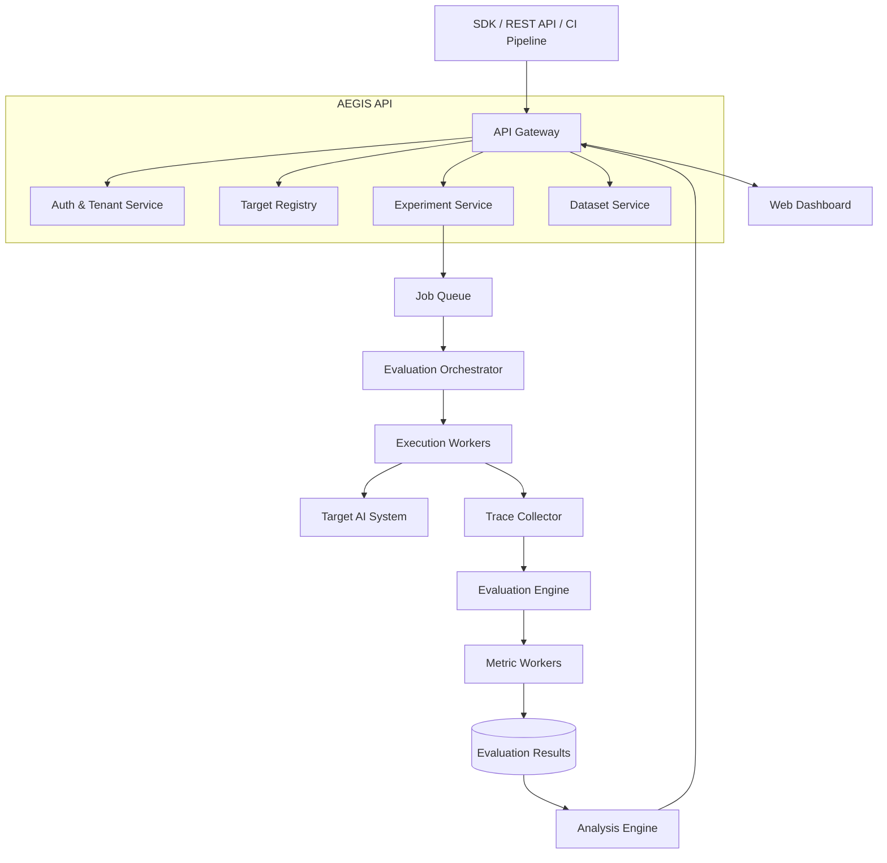
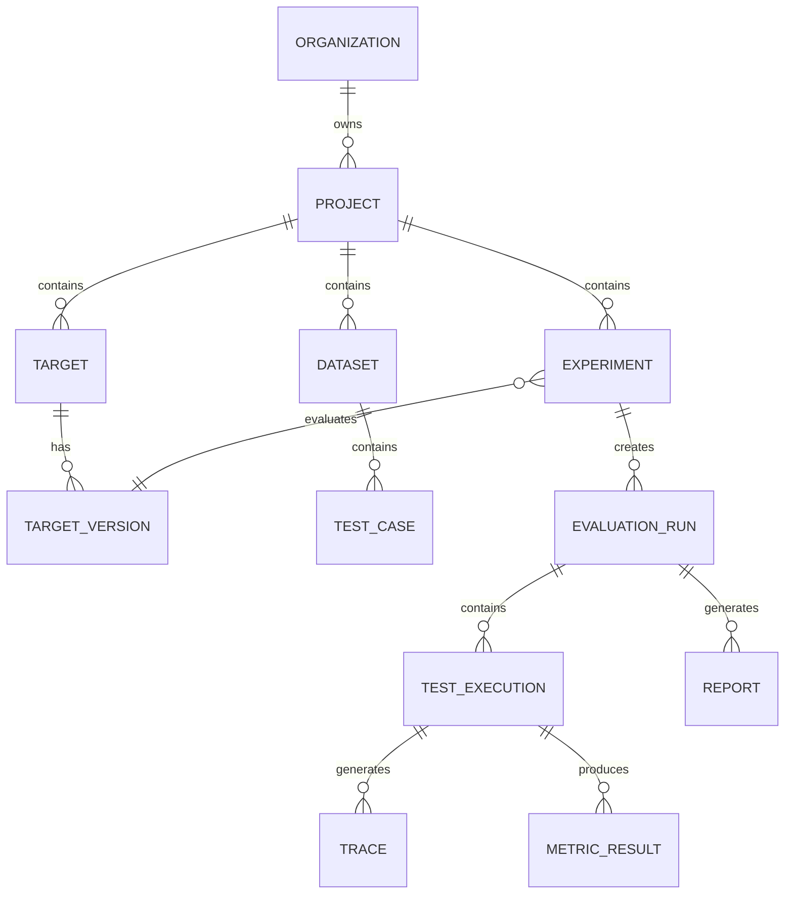
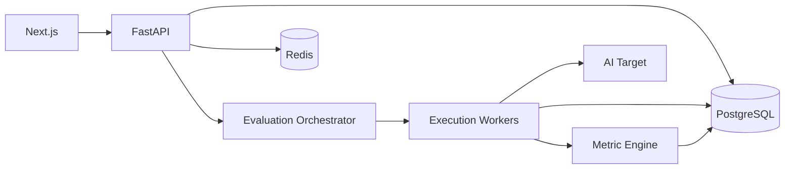

Yes. But before designing it, I want to pressure-test the assumption:

**Aegis should not become another giant “AI platform” that competes with Ancient.**

Ancient builds and runs AI systems.
Aegis should answer:

> **Is this AI system actually good, safe, reliable, and getting worse over time?**

So the design must stay focused.

# AEGIS

## AI Evaluation, Reliability & Observability Platform

```text
                 ┌───────────────────────────┐
                 │         YOUR AI APP       │
                 │                           │
                 │ LLM / RAG / Agent / Tools │
                 └─────────────┬─────────────┘
                               │
                    Traces / Test Runs
                               │
                               ▼
┌─────────────────────────────────────────────────────────────┐
│                          AEGIS                              │
│                                                             │
│  ┌────────────┐    ┌──────────────┐    ┌────────────────┐   │
│  │ Ingestion  │───▶│ Orchestrator │───▶│ Evaluation     │   │
│  │ & Tracing  │    │              │    │ Engine         │   │
│  └────────────┘    └──────────────┘    └───────┬────────┘   │
│                                                 │            │
│       ┌─────────────────────────────────────────┼────────┐   │
│       ▼                 ▼                       ▼        │   │
│   Quality Eval      Safety Eval          Reliability     │   │
│                                                      Cost│   │
│       └───────────────────────┬──────────────────────────┘   │
│                               ▼                              │
│                      Analysis Engine                         │
│             Regression / Failure / Comparison                │
│                               │                              │
│                               ▼                              │
│                        Dashboard/API                         │
└─────────────────────────────────────────────────────────────┘
```

---

# 1. The Core Product Model

The most important design decision:

## Everything revolves around an `AI Target`

An AI Target can be:

```text
LLM Application
RAG Pipeline
Agent
Multi-Agent System
Tool-Using Agent
Model API
```

Example:

```text
Target
├── id
├── name
├── type
├── endpoint
├── version
├── environment
└── configuration
```

Example:

```text
Customer Support Agent
Version: v2.4
Type: Agent
Environment: Production
```

Then everything is evaluated against that target.

---

# 2. Top-Level Architecture



---

# 3. The Most Important Flow

Let's say you have Ancient.

You want to evaluate it.

You create:

```text
Experiment
│
├── Target
│      Ancient v0.4
│
├── Dataset
│      1,000 tasks
│
├── Metrics
│      Task Success
│      Tool Accuracy
│      Latency
│      Cost
│
└── Configuration
       Parallelism: 10
```

Then:

```text
User
 │
 ▼
Create Experiment
 │
 ▼
Evaluation Orchestrator
 │
 ├── Test Case 1 ───► Worker
 │                        │
 │                        ▼
 │                   Ancient
 │                        │
 │                        ▼
 │                    Trace
 │
 ├── Test Case 2 ───► Worker
 │
 └── Test Case N ───► Worker
```

At the end:

```text
1000 Test Cases
      │
      ▼
Metric Computation
      │
      ▼
Evaluation Report
      │
      ▼
Regression Analysis
```

---

# 4. Domain Architecture

This is where I want Aegis to be strong.

```text
AEGIS
│
├── Identity
│
├── Projects
│
├── AI Targets
│
├── Datasets
│
├── Experiments
│
├── Execution
│
├── Tracing
│
├── Evaluation
│
├── Analysis
│
├── Regression
│
└── Reporting
```

Do not create 50 microservices.

Start as a **modular monolith**.

---

# 5. Core Domain Entities



The critical entity is:

## `TestExecution`

```text
TestExecution
│
├── Test Case
├── Target Version
├── Input
├── Output
├── Trace
├── Metrics
├── Cost
├── Latency
└── Status
```

This becomes the center of your debugging system.

---

# 6. Trace Model

A normal observability system stores:

```text
Request → Response
```

That is insufficient for AI.

Aegis needs:

```text
Trace
│
├── User Input
│
├── LLM Generation
│      ├── Model
│      ├── Prompt
│      ├── Completion
│      ├── Tokens
│      └── Latency
│
├── Retrieval
│      ├── Query
│      ├── Retrieved Documents
│      └── Scores
│
├── Tool Call
│      ├── Tool Name
│      ├── Arguments
│      ├── Result
│      └── Error
│
├── Agent Decision
│
└── Final Response
```

Internally:

```text
Trace
 └── Span
      └── Span
           └── Span
```

Example:

```text
User Request
    │
    └── Agent Run
         │
         ├── LLM Call
         │
         ├── Retrieval
         │
         │     └── Vector Search
         │
         ├── Tool Call
         │
         └── LLM Call
```

This should follow an **OpenTelemetry-compatible model** where practical.

---

# 7. Evaluation Engine

Don't hard-code metrics.

Metrics need a plugin architecture.

```text
Metric
│
├── Metric Definition
│
├── Input Requirements
│
├── Evaluator
│
└── Result
```

Interface conceptually:

```text
Evaluator

evaluate(
    execution,
    context
)

→ MetricResult
```

Example metric:

```text
ToolCallAccuracy
```

Input:

```text
Expected Tool: search_database

Actual Tool: search_database
```

Result:

```text
Score: 1.0
```

Another:

```text
StructuredOutputValidity
```

Another:

```text
TaskSuccess
```

Another:

```text
Faithfulness
```

---

# 8. Metric Categories

## Deterministic

No AI judge required.

```text
JSON validity
Exact Match
Schema Validation
Tool Call Accuracy
Latency
Cost
Error Rate
```

---

## Semantic

```text
Semantic Similarity
Answer Relevance
```

Uses embedding models.

---

## LLM-as-Judge

```text
Instruction Following
Answer Quality
Helpfulness
Reasoning Quality
```

Important design:

```text
Metric Result
├── score
├── reason
├── judge_model
├── prompt_version
└── confidence
```

Because an LLM judge itself is not objective truth.

Aegis should preserve how a score was generated.

---

# 9. Agent Evaluation

This is where Aegis becomes valuable.

```text
Task
 │
 ▼
Agent
 │
 ├── Planning
 │
 ├── LLM Call
 │
 ├── Tool Call
 │
 ├── Tool Call
 │
 └── Final Answer
```

Metrics:

```text
Task Success Rate
Tool Selection Accuracy
Tool Argument Accuracy
Loop Rate
Step Count
Recovery Rate
Planning Efficiency
```

Example:

```text
Expected:

search_customer
        ↓
get_orders
        ↓
refund_order

Actual:

search_customer
        ↓
get_orders
        ↓
search_customer
        ↓
search_customer
        ↓
search_customer

Result:

Task Failed
Loop Detected
```

---

# 10. Regression Engine

This is one of the strongest parts.

You have:

```text
Experiment A
ANCIENT v0.3
```

Then:

```text
Experiment B
ANCIENT v0.4
```

Aegis compares:

```text
Metric                v0.3       v0.4

Task Success          87%        91%  ↑

Tool Accuracy         94%        96%  ↑

Latency               1.8s       2.5s  ↓

Cost                  $0.012     $0.019 ↓
```

But aggregate metrics are not enough.

We need:

```text
Per Test Comparison
```

```text
Test #184

v0.3:
SUCCESS

v0.4:
FAILED

Regression Detected
```

This is important.

---

# 11. Failure Analysis Engine

This should not pretend to magically know the root cause.

Instead:

```text
Failure
    │
    ▼
Failure Classification
    │
    ├── Model Failure
    │
    ├── Retrieval Failure
    │
    ├── Tool Failure
    │
    ├── Agent Loop
    │
    ├── Timeout
    │
    └── Validation Failure
```

Then:

```text
Failure Clustering
```

Example:

```text
127 Failures

45 → Wrong Tool
31 → Invalid Arguments
24 → Retrieval Miss
17 → Timeout
10 → Unknown
```

This gives engineers actionable information.

---

# 12. System Components

## API

```text
FastAPI
```

Responsibilities:

```text
Projects
Targets
Datasets
Experiments
Reports
```

---

## Evaluation Orchestrator

Responsible for:

```text
Create Jobs
Schedule Workers
Retry
Timeout
Cancel
Aggregate Results
```

Initially:

```text
Redis
+
Celery / Dramatiq / ARQ
```

Don't use Kafka here unless you have a real reason.

Kafka can be added later for high-scale event streams.

---

## Execution Workers

These are isolated.

```text
Worker
 │
 ├── Load Test Case
 │
 ├── Invoke Target
 │
 ├── Collect Trace
 │
 └── Persist Execution
```

Why isolated?

Because targets can:

```text
Crash
Timeout
Loop
Consume Resources
```

---

# 13. Storage Architecture

```text
                    AEGIS
                      │
       ┌──────────────┼──────────────┐
       ▼              ▼              ▼

   PostgreSQL       Redis         Object Storage

   Metadata         Queue         Large Artifacts
   Results          Cache         Datasets
   Config           Locks         Reports
```

PostgreSQL:

```text
Users
Projects
Targets
Experiments
Runs
Metrics
Results
```

Object storage:

```text
Large Datasets
Trace Payloads
Reports
Artifacts
```

Redis:

```text
Queue
Caching
Distributed Locks
Rate Limits
```

---

# 14. SDK Design

Aegis needs an SDK eventually.

Example:

```python
from aegis import Aegis

aegis = Aegis()

with aegis.trace("customer_support"):
    result = agent.run(message)
```

Then:

```text
Agent
  │
  ▼
Aegis SDK
  │
  ▼
Trace Collector
  │
  ▼
Aegis Backend
```

But:

## Do not start with the SDK.

First build:

```text
REST Target
+
Evaluation Engine
+
Experiment System
```

Then SDK.

---

# 15. Multi-Tenant Architecture

Since this could become SaaS:

```text
Organization
      │
      ▼
Project
      │
      ├── Targets
      ├── Datasets
      └── Experiments
```

Every important record has:

```text
organization_id
project_id
```

Don't add complex RBAC initially.

Start:

```text
Owner
Admin
Member
Viewer
```

Enough.

---

# 16. MVP Architecture

This is what I would actually build first.



No:

```text
Kubernetes
Kafka
Microservices
Service Mesh
10 databases
```

for the MVP.

That would be architecture theater.

---

# MVP Features

## Phase 1

```text
Projects
Targets
Datasets
Experiments
```

## Phase 2

```text
LLM Target Execution
Evaluation Runs
Latency
Cost
Exact Match
JSON Validation
Semantic Similarity
```

## Phase 3

```text
Agent Tracing
Tool Evaluation
Failure Analysis
```

## Phase 4

```text
Experiment Comparison
Regression Detection
Reports
```

## Phase 5

```text
SDK
Production Observability
CI/CD Integration
```

---

# The Relationship with Ancient

This is extremely important:

```text
                  ┌─────────────┐
                  │   ANCIENT   │
                  │             │
                  │ Build & Run │
                  │ AI Systems  │
                  └──────┬──────┘
                         │
                         │
                         ▼
                  ┌─────────────┐
                  │    AEGIS    │
                  │             │
                  │ Measure &   │
                  │ Verify AI   │
                  └─────────────┘
```

Ancient asks:

> How do we build intelligent AI agents?

Aegis asks:

> How do we know those agents actually work?

That is why the two projects together would be powerful.

## My final recommendation

Before writing any code, I would lock these boundaries:

```text
Aegis WILL do:
✓ Evaluation
✓ Regression testing
✓ AI tracing
✓ Failure analysis
✓ Reliability measurement

Aegis WILL NOT initially:
✗ Build agents
✗ Be an LLM gateway
✗ Be a RAG framework
✗ Be a generic observability platform
✗ Try to replace every existing AI tool
```

That boundary is what keeps the project from becoming another unfinished giant architecture.

**The next step should be turning this into a real Arc42-style Software Architecture Document plus a repository structure and database schema.**
