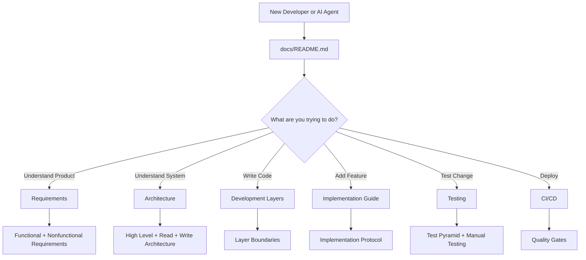
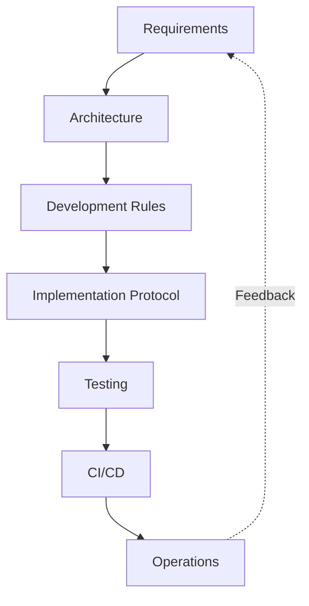

# AEGIS Documentation

## What is AEGIS?

AEGIS is the AI Evaluation, Reliability & Observability severity/verification control plane. It answers a single question: **Is this AI system actually good, safe, reliable, and not getting worse over time?** AEGIS measures and verifies AI systems rather than building them. Ancient builds and runs AI systems; AEGIS measures and verifies them.

AEGIS is not another LLM framework, not an LLM gateway, not a RAG framework, not a generic observability platform, and not a model training or serving platform. It is a software-engineering-grade testing and reliability discipline applied to probabilistic AI: LLM applications, RAG pipelines, agents, multi-agent systems, classifiers, extraction systems, and multimodal applications.

## What Problem Does It Solve?

Probabilistic AI systems lack the reproducibility, provenance tracking, regression detection, safety gating, and evidence-based verdicting that established software engineering provides for deterministic systems. AEGIS introduces:

- **Reproducibility** through versioned experiments, datasets, evaluators, and target configurations.
- **Provenance** through an evidence graph that traces every score back to its configuration, evaluator, judge model, and dataset version.
- **Regression detection** through per-test and aggregate comparison across target versions.
- **Safety gates** through blocking and advisory metrics, non-compensatory policy logic, and deployment gates.
- **Evidence-based verdicts** through the central rule: **No score without evidence.**

## What is AEGIS NOT Responsible For?

| Concern | AEGIS Does Not... |
|---|---|
| Building AI systems | build agents, LLMs, or RAG pipelines |
| Routing inference | serve as an LLM gateway or proxy |
| Framework integration | replace any AI framework |
| Generic telemetry | function as a non-AI observability platform |
| Model lifecycle | train, fine-tune, or serve models |

AEGIS evaluates and verifies. That is all.

## Conceptual Architecture

AEGIS is organized into three planes:

- **Control Plane**: Projects, Targets, Policies, Datasets, Experiments, Evaluators.
- **Execution Plane**: Test Runner, Sandbox, Target Adapter, Tool Sandbox, Memory Sandbox.
- **Evidence Plane**: Traces, Artifacts, Results, Provenance, Audit.

AEGIS is a **modular monolith** built with **FastAPI**, backed by **PostgreSQL** for metadata, **Redis** for queue and caching, and **Object Storage** for large artifacts. The queue is Redis-backed (Celery, Dramatiq, or ARQ), not Kafka initially. Traces follow **OpenTelemetry-compatible semantics**.

## How Does a New Developer Read the Project?

Start at this file. Then follow the recommended reading path below based on what you need to accomplish.

## Recommended Reading Path

1. **Read this file** (`docs/README.md`) to understand what AEGIS is and what it is not.
2. **Read `docs/requirements/README.md`** to understand what the system must do.
3. **Read `docs/requirements/functional-requirements.md`** for the functional requirement areas and attribute template.
4. **Read `docs/requirements/non-functional-requirements.md`** for performance, availability, and reliability targets.
5. **Read `docs/requirements/acceptance-criteria.md`** to understand how feature completion is defined.
6. **Read `docs/requirements/assumptions-and-constraints.md`** for the traceability matrix and architectural constraints.
7. **Read `docs/architecture/`** for high-level and detailed architecture decisions.
8. **Read `docs/development/`** for layer boundaries and implementation protocols.
9. **Read `docs/testing/`** for the test pyramid and manual testing rules.
10. **Read `docs/ci-cd/`** for quality gates and deployment rules.

## Where to Find Things

| What You Need | Where to Look |
|---|---|
| Execution rules for agents and developers | `docs/development/` and `docs/implementation/` |
| Architecture Decision Records | `docs/architecture/architecture-decision-records/` |
| Testing rules and test pyramid | `docs/testing/` |
| CI/CD quality gates | `docs/ci-cd/` |

## Documentation Philosophy

The documentation is not a static description of the code. It is the system that controls how the code evolves. Requirements define intent. Architecture defines boundaries. Development layers define ownership. Implementation guides define change behavior. Tests verify correctness. CI/CD prevents regression. Operations verifies reality.

