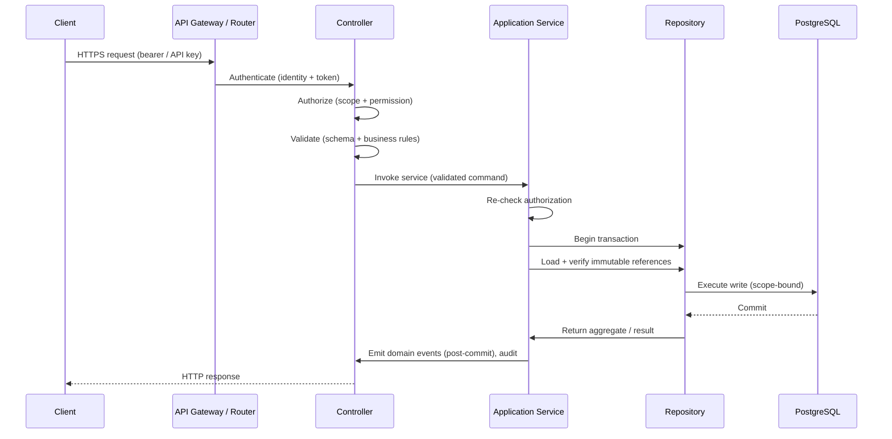

# API Design

This document defines the general rules of the AEGIS API. It is the shared foundation for every resource and operation exposed to clients. Specific behavioral details—error reporting, auth, async execution, versioning, webhooks—are documented in their own files. This document governs URL shape, HTTP semantics, collection querying, the write pipeline, and identity and timestamp conventions.

## Resource-Oriented URLs

The API is organized around resources, not RPC-style verbs. URLs name resources with plural nouns for collections and singular resources beneath them. Versioned entities are modeled as sub-resources.

```text
/organizations/{organization_id}
/organizations/{organization_id}/projects/{project_id}
/projects/{project_id}/targets/{target_id}
/projects/{project_id}/targets/{target_id}/versions/{version_id}
/projects/{project_id}/datasets/{dataset_id}
/projects/{project_id}/datasets/{dataset_id}/versions/{version_id}
/projects/{project_id}/datasets/{dataset_id}/versions/{version_id}/test-cases/{test_case_id}
```

Versioned entities (Target Versions, Dataset Versions, Evaluator Versions) are nested under their parent resource as `versions`. This keeps the read path explicit about which immutable snapshot is being addressed.

## JSON over HTTPS

All requests and responses are JSON (`application/json`) transported over HTTPS. When a client uploads or retrieves large objects in object storage, the API returns signed or pre-authenticated URLs to the object itself; the API response envelope remains JSON.

### Content Negotiation

The API supports content negotiation for response formats:

- `GET` requests accept `application/json` by default.
- `Accept: application/json` returns the canonical JSON representation.
- `Accept: application/problem+json` (or a vendor-specific error content type) returns the standard JSON error envelope when applied to error responses. See `error-contract.md`.
- Clients must include `Content-Type: application/json` on request bodies.

Where OpenAPI-compatible clients require it, `application/*+json` is honored. Unsupported media types produce a `415 Unsupported Media Type` response mapped to `validation_error` or a dedicated code.

## Collection Query Parameters

Every collection endpoint supports a consistent set of query parameters for filtering, sorting, and pagination. They are documented once here rather than repeated per endpoint.

| Parameter | Meaning |
|---|---|
| `cursor` | Opaque pagination cursor returned by the previous page. See `api-conventions.md`. |
| `limit` | Maximum number of items to return. Defaults and maximums per resource; see `api-conventions.md`. |
| `filter` | Filter expression over resource fields. See `api-conventions.md`. |
| `sort` | Sort field and direction. |
| `fields` | Field selection (sparse fields). |

All query parameters are optional except where an endpoint requires a scope such as `project_id` to disambiguate tenancy.

## Create-Read Semantics

Standard life-cycle semantics apply:

- **Create** via `POST` on a collection, with the request body carrying the representation. Successful creation returns `201 Created` with a `Location` header identifying the new resource.
- **Read** via `GET` on a collection (list) or on a single resource (fetch). Singular reads return `200 OK` with the resource representation.
- **Update** via `PATCH` for partial updates of mutable resources. See `api-conventions.md`.
- **Delete** via `DELETE` for resources that are deletable. Immutable resources cannot be deleted.

Immutability is enforced at the application service boundary; the API surfaces the resulting rejection as `immutable_resource`. See `write-architecture.md`.

## Async Pattern for Long-Running Operations

Control-plane reads and creates are synchronous. Experiment execution is long-running and uses the asynchronous pattern defined fully in `async-execution-contract.md`:

```text
POST /experiments/{id}/runs                        → 202 Accepted
                                                      run: { run_id, status, status_url }
GET  {status_url}                                  → 200 OK (Run state)
GET  /executions?run_id={run_id}                   → list of executions
```

The client either polls the status endpoint (with the backoff guidance in `async-execution-contract.md`) or subscribes to webhooks for terminal events. The API never blocks an HTTP request on execution-plane work.

## The Write Pipeline

Every mutating call passes an explicit pipeline. The API layer is the first stage; it must not be the only assurance stage.



The pipeline stages and their obligations:

1. **Authentication** — verify caller identity from a bearer token or scoped API key. Unauthenticated requests are rejected before domain logic runs.
2. **Authorization** — verify the caller's permissions against the target resource and action, scoped to organization and project.
3. **Validation** — validate the payload against schema and business rules before the application service runs.
4. **Application Service** — execute domain logic, enforce invariants, re-check authorization, and coordinate the transaction. It never bypasses validation or authorization.
5. **Transaction** — wrap all database writes in a single atomic transaction; no partial state persists. Immutable resources are read with optimistic locking and a conditional write clause.
6. **Domain Event + Audit** — domain events are emitted only after the transaction commits; every mutation is written to the append-only audit log.

This mirrors `write-architecture.md` exactly. Authorization is re-checked in the application service because transport- or controller-level checks are not trusted alone (`security-architecture.md`).

## Identity and Provenance Conventions

### IDs

- Resource IDs are **UUIDs** (version 4 unless a resource requires a different scheme) and are **unique per tenant** — an ID is only meaningful within its organization, and lookup is always scoped by `organization_id` and `project_id`.
- Executions use **globally unique IDs** generated before the transaction begins and enforced by a database unique constraint, preventing duplicate executions from retries or concurrent submissions (`write-architecture.md`).
- IDs are opaque to clients. Clients must not parse or derive meaning from an ID's structure.

### Timestamps

- All timestamps are **ISO-8601 UTC** (for example, `2026-08-30T12:34:56.789Z`), serialized with a `Z` suffix. No local time or time-zone offset is conveyed by the store.
- Resource representations expose `created_at` and `updated_at` where the resource is mutable. Immutable resources expose `created_at` only.

### Provenance Fields

- Every resource carries ownership and provenance fields: `organization_id`, `project_id`, and `created_by` (the user or service account identity that created it).
- Evidence-producing resources (executions, results) carry references to the Target Version, Dataset Version, Evaluator Version, and Policy Version that produced them, per the "explainable by its configuration" and "no score without evidence" principles in `README.md` and `evidence-architecture.md`.
- A `provenance` object on evidence resources records the source version references and, where applicable, a code/build identity or container image digest.

These conventions are enforced consistently across all resource groups.

## Primary API Groups

The API is organized into the following primary groups. Each group is a top-level collection, nested under the tenant scope indicated. The list below gives the collection path and a one-line description.

| Collection | Example path (after version prefix) | Description |
|---|---|---|
| Organizations | `/organizations` | Tenancy and membership. |
| Projects | `/organizations/{organization_id}/projects` | Team-scoped containers within an organization. |
| Targets | `/projects/{project_id}/targets` | Registered AI systems to evaluate or observe. |
| Target Versions | `/projects/{project_id}/targets/{target_id}/versions` | Immutable configuration snapshots of a target. |
| Datasets | `/projects/{project_id}/datasets` | Versioned evaluation scenario collections. |
| Test Cases | `/projects/{project_id}/datasets/{dataset_id}/versions/{version_id}/test-cases` | Executable scenarios within a dataset version. |
| Experiments | `/projects/{project_id}/experiments` | Reproducible evaluation configurations. |
| Experiment Runs | `/projects/{project_id}/experiments/{experiment_id}/runs` | Asynchronous executions of an experiment. |
| Executions | `/projects/{project_id}/executions` | Internal records of specific invocations. |
| Results | `/projects/{project_id}/results` | Metric results and evidence. |
| Reports | `/projects/{project_id}/reports` | Analysis artifacts (regression, failure, comparison). |
| Policies | `/projects/{project_id}/policies` | Versioned gate and verdict rule sets. |
| Evaluators | `/projects/{project_id}/evaluators` | Versioned evaluation plugins (including evaluator versions). |
| Audit Events | `/organizations/{organization_id}/audit-events` | Append-only mutation records. |

All collections are version-prefixed (`/v1/...`). Collection names are exposed only after an RLS-capable, scope-bound read path exists (see `security-architecture.md`). No endpoint URL is furnished here beyond these collection names; the exact contract is defined by the OpenAPI specs in `openapi/`.
