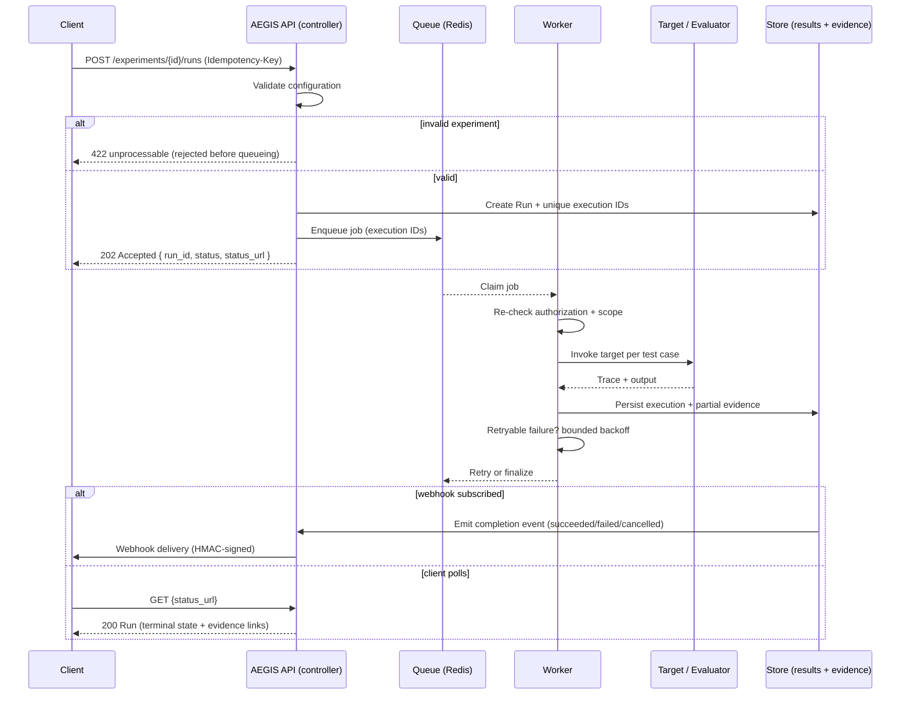

# Async Execution Contract

This document defines the contract for asynchronous experiment execution, satisfying `FR-EXE-01` (execute experiments asynchronously). It covers the request/response flow, the Run and Execution resource representations, terminal states, idempotency, and listing. It is the API complement to `docs/architecture/execution-architecture.md` and `docs/architecture/failure-architecture.md`.

## Overview

Running an experiment is long-running work: it can involve thousands of network calls to the target and to evaluators. The API therefore executes experiments asynchronously against a worker pool. The client submits a run, receives a `202 Accepted` with a run identity and status endpoint, and then either polls or subscribes to webhooks for the terminal state.

## Flow

### Submit

```text
POST /v1/projects/{project_id}/experiments/{experiment_id}/runs

RequestBody: { ... execution settings, variant selection ... }
```

- The request is validated before it is queued. An invalid experiment — one whose configuration violates invariants, references missing versions, or is semantically invalid — is rejected with `422 Unprocessable Entity` mapped to `unprocessable` **before any work is queued** (`error-contract.md`).
- A valid submission returns `202 Accepted` with the Run representation and a `status_url`.
- Executions receive globally unique IDs at creation, enforced by a unique constraint, so duplicate or concurrent submissions never create duplicate executions (`write-architecture.md`, `FR-EXE-05`).

### Status and Polling

```text
GET {status_url}
GET /v1/projects/{project_id}/executions?run_id={run_id}
```

- `GET {status_url}` returns the current Run state.
- Polling guidance: clients should poll infrequently (for example, exponential backoff up to a documented ceiling) and prefer webhooks where low latency matters. Excessive polling is subject to rate limiting (`api-conventions.md`).
- The Run representation includes the `status_url` and `next_cursor`-style pagination for the executions list where applicable.

### Subscription (Preferred for Long Flows)

Clients that want push delivery subscribe to completion events via webhooks (`webhooks.md`). Webhooks are the preferred delivery mechanism for long async flows; polling is the fallback.

## Terminal States

A Run terminates in exactly one of three distinguishable states:

| State | Meaning |
|---|---|
| `succeeded` | All configured test cases completed and evaluation, evidence, and verdict were finalized successfully. |
| `failed` | The run reached a terminal failure. No retry path remained, retries were exhausted, or the failure was non-retryable/deterministic. |
| `cancelled` | The run was cancelled by an identity (user or operator) at a time. Distinct from `failed`. |

- **`failed` and `cancelled` MUST be distinguishable.** This aligns with `failure-architecture.md`: cancelled work is not counted as a failure in reporting.
- A `failed` run records the failure class and error details.
- A `cancelled` run records the cancelling identity and time, and preserves the results of any completed test cases.

### Partial Evidence on Failure

On a failure path where an execution fails partway, the completed portion of evidence is preserved and written durably before the failure is recorded. Evidence is never silently dropped. The `evidence_summary` on the Run reflects what was completed. This honors `failure-architecture.md` ("no score without evidence" on failure paths) and `FR-EVD-03`.

### Internal State Machine

Internally a Run traverses `queued`, `running`, `retrying` (with bounded backoff), and potentially `partial`, before reaching a terminal state. This is fully specified in `failure-architecture.md`; the API surfaces the coarse terminal states (`succeeded`, `failed`, `cancelled`) plus the observable in-progress states (`queued`, `running`, `retrying`, `partial`).

## Run Resource Representation

The Run is the user-facing unit of asynchronous execution. A Run may encompass one or more Executions (for example, across experiment variants or A/B comparisons).

```text
Run
├── id                    (UUID, unique per tenant)
├── status                (queued | running | retrying | partial | succeeded | failed | cancelled)
├── config_snapshot
│   ├── target_version_id
│   ├── dataset_version_id
│   ├── evaluator_version_ids   (list)
│   └── policy_version_id
├── created_by            (user or service account identity)
├── created_at            (ISO-8601 UTC)
├── started_at
├── finished_at
├── status_url
├── evidence_summary      (partial evidence preserved on failure/cancellation)
├── executions            (links to the executions for this run)
└── error                 (present when status is failed)
```

- `config_snapshot` is a set of version references pinning exactly what this run evaluated. The references are immutable snapshots (`Target Version`, `Dataset Version`, `Evaluator Versions`, `Policy Version`), which guarantees reproducibility and the "explainable by its configuration" principle (`README.md`).
- `evidence_summary` reports completed evidence coverage and, on failure or cancellation, indicates the partial evidence that was preserved.

### Execution Resource

The Execution is the internal record of a specific invocation within a Run. It records the actual invocation of a target against a specific test case within the experiment context (`write-architecture.md`). Executions are linked from the Run and are scope-bound.

```text
Execution
├── id                    (globally unique UUID)
├── run_id
├── test_case_id
├── target_version_id
├── dataset_version_id
├── status
├── created_at
└── trace / evidence links
```

An Execution cannot exist without a valid Experiment, Target Version, and Dataset Version (`write-architecture.md`).

## Idempotency

- **Retries and duplicate submits must not duplicate side effects** (`FR-EXE-05`, `failure-architecture.md`).
- Clients supply an `Idempotency-Key` on the submit (`api-conventions.md`). Replaying the same key returns the original Run without creating a new one.
- Independently of client idempotency, execution IDs are globally unique and enforced at the database level, so a retried or redelivered job checks its execution ID and idempotency key before creating records or external effects. If the work already completed, the retry is skipped.
- Deterministic failures are not retried (`failure-architecture.md`): retrying them reproduces the same result and wastes resources.

## Listing Executions

- `GET /v1/projects/{project_id}/executions` lists executions with cursor-based pagination (`api-conventions.md`).
- Executions can be filtered by `run_id`, `status`, dates, and other scope-bound fields.
- Cursor pagination is used because executions can be a large collection; page-based pagination is discouraged.

## Sequence Diagram



## Error and Retryability Mapping

- Client errors (invalid configuration, unauthorized, forbidden) are `4xx` and are not retried.
- Server and transient failures are `5xx` and retryable with backoff; `429` signals rate limiting.
- Queue-unavailable returns `503` with a retryable code so a resubmission can succeed once the queue recovers (`error-contract.md`, `failure-architecture.md`).
- Retryability of the underlying job is classified in the failure architecture; the API surfaces the terminal outcome to the client.

## References

- `FR-EXE-01` through `FR-EXE-07` in `docs/requirements/functional-requirements.md`.
- `docs/architecture/execution-architecture.md` and `docs/architecture/failure-architecture.md`.
- `docs/architecture/write-architecture.md` (unique execution IDs, idempotency, immutability).
- `webhooks.md` (preferred delivery) and `api-conventions.md` (pagination, idempotency keys, rate limiting).
