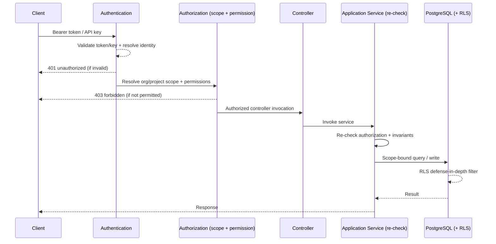

# Authentication and Authorization

This document defines how clients authenticate to the AEGIS API and how their permissions are authorized across every layer. It is the API-facing complement to `docs/architecture/security-architecture.md`; that document is the authoritative statement of the security model. This document focuses on the request path and the API surface.

## Authentication

AEGIS authenticates two identity classes (per `security-architecture.md`):

- **Users**: human identities authenticated through the identity provider (OAuth2 / OpenID Connect).
- **Service accounts**: non-human identities for CI/CD and automated evaluation, authenticated with API keys.

### Bearer Tokens (Users)

- Users authenticate by presenting a bearer token in the `Authorization: Bearer <token>` header.
- Tokens may be JWTs or opaque tokens depending on the identity provider integration. Either way the token is validated (signature, issuer, audience, expiry) before any authorization is attempted.
- User tokens carry the identity and any session context needed to resolve organization, project, and role memberships.

### Service Accounts and API Keys

- Service accounts are the non-human identity type used by CI/CD and automated evaluation clients.
- An API key is issued per service account. Keys authenticate the request and resolve the service account's scope and permissions.

API key properties (from `security-architecture.md` and grilling.md):

- **Scoped**: a key is scoped to organization, project, environment, and target where appropriate.
- **Never global**: no key can access resources outside its scope.
- **Revocable**: a key can be revoked without affecting other keys.
- **Rotatable**: keys support rotation with a documented replacement process.

### Issuance, Rotation, and Revocation

- API keys are issued through the management API by an identity with the appropriate permission (Owner or Admin).
- Issuance records the scope, the permitted target scope, and the permission set, and stores only a hash of the key; the plaintext is returned to the caller once at creation.
- **Rotation**: an administrator or the owning service account can rotate a key. Rotation issues a replacement key and, optionally, invalidates the previous one after a grace period.
- **Revocation**: revocation immediately rejects requests authenticated by the revoked key. Revocation affects only that key.
- The value of a key is never returned again after creation and is never stored or logged in plaintext.

## Authorization

### Permissions Are First-Class

Permissions are modeled explicitly; roles bundle permissions. The API does not treat role names as the source of truth for enforcement. Authorization always resolves the concrete permission required by the action and checks it against the caller's effective permissions within the tenant scope.

### Roles

The initial roles bundle permissions as follows (from `security-architecture.md`):

- **Owner**: Full control of an organization, including billing, tenancy, and membership management.
- **Admin**: Administrative control of projects, including project configuration and member management.
- **Engineer**: Create and run experiments, datasets, targets, and evaluations; can access execution traces.
- **Analyst**: View results, run analyses, and generate reports; cannot modify targets or datasets.
- **Viewer**: Read-only access to dashboards and reports; no raw trace access.

### Enforcement at Every Layer

Authorization is enforced at every layer where the request, job, or record is processed (`security-architecture.md`):

- **API**: every endpoint enforces organization and project scoping and permission checks.
- **Jobs / execution**: queue consumers verify the worker's authorization to execute the job.
- **Storage**: object storage access is gated by authorization; raw trace data is not accessible by default.
- **Telemetry**: trace and telemetry access is authorization-gated.
- **External integrations**: external calls (targets, CI/CD, notifications) are authorized and governed by policy.

Transport-level (API-layer) checks are never trusted alone. Permissions are re-checked in the application service at each layer of processing.

### Tenant Scoping

- Every request resolves an `organization_id` and `project_id` context from the authenticated identity and the requested resource path.
- Every record lookup is scope-bound by `organization_id` and `project_id`. A client cannot reach a record outside its resolved scope even if it knew the record's ID.
- PostgreSQL Row-Level Security (RLS) is a strong candidate and is applied as defense in depth beneath the application checks. RLS alone is not sufficient; authorization is enforced across API, jobs, storage, telemetry, and integrations (`security-architecture.md`).

### Sensitive Data Access

- **Raw traces**: raw trace content can contain prompts, documents, PII, and secrets. Raw trace access requires explicit permission and is audit-logged; it is not granted by default.
- **Gate overrides**: overriding a gate verdict (for example, forcing a deployment through a blocked gate) requires an explicit override permission and records approval context per `security-architecture.md`.
- **Admin visibility**: administrators see data subject to tenant policy and data classification. Administrative visibility is not blanket access (grilling.md, question 95). Data classification categories are `Public`, `Internal`, `Confidential`, `Restricted`, `Regulated` and determine who may access, redaction applied, retention, and audit requirements.

## The Request Authorization Path

- **Authentication** runs first and rejects unauthenticated callers before any authorization or domain logic.
- **Authorization** resolves the tenant scope and the concrete permission for the action; failures return `403 forbidden`.
- The **controller** does not trust its own authorization: the **application service re-checks** the permission and scope before executing domain logic. This re-check is the guarantee that transport-level checks are never the only assurance.
- The **database** applies RLS as defense in depth, constraining the rows the application can read and write even if application logic errs.

## Mapping to the Error Contract

- Missing or invalid credentials produce `401` mapped to `unauthorized`.
- Valid credentials but insufficient permission produce `403` mapped to `forbidden`.
- Rate limiting and abuse controls on repeated authentication failures follow `api-conventions.md` and `error-contract.md`.

## References

- `docs/architecture/security-architecture.md` — the authoritative security model (authentication, authorization, tenant isolation, RLS, role definitions, data classification).
- grilling.md sections on tenancy (IV), security/red team (XIV), and observability (XIX).
- `api-conventions.md` — rate limiting, request IDs, and error consistency.
- `error-contract.md` — `unauthorized` and `forbidden` codes.
