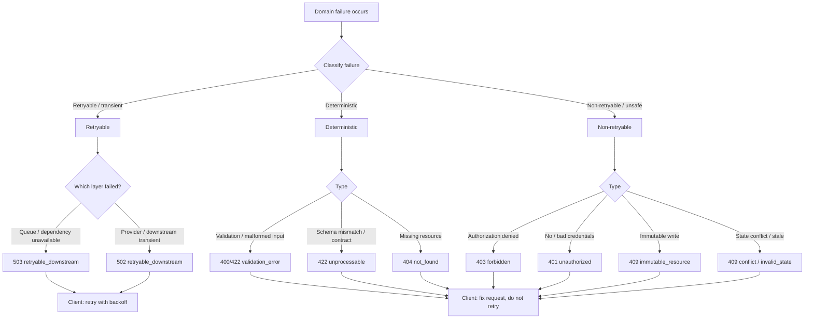

# Error Contract

This document defines the uniform error envelope, the standard error codes, the rules for mapping failures to HTTP responses, and the classification of retryable versus non-retryable errors. It is the API complement to `docs/architecture/failure-architecture.md`, which is the authoritative source of the failure taxonomy and retry policy.

Every API client and SDK must handle errors using the contract in this document. Error handling is a first-class part of the API design: AEGIS must fail predictably even when the caller behaves unpredictably (grilling.md, question 425).

## The Error Envelope

Every error response uses the same JSON envelope:

```text
{
  "error": {
    "code": "...",
    "message": "...",
    "details": { },
    "request_id": "..."
  }
}
```

| Field | Type | Meaning |
|---|---|---|
| `code` | string | Stable, machine-readable error code. Clients branch on this. |
| `message` | string | Human-readable explanation. Never the only contract; may change. |
| `details` | object | Optional structured context (for example, `retryable`, `field`, `resource_id`, `allowed`). |
| `request_id` | string | The request ID that ties the error to server-side logs and observability. |

Rules:

- The envelope is identical across all error responses regardless of status code.
- `code` is the precise, stable classification. The HTTP status is the transport-level classification.
- `request_id` always matches the `X-Request-Id` response header (`api-conventions.md`).
- The envelope never contains a stack trace, internal exception details, or leaks of sensitive data.
- `details` may carry extra context such as `details.retryable`, `details.field`, or `details.attempts`, but must never carry secrets.

## Standard Error Codes

| `code` | HTTP | Meaning |
|---|---|---|
| `validation_error` | 400/422 | Request payload failed schema or business-rule validation. Not retryable. |
| `not_found` | 404 | The requested resource does not exist in the caller's scope. Not retryable. |
| `conflict` | 409 | The request conflicts with the current state (for example, duplicate `Idempotency-Key` reused with a different payload, or a stale `If-Match`). Not retryable. |
| `invalid_state` | 409 | The request is invalid given the resource's current state (for example, running a run that is already terminal). Not retryable. |
| `forbidden` | 403 | The caller is authenticated but lacks permission for the action or scope. Not retryable. |
| `unauthorized` | 401 | Missing or invalid credentials. Not retryable (re-authentication is required). |
| `rate_limited` | 429 | The caller exceeded a rate limit. Retryable after `Retry-After`. |
| `retryable_downstream` | 502/503 | A downstream dependency (queue, provider, storage) failed transiently. Retryable with backoff. |
| `unprocessable` | 422 | The request is semantically invalid for the operation. For experiments, this indicates an invalid experiment that must be rejected before it is queued. Not retryable. |
| `immutable_resource` | 409 | A write was attempted on an immutable resource (Target Version, locked Dataset Version, Experiment snapshot, Evaluator Version, historical Result). Not retryable. |

The canonical set is defined here; the OpenAPI schemas in `openapi/` enumerate the codes returned by each endpoint. Adding a new code requires updating this document and the contract tests.

## Rules

### Never Leak Stack Traces

Error responses never leak stack traces, internal exception messages, or implementation details to clients. Domain errors are mapped to codes in the interface layer, where internal exceptions are translated into the public envelope at the boundary. Only the information required for the client to act is exposed.

### Map Domain Errors to Codes in the Interface Layer

Translation between domain errors (raised by application services) and public error codes happens in the interface/controller layer. Domain/application layers raise typed, internal errors; the controller maps them to the envelope and code. This keeps internal error vocabulary out of the public contract.

### Classify Retryable vs Non-Retryable

Every failure is classified before the system reacts, per `failure-architecture.md`:

- **Retryable**: transient failures that may resolve (network timeouts, provider rate limits, temporary unavailability). Retried subject to the bounded retry policy.
- **Non-Retryable**: failures with no plausible chance of success on retry, or where retry is unsafe (authorization denial, invalid configuration, data corruption).
- **Deterministic**: failures guaranteed to reproduce identically on retry (invalid input, schema mismatch). Usually not retried.

The client-facing signal `details.retryable` reflects this classification where applicable. **Deterministic failures are NOT retried.**

### Queue-Unavailable

When the execution queue is unavailable, a submit that cannot be dispatched returns `503 Service Unavailable` with a retryable code (`retryable_downstream` or a queue-specific subclass). The client can retry the submission with backoff once the queue recovers. This is distinct from a validation failure, which is rejected with `422` before queueing.

### HTTP Status Ranges

- **4xx — client errors**: the request must be corrected by the client; **not retried**. Includes `validation_error`, `not_found`, `conflict`, `invalid_state`, `forbidden`, `unauthorized`, `immutable_resource`, `unprocessable`.
- **429 — rate limited**: the client exceeded a limit; **retryable after `Retry-After`**, per `api-conventions.md`.
- **5xx — server and downstream errors**: **retryable with backoff**. Includes `retryable_downstream` and related transient server failures.

## Error Classification → HTTP Mapping



Every error is logged with its `request_id`, so that any client-visible error can be traced to server-side logs and telemetry (see the observability layer in `docs/development/layers/10-observability-layer.md` and `api-conventions.md` on request IDs).

## Logging

- Every error is logged with its `request_id` (and, where available, the authenticated identity, the tenant scope, the endpoint, and the response code).
- Log messages never contain secret material or raw PII; redaction applies per `security-architecture.md`.
- Logs and telemetry link to the client-facing error through `request_id`, supporting reproduction and incident response.

## References

- `docs/architecture/failure-architecture.md` — failure taxonomy, retry classes, retry policy.
- `docs/architecture/security-architecture.md` — redaction and secrets handling on error paths.
- `api-conventions.md` — request IDs, rate limiting, `Retry-After`.
- `async-execution-contract.md` — how execution-plane failures surface to the client.
