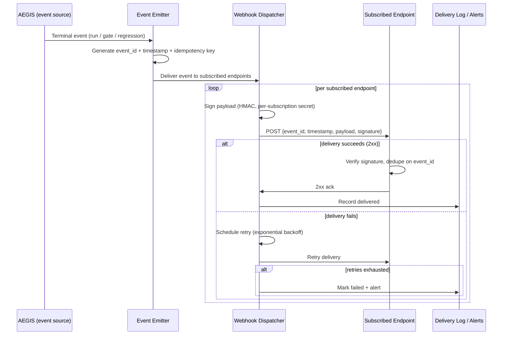

# Webhooks

This document defines the webhook contract for delivering completion and verdict events from AEGIS to external systems. Webhooks deliver events on long-running flows and notifications that asynchronous polling would deliver late: experiment run completion, gate verdicts, and regression detection. Webhooks are the preferred delivery mechanism for these events; polling is the fallback.

## Events Emitted

Webhooks deliver the following event types:

| Event | Meaning |
|---|---|
| `experiment_run.completed` | An experiment run reached `succeeded`. |
| `experiment_run.failed` | An experiment run reached `failed`. |
| `experiment_run.cancelled` | An experiment run reached `cancelled`. |
| `gate.verdict` | A gate was evaluated against a policy and produced a verdict (for example, pass or block). |
| `regression.detected` | Regression analysis detected a regression relative to a baseline. |

The terminal-state transitions are those defined in `async-execution-contract.md`. A `gate.verdict` event is emitted when a policy verdict is computed (`security-architecture.md` notes that gate and policy verdicts must never be stale). The exact event schema and payloads are defined in the OpenAPI specifications under `openapi/`.

## Subscription Resource

Webhook subscriptions are managed as resources.

```text
WebhookSubscription
├── id
├── endpoint       (HTTPS URL)
├── secret         (per-subscription HMAC secret)
├── events         (list of subscribed event types)
├── enabled        (boolean)
├── created_by
├── created_at
└── updated_at
```

- A subscription is scoped to the tenant (organization and project) that owns it.
- The `endpoint` must be an HTTPS URL pointing to a delivery target.
- `events` lists the event types delivered to this endpoint.
- `enabled` controls whether delivery is active without deleting the subscription.

## Signature Verification

Every webhook delivery is signed with HMAC using the subscription's per-subscription secret.

- The delivery request includes a signature header carrying the HMAC of the raw payload computed with the subscription secret.
- A stable algorithm and timestamp format are documented in the OpenAPI spec and contract tests; recipients MUST verify the signature and reject unsigned or invalidly signed deliveries.
- The signature is bound to the exact payload delivered; any payload tampering invalidates the signature.
- Recipients are expected to store the per-subscription secret at subscription creation and use it to verify every delivery.

### Secret Rotation

- Per-subscription secrets support rotation. Rotating a secret issues a new value; deliveries switch to the new secret and the old one is retired.
- Rotation follows the documented process so recipients can update their stored secret without losing deliveries.
- The plaintext secret is returned once at creation/rotation and is never stored or logged in plaintext (`security-architecture.md`).

## Delivery Retry

Delivery of a webhook is subject to bounded, exponential backoff:

- A failed delivery (non-2xx response or network error) is retried.
- Retries use exponential backoff with jitter (as in `failure-architecture.md`) up to a configured maximum number of attempts.
- After the maximum attempts are exhausted, the event is marked as not delivered and surfaced for investigation (for example, through the failed-delivery log and an alert). Delivery is never retried indefinitely.
- Webhook delivery retries are distinct from request retryability on the API; the webhook delivery retry policy is documented here and in the OpenAPI spec.

## Ordering Guarantees

- Ordering is **best-effort per event**, not strictly ordered across an event stream.
- Every event carries an `event_id` and a `timestamp`.
- Because ordering is best-effort, recipients MUST use `event_id` and `timestamp` to deduplicate and, where order matters, to reconcile rather than assuming arrival order.
- A client should treat each event as independently verifiable and idempotent.

## Idempotent Event Delivery

- Every event includes an `event_id` (globally unique) and an idempotency key derived from the event identity.
- Delivery is idempotent: a recipient may receive the same event more than once (for example, after a retry). The recipient should deduplicate on `event_id`.
- The event idempotency semantics mirror the idempotency guarantees of the underlying operations (`FR-EXE-05`, `api-conventions.md`); an event is never re-emitted with the same `event_id` unless it is a legitimate delivery retry.

## Security

Webhooks follow strict security requirements:

- **HTTPS only**: subscription endpoints must be HTTPS. The API never delivers to non-HTTPS endpoints.
- **Endpoint allowlist**: by default, deliveries are allowed only to registered/allowlisted endpoints or endpoint patterns, configurable per tenant. Unknown endpoints are rejected at subscription creation or delivery.
- **HMAC verification** (above).
- **Secret rotation** (above): secrets never appear in logs, payloads, or URLs.
- **Payload integrity**: the signed payload is the exact body delivered; recipients verify integrity via the signature.

## Relationship to Polling

- **Webhooks are preferred** for long asynchronous flows (experiment runs) and active notifications (gate verdicts, regression detection), because they avoid the latency and load of polling.
- **Polling is the fallback**: a client that cannot or does not subscribe uses the status endpoint and execution listing described in `async-execution-contract.md`.
- Both paths converge on the same terminal state and evidence links, so a client can safely mix them: subscribe for push, and poll as a reconciliation/fallback. Deduplication on `event_id` (webhooks) and stable run state (polling) keep the two paths consistent.

## Sequence Diagram



## References

- `async-execution-contract.md` — the terminal states and run lifecycle the events report.
- `api-conventions.md` — rate limiting, request IDs, and error consistency (webhook deliveries carry request IDs too).
- `docs/architecture/failure-architecture.md` — bounded retry, exponential backoff with jitter.
- `docs/architecture/security-architecture.md` — secrets management, HMAC, HTTPS, authorization on delivery paths.
- `openapi/README.md` — event schemas and subscription endpoints.
