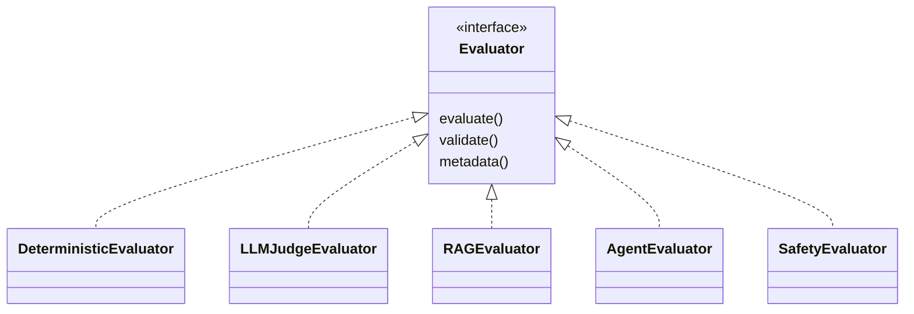

# ADR-004: Evaluator Plugin Isolation - Status: Accepted

## Status

Accepted

## Date

2026-08-30

## Context

AEGIS evaluates AI systems with many kinds of metrics: deterministic (JSON validity,
exact match, tool accuracy, latency, cost), semantic (similarity, relevance, using
embedding models), and LLM-as-judge (quality, helpfulness, reasoning). The product
direction in `grilling.md` is categorical that metrics must not be hard-coded:

- Q36: "Should metrics be hardcoded?" — **No.**
- Q37: "Should metrics be plugins?" — **Yes.**

Evaluators are themselves versioned, fallible dependencies. They are not objective
truth; an LLM judge produces evidence and confidence, not metaphysical certainty
(Q17, Q18, Q49, Q72). Consequently each score must preserve how it was generated
(Q50: "Score + evidence + evaluator + uncertainty/provenance"), which means carrying
evaluator identity, evaluator version, judge model, and judge prompt version
(Q42-Q44, Q248-Q249). Evaluators may be third-party frameworks (DeepEval, Ragas)
integrated as adapters rather than being re-implemented (Q28-Q31).

Because evaluators run arbitrary logic and, in the LLM-judge case, invoke external
models and probabilistic computations, they cannot be trusted to run inside the control
plane: a failing or misbehaving evaluator must not crash the Control Plane or corrupt
its invariants. This mirrors the isolation rationale for untrusted execution
(grilling.md Q68-Q70).

## Decision

Evaluators are **plugins** behind a stable evaluator interface and are executed in
**isolation** (a separate process or RPC boundary), never imported directly into the
control plane.

The evaluator interface is contract-tested and stable. Every evaluator implements:

- `evaluate()` — produce a `MetricResult` from an execution and context.
- `validate()` — validate evaluator configuration and input requirements before use.
- `metadata()` — expose evaluator identity, version, required inputs, and category.

Because an LLM judge is not objective truth, LLM-judge evaluators must additionally
return, with each result: a confidence value, the evaluator identity and version, and
the judge prompt version. This provenance is what makes a score defensible and
reproducible (Q41-Q44, Q248-Q249).

Third-party frameworks (DeepEval, Ragas) are supported as adapters behind the same
interface, keeping the AEGIS domain model as the single source of provenance truth
while reusing established metric implementations (Q28-Q31).

## Consequences

### Positive

- **Strong isolation.** A crashing, looping, or misbehaving evaluator cannot take down
  the control plane or corrupt shared state.
- **Independent versioning and shipping.** Evaluators can be added, fixed, and released
  without redeploying the control plane.
- **Failure containment and per-evaluator scaling.** Resource-hungry evaluators (for
  example, LLM judges) can be isolated and scaled independently.
- **Third-party integration.** DeepEval, Ragas, and future frameworks are wrapped as
  adapters without forcing their internal assumptions onto the domain model.

### Negative

- **IPC/RPC contract to maintain.** The isolation boundary introduces a serialization
  and transport contract that must be defined, versioned, and contract-tested so that
  evaluators and the control plane evolve without breaking each other.
- **Operational overhead.** Running evaluators in separate processes adds process
  management, lifecycle, and deployment surface compared to in-process imports.
- **Latency and complexity.** Every evaluation crosses a process boundary, slightly
  increasing latency and adding a failure mode to manage.

## Alternatives Rejected

- **Import evaluators directly into the control plane** — a failing evaluator could
  crash the Control Plane and break the isolation that untrusted logic requires.
- **Hard-code metrics into the engine** — explicitly rejected by grilling.md Q36-Q37;
  prevents the plugin architecture and third-party adapters.

## When to Revisit

Revisit when the number of evaluators explodes and the isolation overhead outweighs the
benefit, or when in-process execution becomes safe enough for the deterministic-only
evaluators (which carry no probabilistic judge risk). Deterministic evaluators are the
first candidates for a relaxation, but the isolation boundary must be retained for
LLM-judge and other risk-bearing evaluator categories.

## Linked Documents

- grilling.md Q36-Q50 (plugin metrics, evaluator identity and provenance), Q68-Q70
  (isolation rationale), Q248-Q249 (judge model comparison)
- README.md §7, §8 (evaluator interface, metric categories)
- docs/requirements/functional-requirements.md FR-EVL-01, FR-EVL-02, FR-EVL-07
- docs/architecture/component-architecture.md
