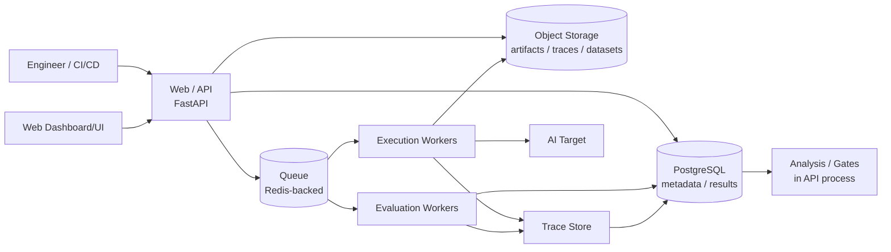

# Container Architecture

This document is the C4 container view of AEGIS: the deployable/runnable units of the modular monolith. A container is a process or data store that can be run, scaled, and deployed. Because AEGIS is a modular monolith, several of these containers are packaged together initially; others must remain separable.

## Containers

- **Web/API** — the FastAPI control-plane surface.
- **Asynchronous Workers** — execution workers and evaluation workers that run in the Execution Plane.
- **Queue Infrastructure** — the Redis-backed job queue.
- **PostgreSQL** — metadata and results.
- **Object Storage** — artifacts, traces, and datasets.
- **Trace Store** — OpenTelemetry-compatible traces.
- **Web Dashboard/UI** — an optional initial or later browser interface over the API.

## Container Diagram

The Execution Plane (execution workers and evaluation workers, plus the queue and target adapters) is packaged separately from the Control Plane (Web/API). The web dashboard, if present, is a separate deployable that talks only to the API.

## Container Details

### Web / API (FastAPI)
- **Responsibility**: The authoritative control-plane surface: Projects, Targets, Datasets, Experiments, Reports, and Policies.
- **Primary Technology**: FastAPI over PostgreSQL metadata, publishing jobs to the queue.
- **How It Scales**: Horizontally scalable, stateless HTTP processes; scales with request concurrency.
- **Failure Behavior**: Fail-closed when dependencies (PostgreSQL) are unavailable; requests cannot bypass authorization.
- **Layer(s) Implemented**: Control Plane authority (interface, application, domain).

### Asynchronous Workers
- **Responsibility**: Execution workers invoke targets, collect traces, and persist executions; evaluation workers run the evaluation fabric and produce metric results.
- **Primary Technology**: Worker processes consuming the Redis-backed queue.
- **How It Scales**: Horizontally scalable worker pool, independent of the API, scaling with target I/O and evaluation load.
- **Failure Behavior**: Bounded retries with exponential backoff, mandatory timeouts, cooperative cancellation plus hard timeouts; targets that crash, time out, loop, or consume resources are contained here.
- **Layer(s) Implemented**: Execution Plane (execution, evaluation, target adapters).
- **Isolation requirement**: Execution workers must be isolated from the Control Plane. Targets are untrusted and can crash, time out, loop, or consume resources (grilling.md), so workers never run inside the API process and cannot modify policy definitions.

### Queue Infrastructure
- **Responsibility**: Buffers and distributes work from the Control Plane to the Execution Plane.
- **Primary Technology**: Redis-backed queue (Celery, Dramatiq, or ARQ).
- **How It Scales**: Scales with worker concurrency and queue throughput.
- **Failure Behavior**: Queue outages stall dispatch; jobs are retryable and idempotent where possible.
- **Layer(s) Implemented**: Execution Plane boundary.

### PostgreSQL
- **Responsibility**: Stores metadata, results, configuration, and evidence-graph links.
- **Primary Technology**: PostgreSQL.
- **How It Scales**: Vertically initially; read replicas and partitioning as results grow.
- **Failure Behavior**: Unavailability causes the Control Plane to fail closed; results remain durable and immutable.
- **Layer(s) Implemented**: Evidence Plane and Control Plane persistence.

### Object Storage
- **Responsibility**: Stores large artifacts, datasets, trace payloads, and reports.
- **Primary Technology**: Object storage (S3-compatible).
- **How It Scales**: Scales in capacity independently; content-addressed for deduplication.
- **Failure Behavior**: Outage limits artifact/trace access but metadata remains queryable.
- **Layer(s) Implemented**: Evidence Plane persistence.

### Trace Store
- **Responsibility**: Stores OpenTelemetry-compatible execution traces of model calls, retrieval, tools, memory, and agent execution.
- **Primary Technology**: OpenTelemetry-compatible trace model on object storage plus PostgreSQL metadata.
- **How It Scales**: Scales with execution volume; evaluation traces are normally unsampled.
- **Failure Behavior**: Storage loss or privacy leakage are the main risks; redaction is applied before storage.
- **Layer(s) Implemented**: Evidence Plane.

### Web Dashboard/UI
- **Responsibility**: A browser interface over the API for engineers to view results, evidence, traces, and reports.
- **Primary Technology**: A separate frontend (e.g., Next.js) that talks only to the API.
- **How It Scales**: Scales as a static/edge-served frontend.
- **Failure Behavior**: If unavailable, the API and evaluation continue to operate; the UI never has direct database access.
- **Layer(s) Implemented**: Interface over the Control Plane.

## Packaging Within the Modular Monolith

Initially the modular monolith packages together the Control Plane containers: the Web/API, its services, PostgreSQL metadata access, and the queue client, all in one deployable with strict internal module boundaries (ADR-001). Redis and object storage are supporting infrastructure.

The containers that must remain separable are the Execution Plane workers. Because targets are untrusted and can crash, time out, loop, or consume resources, execution workers and evaluation workers are deployed and scaled independently from the Control Plane. The queue is the explicit contract between them.

The Dashboard/UI is a separate, optional container so that it can be introduced later without coupling to the API process.
