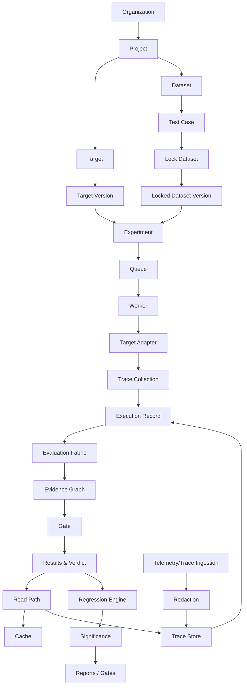

# Data Flow Architecture

This document describes the canonical end-to-end data flows in AEGIS. Each flow is defined by its purpose, trigger, steps, data touched, guarantees, failure points, and authorization points.

---

## Overall Data Flow Diagram



---

## 1. Registration Flow

**Purpose**: Establish the configuration surface for evaluation: organization, project, target, target version, dataset, test cases, and dataset lock.

**Trigger**: An administrator or engineer provisions resources.

**Steps**:

1. Create Organization.
2. Create Project within the organization.
3. Register Target within the project.
4. Create Target Version (immutable snapshot of the AI system's configuration).
5. Create Dataset (unlocked, mutable).
6. Add Test Cases to the dataset.
7. Lock the Dataset.

**Data touched**: Organization, Project, Target, Target Version, Dataset, Test Case records. All records carry organization and project ownership fields.

**Guarantees**: Target Versions are immutable once created. Dataset Versions become immutable after lock. Registration writes are atomic within the write pipeline (AUTH -> AUTHZ -> VALID -> APP -> TX -> DB -> EVENT -> AUDIT).

**Failure points**: Invalid configuration, missing permissions, duplicate target/version creation.

**Authorization points**: Organization membership for org-level creation; project membership for project-level creation; Engineer role required for dataset lock.

---

## 2. Write Flow (Create / Mutate)

**Purpose**: Persist new or changed domain records.

**Trigger**: A user, service account, or worker creates or mutates a record.

**Steps**: Follow the write pipeline in docs/architecture/write-architecture.md:

```text
AUTH -> AUTHZ -> VALID -> APP -> TX -> DB -> EVENT -> AUDIT
```

**Data touched**: Any mutating write. All writes wrap multiple related records in a single atomic transaction.

**Guarantees**: Atomicity (all-or-nothing transactions), immutability for immutable resources, idempotency keys for external effects, audit trail for every mutation.

**Failure points**: Invariant violations, concurrency conflicts on immutable resources, transaction rollback.

**Authorization points**: Caller identity, resource-scoped permissions, and approval checks where required.

---

## 3. Execution Flow

**Purpose**: Run an experiment against a target and produce scored results.

**Trigger**: An experiment is created and submitted for execution.

**Steps**:

1. Experiment -> Queue (asynchronous job).
2. Queue -> Worker.
3. Worker -> Target Adapter (invokes the AI system).
4. Target Adapter -> Trace Collection.
5. Evaluation Fabric computes metrics over the execution.
6. Results -> Evidence Graph.
7. Gate evaluates policy over the aggregated results.

**Data touched**: Experiment, Execution, Target invocation output, Trace, Metric Results, Evidence, Verdict.

**Guarantees**: At-least-once delivery with idempotency (no duplicate side effects), bounded retries, mandatory timeouts, failure containment.

**Failure points**: Target crash/timeout/loop, provider outage, queue unavailability, worker failure. Partial results are preserved on failure.

**Authorization points**: Execution permission on the experiment; target invocation authorization; gate evaluation runs under the experiment's policy scope.

---

## 4. Read Flow

**Purpose**: Serve results, metrics, traces, and reports to users.

**Trigger**: A user or service request queries experiment results or dashboard data.

**Steps**:

1. API receives the query.
2. Cache is checked for a cached summary.
3. On cache miss, PostgreSQL is queried for experiment metadata.
4. Trace summaries are fetched from the trace store.
5. Response includes data plus provenance.

See docs/architecture/read-architecture.md for the full read flow and caching model.

**Data touched**: Experiment metadata, aggregate summaries, metric results, trace summaries/full traces.

**Guarantees**: Cursor-based pagination for large result sets, historical immutability (stable reads over historical data), cache invalidation on evaluator/model version change.

**Failure points**: Cache miss latency, trace store retrieval cost, authorization rejection.

**Authorization points**: Organization and project scoping; raw trace access requires Engineer-level or explicit authorization.

---

## 5. Ingestion Flow

**Purpose**: Ingest target telemetry and traces (OpenTelemetry-compatible) into AEGIS.

**Trigger**: A target system emits telemetry through the SDK, OpenTelemetry collector, webhook, or trace ingestion endpoint.

**Steps**:

1. Telemetry/traces are ingested.
2. PII redaction is applied before storage.
3. Traces are stored in the trace store (object storage).
4. Traces are linked to the relevant executions.

**Data touched**: Trace spans, token usage, latency, cost, tool calls, retrieval events, memory events. Content capture is configurable for privacy.

**Guarantees**: Redaction before storage (FR-TRC-04), secret detection and redaction (FR-TRC-05), evaluation traces normally not sampled, production telemetry supports sampling.

**Failure points**: Ingestion overload, redaction misses, trace store unavailability.

**Authorization points**: Ingestion is authenticated via service accounts or API keys scoped to project and environment.

---

## 6. Analysis / Regression Flow

**Purpose**: Detect regressions, cluster failures, and report significance across experiment or target versions.

**Trigger**: An experiment completes, or a user requests a comparison report.

**Steps**:

1. Results -> Regression Engine.
2. Per-test and aggregate comparison across target versions.
3. Statistical significance testing where sample sizes permit.
4. Reports and gate verdicts generated.

**Data touched**: Metric results from baseline and candidate experiments, per-test comparison data, slice-level breakdowns, gate policy definitions.

**Guarantees**: Non-compensatory logic (safety failures cannot be masked by quality improvements), gate verdicts recorded with evidence, regression signals are traceable to specific tests.

**Failure points**: Insufficient sample size for significance, missing baseline, policy evaluation errors.

**Authorization points**: Report and comparison access gated by project membership; gate overrides require approval and are audit-logged.
