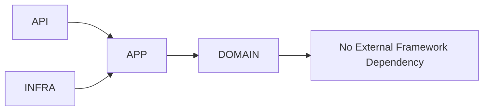

# Development Architecture

This document describes the layered **source** structure of the AEGIS codebase and the rules that govern it. The layer boundaries are documented in detail in `docs/development/layers/`; this page defines the numbering, the dependency direction rule, and how to place a new file.

## Layer Numbering

The source tree is organized into numbered layers, each documented under `docs/development/layers/`:

- **00-system-boundaries** — the boundary of the system and what may never be crossed.
- **01-domain** — the domain model and core entities (Target, Target Version, Dataset, Test Case, Experiment, Execution, Trace, Metric Result, Evaluator, Policy/Gate).
- **02-application** — application/orchestration services that use the domain.
- **03-interface** — the API surface (FastAPI) and external interface contracts.
- **04-infrastructure** — adapters for PostgreSQL, Redis, object storage, and other infrastructure.
- **05-execution** — the execution engine and target adapters.
- **06-evaluation** — the evaluation fabric and its evaluator plugins.
- **07-analysis** — regression, failure clustering, comparison, and statistical analysis.
- **08-policy-and-gates** — policies and release gates.
- **09-evidence** — the evidence graph, results, provenance, and traces.
- **10-observability** — telemetry of the system itself and AI traces.
- **11-security** — authentication, authorization, tenancy, and classification.

## One-Line Purpose of Each Layer

- **00-system-boundaries**: Defines what is inside, outside, and never directly accessible.
- **01-domain**: The pure domain model and core entities, free of external concerns.
- **02-application**: Use cases and orchestration that apply the domain.
- **03-interface**: The external surface that translates requests into application calls.
- **04-infrastructure**: Implementations of interfaces against external technology.
- **05-execution**: Scheduling and running work against targets.
- **06-evaluation**: Computing metric results from executions and traces.
- **07-analysis**: Turning results into regression, failure, and comparison insights.
- **08-policy-and-gates**: Turning evidence into pass/warn/block/defer decisions.
- **09-evidence**: The immutable record and provenance that underpin every score.
- **10-observability**: Telemetry for operating AEGIS and for AI traces.
- **11-security**: Authentication, authorization, tenancy, and classification.

## Dependency Direction Rule

Dependencies flow toward the domain. The interface layer calls the application layer, the application layer calls the domain layer, and infrastructure implements interfaces and depends upward only (toward the interfaces and domain, never inward into a concrete dependant).

The execution, evaluation, analysis, policy/evidence, and security layers are specialization layers over application and infrastructure: they implement interfaces and call the application layer, never skipping it. Observability and security are **cross-cutting**: they may be applied at any layer but introduce no domain dependency.

**No layer may reach across to a non-neighboring layer without an ADR.** This is the central structural rule. A jump from the interface straight to infrastructure, or from execution straight to policy authority, requires a recorded, justified decision in `docs/architecture/architecture-decision-records/`.

## Domain Code Has No Framework Imports

Code in the **domain layer** has **no framework imports**. It must not import HTTP, SQL, Redis, FastAPI, Django, Celery, or any provider SDK. The domain model is pure business logic and entities so that it can be tested, reasoned about, and preserved without coupling to technology. Framework concerns belong to the interface, application, and infrastructure layers; domain code depends on nothing external.

## Deciding Which Layer a New File Belongs To

Apply this decision procedure:

1. **Does the code define what the system can and cannot do, or a core entity?** If it is pure domain logic about entities and invariants, with no external technology, place it in **01-domain**. It must have no framework imports.
2. **Does it orchestrate a use case using the domain?** Place it in **02-application**.
3. **Does it expose or accept input/output on the boundary (HTTP, SDK, dashboard)?** Place it in **03-interface**.
4. **Does it talk to a specific technology (PostgreSQL, Redis, object storage, an LLM provider)?** Place it in **04-infrastructure** as an implementation of an interface; it depends upward only.
5. **Does it schedule or run work against targets?** Place it in **05-execution**.
6. **Does it compute a metric or score?** Place it in **06-evaluation**.
7. **Does it interpret results (regression, failure, comparison)?** Place it in **07-analysis**.
8. **Does it make a pass/warn/block/defer decision?** Place it in **08-policy-and-gates**.
9. **Does it produce or maintain the immutable record, provenance, or traces?** Place it in **09-evidence**.
10. **Does it instrument the system itself or carry AI telemetry?** Place it in **10-observability**.
11. **Does it enforce identity, authorization, tenancy, or classification?** Place it in **11-security**.
12. **Does it define or transform the system boundary?** Place it in **00-system-boundaries**.

If a file would cross more than one non-neighboring layer, split it into the correct layers rather than compressing it. If splitting is impossible and the rule must be broken, record an ADR.

## Relationship to the Planes

This source layout is the coding-time expression of the runtime planes:

- The **Control Plane** is realized by the domain (01), application (02), interface (03), and policy & gates (08) layers, plus security (11) and the control-plane parts of infrastructure (04).
- The **Execution Plane** is realized by the execution (05) and evaluation (06) layers and their infrastructure adapters, kept isolated from the control plane.
- The **Evidence Plane** is realized by the evidence (09) layer, the trace infrastructure (04), and the parts of analysis (07) that read from it.

Observability (10) and security (11) are cross-cutting and apply to all planes. The dependency rule — always toward the domain, never across non-neighboring layers without an ADR — is what keeps the authority, isolation, and evidence integrity of the three planes intact in the code that implements them.
