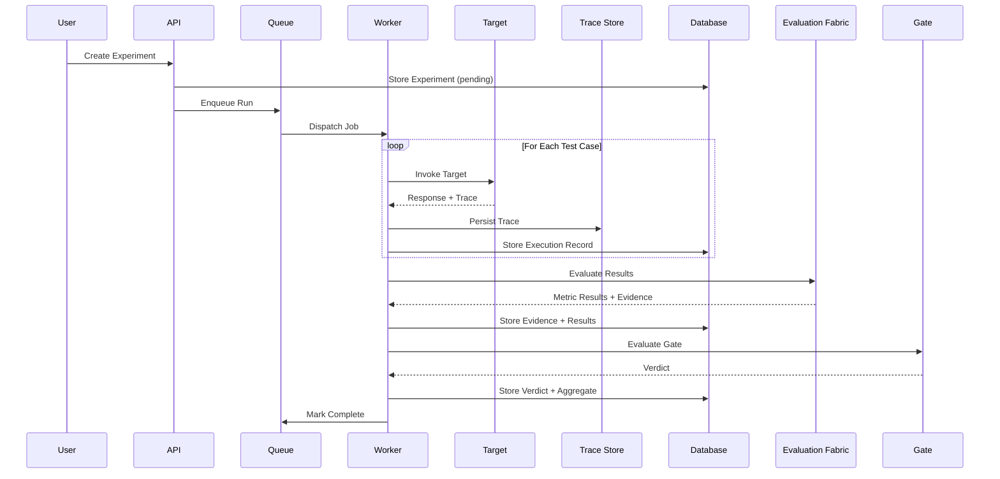

# Execution Architecture

## Asynchronous Execution

AEGIS executes experiments asynchronously. Large evaluation runs involve thousands of network calls to target systems, evaluator invocations, and trace collection. Synchronous execution would block API responses for minutes or hours. The execution engine decouples request submission from result production.

---

## Lifecycle

The execution lifecycle follows this sequence:



---

## Execution Engine Responsibilities

### Job Scheduling

The execution engine receives experiment requests through the API and enqueues them as jobs. Each job contains a complete snapshot of the experiment configuration: target version, dataset version, evaluator versions, execution settings, and timeout constraints. The job is dispatched to a worker from the queue.

Workers pull jobs from the queue and execute them. The queue provides at-least-once delivery. Workers are horizontally scalable: multiple workers consume from the same queue, and jobs are distributed across available workers.

### Worker Lifecycle

A worker process:

1. Claims a job from the queue.
2. Loads the experiment configuration from the job payload.
3. Iterates over test cases in the dataset.
4. For each test case: invokes the target, collects the trace, persists the execution record.
5. After all test cases complete: dispatches evaluation through the evaluation fabric.
6. Collects metric results and evidence.
7. Evaluates the gate policy against the aggregated results.
8. Persists the verdict, aggregate summary, and final state.
9. Releases the job.

### Retries

Retries are bounded. AEGIS does not retry indefinitely. The retry policy follows:

- **Bounded retries**: Every retryable failure has a maximum retry count. Exceeding the count transitions the execution to a failed state.
- **Exponential backoff with jitter**: Retries are spaced with exponential backoff and randomized jitter to prevent retry storms when multiple workers hit the same transient failure simultaneously.
- **Error classification**: Failures are classified before retry.
  - **Deterministic failures** (invalid input, schema mismatch, unauthorized target) are not retried. Retrying them produces the same result.
  - **Transient failures** (network timeout, provider rate limit, temporary unavailability) are retried within policy bounds.
  - **Ambiguous failures** (provider returned 500 but may have processed the request) require idempotency to avoid duplicating side effects.
- **Idempotency**: Jobs are designed to be idempotent where possible. A retried job checks whether the execution ID already exists before creating new records. If the execution already exists with a completed or failed state, the retry is skipped.
- **Side-effect protection**: Retries must not duplicate external side effects. When a job invokes a target that produces side effects (for example, an agent that writes to a database or sends a message), the idempotency key ensures the side effect is executed at most once.

### Timeouts

Timeouts are mandatory at three levels:

- **Per-test timeout**: Each test case invocation has a timeout. If the target does not respond within the timeout, the test case is marked as timed out and the worker proceeds to the next test case.
- **Per-target timeout**: The total time spent invoking a specific target across all test cases is bounded. If the target is consistently slow or unresponsive, the execution transitions to a failed state rather than consuming indefinite resources.
- **Whole-experiment timeout**: The entire experiment execution has a timeout. If the experiment does not complete within this window, the worker terminates the execution, persists partial results, and marks the experiment as timed out.

### Cancellation

AEGIS supports two cancellation modes:

- **Cooperative cancellation**: When a user cancels an experiment, the system signals the worker through the queue. The worker checks for cancellation between test cases and stops gracefully, persisting any completed work.
- **Hard timeout**: If a worker does not respond to a cooperative cancellation signal within a configured grace period, the worker is forcibly terminated. Partial results are preserved if they were persisted before termination.

Cancelled executions are distinguishable from failed executions. A cancelled execution records that it was cancelled by a specific identity at a specific time, and preserves results from completed test cases.

### Sandboxing

Workers are isolated from the control plane and from each other. Target invocations occur within the worker process, not within the application service. This isolation exists because:

- Targets can crash, consume excessive memory, loop indefinitely, or exhaust network connections.
- Untrusted target code must not have access to the database, queue, or internal services.
- Tool side effects from target execution must not affect the control plane.

Workers are deployed as separate processes with resource limits. Target invocations use network-level isolation: workers can reach target endpoints but not internal infrastructure unless explicitly configured.

---

## Unique Execution IDs

Every execution receives a globally unique ID generated before the transaction that creates the execution record. This ID serves as:

- The primary key for the execution record in the database.
- The idempotency key for retry deduplication.
- The trace correlation ID linking execution, trace, and evaluation data.
- The reference key for audit logging.

The ID is generated using a collision-resistant algorithm. The same ID must never be reused for a different execution.

---

## Failure Containment

The Fail-Contained principle governs execution behavior:

```text
Fail contained, retry deliberately, never silently duplicate side effects.
```

Targets are external systems that AEGIS cannot control. They can:

- **Crash**: The target process terminates unexpectedly.
- **Timeout**: The target takes longer than the configured timeout.
- **Loop**: The target enters an infinite loop, consuming resources indefinitely.
- **Consume resources**: The target exhausts network connections, memory, or compute budget.
- **Return malformed data**: The target returns responses that violate expected schemas.
- **Produce side effects**: The target writes to databases, sends messages, or triggers external actions.

Workers are isolated to contain these failures. A crashed or looping worker does not affect other workers or the control plane. Resource limits prevent a single target invocation from exhausting worker capacity. Partial results from failed test cases are preserved rather than discarded.

### Reference

- FR-EXE-01: Asynchronous Experiment Execution (docs/requirements/functional-requirements.md)
- ADR-002: Queue selection (docs/architecture/architecture-decision-records/)
