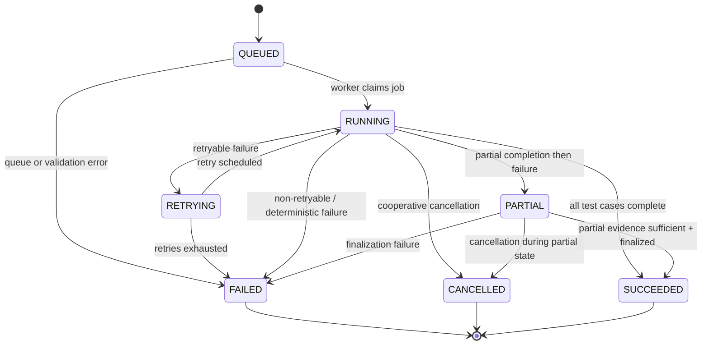

# Failure Architecture

## Modeling and Handling Failure

AEGIS is honest about failure. AI systems fail in ways traditional software does not: nondeterministic outputs, retrieval misses, agent loops, tool misuse, and provider outages. The failure architecture classifies failure first, reacts deliberately, and preserves evidence on every path.

The governing principles:

```text
Fail contained, retry deliberately, never silently duplicate side effects.
Predictable failure under unpredictable conditions.
No score without evidence.
```

The last principle applies on failure paths too. Partial evidence is preserved, never silently dropped.

---

## Failure Taxonomy

Classify first, then react. AEGIS distinguishes the following failure classes:

### Model Failure

The underlying model produces incorrect, irrelevant, or unsafe output. This is a semantic failure detected by evaluation, not an infrastructure failure. Response: record, score, and surface to regression analysis.

### Retrieval Failure

The retrieval stage fails to return relevant or sufficient context. Includes retrieval miss, poor ranking, stale documents, and retrieval poisoning. Response: classify as retrieval failure, evaluate via retrieval metrics (recall, precision, ranking, coverage).

### Tool Failure

A tool call fails, returns malformed data, returns adversarial content, or times out. Includes wrong tool selection, correct tool with wrong arguments, correct tool with dangerous arguments, and tool hallucination. Response: recorded as a tool failure with the specific subclass.

### Agent Loop / Timeout

The agent enters a loop, exceeds its step/token/time budget, or fails to terminate. Response: detect the loop, enforce the agent budget, and record as a reliability failure.

### Validation Failure

The target produces output that violates a schema, contract, or policy. Includes malformed JSON, missing required fields, and guardrail violations. Response: validation failure; usually deterministic and not retried.

### Provider Outage / Rate Limit / Malformed Response

The model provider is unavailable, rate-limited, or returns a malformed or empty response. Response: classify, then apply the retry policy for transient cases.

### Infrastructure Failure

The underlying platform fails: queue unavailable, database unavailable, Redis/cache unavailable, object storage unavailable. Response: fail closed or degrade according to application policy.

### Secret / Security Incident

A model or target outputs a secret, exposes PII, or triggers a guardrail alarm. Response: detect, redact, alert, and treat as a security incident per policy.

---

## Error Classification

Every failure is classified into one of three retry classes before the system decides how to react:

### Retryable

Transient failures that may resolve on their own: network timeouts, provider rate limits, temporary unavailability. These are retried subject to the bounded retry policy.

### Non-Retryable

Failures with no plausible chance of succeeding on retry, or failures where retry is unsafe: authorization denial, invalid configuration, data corruption. These transition the execution to a failed state without retry.

### Deterministic

Failures guaranteed to reproduce identically on retry: invalid input, schema mismatch, unauthorized target. Deterministic failures are usually not retried because retrying produces the same result and wastes resources.

The classification determines the retry path. Ambiguous failures (for example, a provider returns 500 but may have processed the request) are treated specially: they require idempotency so a retry cannot duplicate side effects.

---

## Retry Policy

### Bounded Retries

AEGIS never retries indefinitely. Every retryable failure has a configured maximum retry count. Exceeding the count transitions the execution to a failed state.

### Exponential Backoff with Jitter

Retries are spaced with exponential backoff and randomized jitter. Jitter prevents retry storms: when many workers observe the same provider outage simultaneously, synchronized retries would amplify load. Backoff spreads them out.

### Idempotency

Retries must not duplicate side effects. Jobs are designed to be idempotent where possible. A retried job checks its execution ID and idempotency key before creating new records or external effects. If the work already completed, the retry is skipped.

### Retry Storms

Retry storms are controlled by:

- Bounded retry counts.
- Exponential backoff with jitter.
- Per-target rate limits (FR-EXE-06).
- Per-target limits on concurrent invocations.

### Per-Target Limits

Each target has configured limits on the number of concurrent invocations and the total number of retries it can consume. This prevents a single misbehaving target from exhausting the worker pool or provider budget.

---

## Timeouts and Cancellation Semantics

### Timeouts

Timeouts are mandatory at three levels:

- **Per-test timeout**: Each test case invocation is bounded.
- **Per-target timeout**: Total time spent against a specific target is bounded.
- **Whole-experiment timeout**: The entire experiment is bounded.

A timeout records the fact that the work was timed out, including which timeout boundary was crossed.

### Cancellation

Cancellation is cooperative plus hard:

- **Cooperative cancellation**: The system signals the worker; the worker stops between test cases and persists completed work.
- **Hard timeout**: If the worker does not stop within a grace period, it is forcibly terminated. Persisted partial results are preserved.

### Failed vs Cancelled

Failed and cancelled must be distinguishable. A failed execution records the failure class and error details. A cancelled execution records that it was cancelled by an identity at a time, and preserves the results of any completed test cases. The distinction matters for reporting: cancelled work is not counted as a failure.

---

## Degradation

AEGIS distinguishes what may be stale from what must never be stale.

### Fail Closed vs Degrade

- **Fail closed**: When a dependency that guarantees correctness is unavailable, the system refuses the operation rather than proceeding on incorrect data. Policy enforcement fails closed: gates and policy verdicts are never computed from stale or partial policy data.
- **Degrade**: When a non-critical dependency is unavailable, the system degrades gracefully while preserving correctness.

### What Is Allowed to Be Stale

Cached summaries and aggregate dashboards may be stale. The cache serves stale-but-consistent data that is eventually refreshed and invalidated on configuration change.

### What Must Never Be Stale

Policy and gate verdicts must never be stale. A deployment gate evaluated against outdated policy is incorrect.

### What Must Never Be Silently Dropped

Evidence must never be silently dropped. On a failure path where an execution fails partway, the completed portion of evidence is preserved. Partial evidence is written durably before the failure is recorded. A silence or drop of evidence would compromise "no score without evidence."

---

## Recovery

### What Operators Do

Operators follow the runbooks in docs/operations/incident-response.md. This includes: identifying the incident class, containing spread, rolling back unsafe changes, restoring infrastructure, and verifying evidence integrity after recovery.

### What the System Does Automatically

- **Retries** transient failures within bounds.
- **Preserves partial evidence** on failure paths.
- **Fails contained**: an isolated worker failure does not corrupt other workers or the control plane.
- **Records state transitions** so the system knows exactly where an execution stopped and can resume or report accurately.
- **Alerts** on security incidents and critical failures.

---

## Chaos Perspective

Chaos testing deliberately kills components to prove the failure architecture works. See docs/testing/chaos-testing.md.

What AEGIS deliberately kills, and what it must prove:

### Was Any Execution Duplicated?

When a worker is killed mid-job and the job is redelivered, does the system create a duplicate execution or side effect? Idempotency keys and unique execution IDs must guarantee no duplication.

### Did Evidence Corrupt?

When infrastructure fails during evidence collection, does partial evidence remain intact and correct?

### Did a Retry Storm Happen?

When a provider becomes unavailable globally, do bounded retries, backoff, and jitter prevent a retry storm?

### Was the User Notified?

When an execution fails or is cancelled, is the user notified through the appropriate channel?

### Did the System Recover?

After a killed worker, a failed queue, or a provider outage, does the system recover cleanly and resume or accurately report the failed work?

Chaos testing proves the failure architecture holds under unpredictable conditions.

---

## Execution State Machine



### State Semantics

- **QUEUED**: The job is waiting in the queue for a worker.
- **RUNNING**: A worker is actively processing the experiment.
- **RETRYING**: A retryable failure occurred; the job is scheduled for retry with backoff. It returns to RUNNING when retried.
- **FAILED**: A terminal failure. Either no retryable path remains, retries are exhausted, or the failure is deterministic/non-retryable.
- **CANCELLED**: Terminal state caused by user or operator cancellation. Distinct from FAILED.
- **SUCCEEDED**: All test cases completed and evaluation, evidence, and verdict were finalized successfully.
- **PARTIAL**: Some test cases completed before a failure; partial evidence is preserved. This transition records that a portion of the experiment produced evidence.

The state machine ensures every execution terminates in a distinguishable state, and that partial evidence is never lost to a hard failure.
