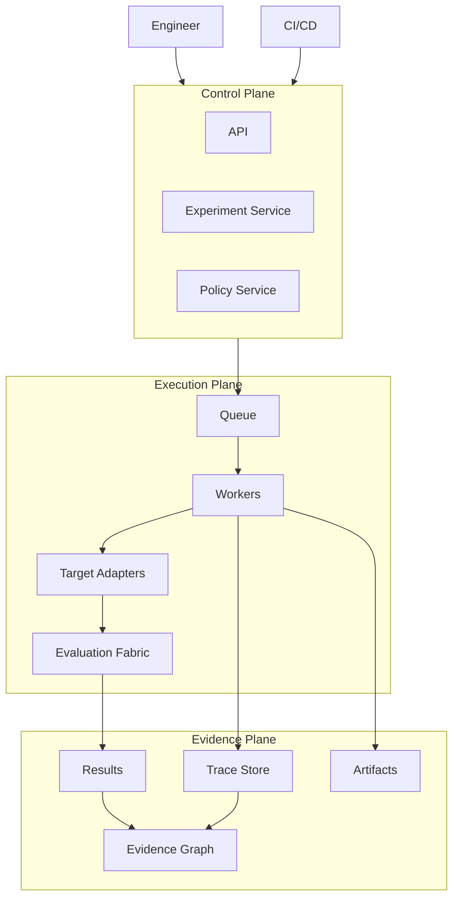

# High-Level Architecture

This document describes the big picture of AEGIS. It establishes the three planes, the modular monolith decision, the technology supporting each plane, and the connective principle that holds them together. Detailed component behavior, containers, and layer rules are described in their own documents; this page does not repeat every detail.

## The Three Planes

AEGIS is divided into three planes, each with a distinct kind of authority:

- **Control Plane** — holds authority and makes decisions. It owns Projects, Targets and their versions, Datasets, Experiments, Evaluators, and Policies/Gates. It is where engineers define intent.
- **Execution Plane** — runs work against targets. It owns the queue, the workers, the target adapters, and the evaluation fabric. It is where work actually happens, and it is deliberately isolated because targets can crash, time out, loop, or consume resources.
- **Evidence Plane** — holds immutable verification records. It owns the trace store, the results, the artifacts, and the evidence graph. It is where claims are proven.

These planes are separated because authority, execution, and verification must not be conflated. The Control Plane decides; the Execution Plane acts; the Evidence Plane proves. If execution could influence control decisions directly, or if verdicts could be produced without verifiable evidence, the system could not be trusted. The separation is what makes the central law enforceable:

> **No score without evidence.**

Every score, verdict, and gate outcome must be traceable to the evidence — the execution, the trace, the artifacts, the evaluator version, and the configuration — that produced it.

## Modular Monolith Decision

AEGIS is a **modular monolith**: one deployable application whose internals are divided into strict modules, not a set of microservices. This is a deliberate choice recorded in **ADR-001**. The product's biggest architecture mistake would be premature microservices; a modular monolith preserves the ability to split later while avoiding distributed-system complexity now.

## The High-Level Diagram

Engineers and CI/CD submit intent to the Control Plane. The Control Plane emits work to the Execution Plane's queue. Workers invoke targets through adapters, and the evaluation fabric computes results. Workers also emit traces and artifacts into the Evidence Plane. Results and traces feed the evidence graph, from which every score and gate outcome is ultimately derived.

## Technology by Plane

- **Control Plane**: FastAPI for the API, PostgreSQL for metadata, results, and configuration state. Redis for queue coordination.
- **Execution Plane**: a Redis-backed queue (Celery, Dramatiq, or ARQ — not Kafka initially), horizontally scalable workers, target adapters, and the evaluation fabric. See **ADR-001**.
- **Evidence Plane**: PostgreSQL for results and evidence-graph metadata, object storage for large artifacts, datasets, trace payloads, and reports, and a trace store using OpenTelemetry-compatible semantics.

## Major Component Templates

The principal components in the diagram are described with the component template. (Reference: the template is defined in `README.md`.) Minor integration points are covered in the component and container documents.

### API
- **Responsibility**: The single authority-facing surface the Control Plane exposes to users and CI/CD.
- **Inputs**: HTTP requests from the Engineer and CI/CD, authenticated and authorized.
- **Outputs**: Commands to create/update Projects, Targets, Datasets, Experiments, Evaluators, and Policies; responses reflecting the resulting state.
- **Dependencies**: The Control Plane services it fronts (Experiment, Policy), PostgreSQL, and authentication/authorization.
- **Failure Modes**: Routing errors, authorization misconfiguration, dependency outage (PostgreSQL unavailable) causing fail-closed behavior.
- **Scaling Model**: Horizontally scalable stateless HTTP endpoints; scales with request concurrency.
- **Security Boundary**: It trusts nothing implicitly; it authenticates callers and authorizes every action before it reaches a service. It never exposes raw traces or secrets without authorization.
- **Why This Component Exists**: It gives authorities a single controlled entry point instead of letting services be reached directly.
- **Why It Is Not Combined With Another Component**: It must remain a pure interface over the services; merging it with a service would let callers bypass cross-cutting enforcement.
- **Technology Choice**: FastAPI.
- **Alternatives Rejected**: A separate API gateway; Flask/Django (FastAPI suits async I/O and typed contracts).
- **When To Replace Technology**: When the interface needs streaming or eventing at a scale FastAPI cannot serve, or a dedicated gateway is justified.

### Experiment Service
- **Responsibility**: Owns Experiments — the immutable, reproducible evaluation configurations executed against target versions.
- **Inputs**: Experiment definitions from the API; target versions, datasets, and evaluator references.
- **Outputs**: Work items published to the queue; experiment state transitions; references to resulting executions.
- **Dependencies**: Target registry, dataset service, evaluator registry, queue, PostgreSQL.
- **Failure Modes**: Invalid experiment definition; references to missing/immutable versions; queue failure blocking dispatch.
- **Scaling Model**: Scales with the Control Plane process; work is fanned out through the queue.
- **Security Boundary**: It may only reference versions the caller is authorized to use; it does not mutate Evidence Plane records.
- **Why This Component Exists**: Experiments are the core reproducible unit; they must be immutable once running.
- **Why It Is Not Combined With Another Component**: It is separated from execution (the Execution Plane does the work) so that intent stays reproducible and isolated.
- **Technology Choice**: Python services over PostgreSQL metadata.
- **Alternatives Rejected**: Colocating scheduling inside worker code (breaks reproducibility and authority separation).
- **When To Replace Technology**: When experiment orchestration needs durable multi-node scheduling beyond Redis-backed queueing.

### Policy Service
- **Responsibility**: Owns Policies/Gates — blocking and advisory rules, non-compensatory logic, and human-override handling.
- **Inputs**: Policy definitions from the API; evidence-graph results and verdict data.
- **Outputs**: Gate outcomes (pass, warn, block, human override) used to authorize deployments and releases.
- **Dependencies**: Evidence graph, results, API, authorization.
- **Failure Modes**: Misconfigured thresholds; flaky metrics causing unstable gates; non-compensatory logic misapplied.
- **Scaling Model**: Scales with control plane; operates over already-computed evidence.
- **Security Boundary**: Only authorities may define or modify policies; the Execution Plane cannot modify policy definitions.
- **Why This Component Exists**: Deployment decisions must be deterministic, evidenced, and non-compensatory, not ad hoc.
- **Why It Is Not Combined With Another Component**: It must be able to trust its inputs, so it is separated from the components that produce those inputs.
- **Technology Choice**: Python service over PostgreSQL.
- **Alternatives Rejected**: Hardcoding gates in CI (loses evidence and non-compensatory logic).
- **When To Replace Technology**: When policy needs a dedicated rule engine at scale.

### Queue
- **Responsibility**: Buffers and distributes work from the Control Plane to the Execution Plane.
- **Inputs**: Work items (jobs) published by the Control Plane.
- **Outputs**: Work items delivered to workers.
- **Dependencies**: Redis.
- **Failure Modes**: Queue outages stall dispatch; message loss or duplication requires idempotency.
- **Scaling Model**: Redis-backed, horizontally scalable with worker concurrency; not Kafka-class durable streaming.
- **Security Boundary**: It carries work descriptors, never raw target secrets or Evidence Plane records.
- **Why This Component Exists**: It decouples intent from execution and enables asynchronous, retryable work.
- **Why It Is Not Combined With Another Component**: It sits at the plane boundary to keep authority and execution separate.
- **Technology Choice**: Redis-backed queue (Celery, Dramatiq, or ARQ).
- **Alternatives Rejected**: Kafka for initial job queueing (overkill for background job distribution; see **ADR-001**).
- **When To Replace Technology**: When durable streaming, replay, and event distribution demand a log-based broker.

### Workers
- **Responsibility**: Execute jobs: invoke targets, collect traces, persist executions and artifacts.
- **Inputs**: Work items from the queue; target adapter configuration.
- **Outputs**: Executions, traces, artifacts, and results into the Evidence Plane.
- **Dependencies**: Queue, target adapters, trace store, object storage, PostgreSQL.
- **Failure Modes**: Targets that crash, time out, loop, or consume resources; necessity of retries, timeouts, and cancellation.
- **Scaling Model**: Horizontally scalable worker pool; scales with target I/O and desired parallelism.
- **Security Boundary**: It is isolated from the Control Plane and cannot modify policy definitions; targets are invoked subject to sandboxing and explicit authorization.
- **Why This Component Exists**: Untrusted target execution must be contained separately from authoritative control (grilling.md).
- **Why It Is Not Combined With Another Component**: Workers must be isolated from the Control Plane because targets can crash, time out, loop, or consume resources.
- **Technology Choice**: Separately runnable worker processes.
- **Alternatives Rejected**: Executing targets inside the API process (high isolation risk).
- **When To Replace Technology**: When execution requires dedicated sandbox runtimes, e.g. containers or serverless isolation.

### Target Adapters
- **Responsibility**: Integrate workers with arbitrary AI target systems — black-box HTTP, SDK, OpenTelemetry ingestion, or CI execution.
- **Inputs**: Invocation requests from workers for a target version.
- **Outputs**: Target responses and execution traces.
- **Dependencies**: Workers, the external target systems, provider configuration.
- **Failure Modes**: External target errors, timeouts, rate limits, malformed responses.
- **Scaling Model**: Scales with the worker pool invoking them.
- **Security Boundary**: Adapters are the only interface to untrusted targets; they must never decide gate outcomes.
- **Why This Component Exists**: Targets are heterogeneous (LLMs, RAG, agents) and must be reachable through a uniform adapter contract.
- **Why It Is Not Combined With Another Component**: It is separate so that target-specific integration and risk stay out of scheduling and evaluation.
- **Technology Choice**: Pluggable adapters over protocols (HTTP, SDK, OpenTelemetry).
- **Alternatives Rejected**: Hardcoding each target type into the worker.
- **When To Replace Technology**: When new integration modes demand a new adapter class.

### Evaluation Fabric
- **Responsibility**: The plugin architecture of evaluators — deterministic, semantic/metrics, LLM-judge, RAG, agent, memory, tool, and safety evaluators.
- **Inputs**: Executions and their traces; evaluator configuration and versions.
- **Outputs**: Metric results and evidence into the Evidence Plane.
- **Dependencies**: Workers, trace store, results, optional LLM providers (used by LLM-judge and cost accounting).
- **Failure Modes**: Evaluator instability, flaky metrics, judge bias or inconsistency, cost explosion on retry.
- **Scaling Model**: Scales with evaluation workers; evaluation work is distributed across the worker pool.
- **Security Boundary**: Evaluators cannot access the Control Plane; their prompts are versioned and their outputs never exceed their authorization.
- **Why This Component Exists**: Metrics must be pluggable, versioned, and reproducible — never hardcoded.
- **Why It Is Not Combined With Another Component**: It is separated so metrics remain testable and replaceable independently of execution.
- **Technology Choice**: Plugin-based evaluator registry over OpenTelemetry-compatible trace input.
- **Alternatives Rejected**: Hardcoded metrics in the worker.
- **When To Replace Technology**: When new evaluation scopes require a fundamentally different evaluator SDK.

### Trace Store
- **Responsibility**: Stores traces of model calls, retrieval, tools, memory, and agent execution with OpenTelemetry-compatible semantics.
- **Inputs**: Traces emitted by workers and target adapters.
- **Outputs**: Trace data for evaluation, analysis, and the evidence graph.
- **Dependencies**: Object storage for trace payloads, PostgreSQL for trace metadata and links.
- **Failure Modes**: Storage loss, privacy leakage if prompts/PII are stored without redaction.
- **Scaling Model**: Scales with execution volume; supports sampling for production observability but evaluation traces are normally unsampled.
- **Security Boundary**: Traces can contain prompts, documents, PII, and secrets; access is authorized and redaction is applied before storage.
- **Why This Component Exists**: Evaluation without execution context cannot explain failures.
- **Why It Is Not Combined With Another Component**: It is evidence, not control; it stays in the Evidence Plane and does not invoke targets.
- **Technology Choice**: OpenTelemetry-compatible trace model on object storage + PostgreSQL.
- **Alternatives Rejected**: Inventing a private telemetry format.
- **When To Replace Technology**: When a dedicated tracing backend is justified.

### Results
- **Responsibility**: Stores metric results and evidence, linking every score to its evaluator version, judge model, configuration, and evidence graph.
- **Inputs**: Metric results from the evaluation fabric.
- **Outputs**: Results for analysis, policy, and the evidence graph.
- **Dependencies**: PostgreSQL.
- **Failure Modes**: Corruption or loss of result provenance; a score without attached evidence.
- **Scaling Model**: Scales with evaluation volume; results are relational and aggregatable.
- **Security Boundary**: Results are authoritative evidence; they are written only by evaluation, never mutated by control decisions.
- **Why This Component Exists**: Verdicts must be reproducible and evidenced.
- **Why It Is Not Combined With Another Component**: It is the evidence of record, separate from the execution that produced it.
- **Technology Choice**: PostgreSQL.
- **Alternatives Rejected**: Offline/denormalized stores that lose provenance.
- **When To Replace Technology**: When results volume requires columnar or analytical storage.

### Artifacts
- **Responsibility**: Stores large immutable artifacts — datasets, trace payloads, reports — referenced by the evidence graph.
- **Inputs**: Artifact blobs from workers and the dataset service.
- **Outputs**: Artifact references consumed by analysis, reporting, and the evidence graph.
- **Dependencies**: Object storage.
- **Failure Modes**: Storage availability, durability, and access-control misconfiguration.
- **Scaling Model**: Scales in object-storage capacity; content-addressed for deduplication.
- **Security Boundary**: Artifacts can be sensitive; access is authorized and tenancy is enforced.
- **Why This Component Exists**: Large payloads must be stored outside the relational database.
- **Why It Is Not Combined With Another Component**: It is storage, distinct from the metadata and results that reference it.
- **Technology Choice**: Object storage.
- **Alternatives Rejected**: Storing large blobs in PostgreSQL.
- **When To Replace Technology**: When a different durable object store is required by the deployment.

### Evidence Graph
- **Responsibility**: The provenance model linking experiments, versions, executions, traces, artifacts, evaluators, results, and verdicts into a graph from which any score is explainable.
- **Inputs**: Results and trace metadata from the Evidence Plane.
- **Outputs**: Claims, provenance, and the basis for analysis and gates.
- **Dependencies**: Results, trace store, artifacts, PostgreSQL.
- **Failure Modes**: Broken links that leave a score without evidence; immutability violations.
- **Scaling Model**: Scales with graph size; relational traversal over PostgreSQL.
- **Security Boundary**: It is append-only and authorized; control-plane actors cannot rewrite evidence.
- **Why This Component Exists**: It implements "No score without evidence" as a first-class data structure.
- **Why It Is Not Combined With Another Component**: It is the proving layer, kept separate from decision and execution.
- **Technology Choice**: PostgreSQL-backed graph over results and trace metadata.
- **Alternatives Rejected**: A dedicated graph database for the initial scope.
- **When To Replace Technology**: When traversal at scale demands a purpose-built graph engine.
