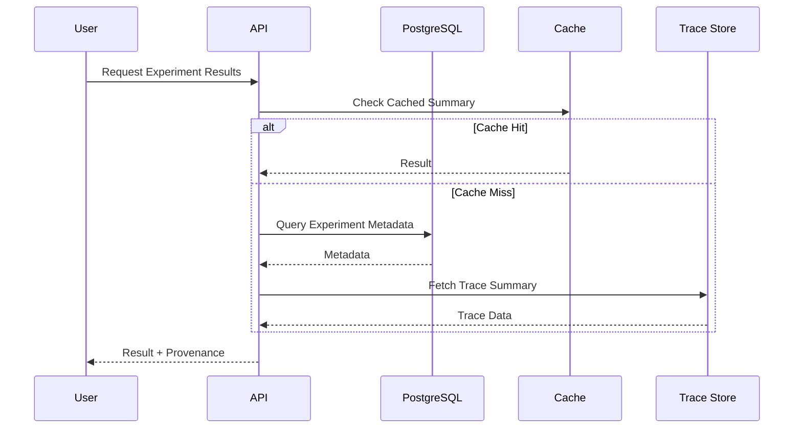

# Read Architecture

## Design Decision: Single Write Model with Optimized Read Queries

AEGIS does not introduce a full CQRS implementation from day one. The initial read architecture follows a pragmatic pattern:

```text
Single Write Model
+
Optimized Read Queries
+
Optional Read Models
```

This is a deliberate rejection of the following premature pattern:

```text
Microservice
+
Event Bus
+
Separate Database
+
CQRS Everywhere
```

The latter increases operational complexity, introduces eventual consistency across every data path, and requires infrastructure justification that does not yet exist. AEGIS starts with a single PostgreSQL instance for metadata, Redis for caching, and a trace store for span data. Read queries hit these stores directly through well-scoped application services.

When measured read load, stale-read requirements, or cross-service query fan-out demands it, AEGIS will introduce dedicated read models through an Architecture Decision Record (ADR). Until that point, every read path is optimized within the single write model.

---

## Read Flow



---

## Query Boundaries

AEGIS serves the following logical query families through its read paths:

### Experiment List

Paginated listing of experiments within a project. Filtered by target, dataset, status, date range, and author. Returns experiment metadata: name, target version reference, dataset version reference, status, creation timestamp, and summary verdict.

### Result Lists

Paginated listing of metric results for a given experiment or target version. Filterable by evaluator type, score range, severity, and slice label. Each result carries its evaluator identity, version, score, confidence, and evidence references.

### Metric Aggregates

Precomputed aggregate summaries per experiment: mean, median, P50/P95/P99 for latency, pass/fail rates per metric, slice-level breakdowns, and cost totals. Aggregates are computed at write time and stored as read-optimized summaries. This avoids expensive real-time aggregation over large result sets.

### Trace Retrieval

Two-tier access: trace summaries (span names, durations, status, and key attributes) are served from the database or cache. Full trace payloads (complete span trees, input/output data, tool call details) are fetched from the trace store on demand. Full trace retrieval is authorization-gated because traces can contain prompts, documents, PII, and secrets.

### Report and Regression Views

Experiment comparison reports, regression diffs, and gate verdicts. These views combine aggregate metrics, per-test comparison data, and policy evaluation outcomes. Reports are materialized at experiment completion and cached for subsequent reads.

---

## Pagination

All list endpoints use cursor-based pagination. Offset-based pagination is rejected because it produces inconsistent results when rows are inserted or deleted between pages, and it degrades on large tables.

Each paginated response includes:

```text
{
  "data": [...],
  "cursor": {
    "next": "opaque-cursor-value",
    "has_more": true
  }
}
```

The cursor encodes the sort key (typically `created_at` plus `id` for stability). Clients pass the `next` cursor in subsequent requests. This guarantees stable page boundaries even under concurrent writes.

---

## Index Strategy

### Metadata Tables

PostgreSQL indexes support the following query patterns:

- **Experiment listing**: Composite index on `(project_id, created_at DESC, id)` for stable, filtered listing within a project.
- **Result lookup**: Index on `(experiment_id, evaluator_id)` for per-experiment result retrieval. Partial index on `(experiment_id) WHERE verdict = 'fail'` for failure-only queries.
- **Target version resolution**: Index on `(target_id, created_at DESC)` for version history traversal.
- **Dataset version resolution**: Index on `(dataset_id, created_at DESC)` for version history traversal.
- **Slice queries**: Index on `(experiment_id, slice_label)` for subgroup analysis queries.
- **Policy evaluation**: Index on `(experiment_id, gate_id)` for gate verdict retrieval.

### Read-Model Tables

Aggregate summaries and materialized views have their own indexes:

- **Aggregate summaries**: Unique index on `(experiment_id)` since one experiment produces one aggregate summary.
- **Regression comparisons**: Index on `(baseline_experiment_id, candidate_experiment_id)` for paired comparison lookups.
- **Gate verdicts**: Index on `(experiment_id, gate_status)` for filtering by pass/fail/block status.

All indexes are reviewed against query plans before deployment. Indexes that do not demonstrate measurable improvement under representative load are removed.

---

## Caching

### What Is Cached

- **Aggregate summaries**: Experiment-level metric aggregates are cached after computation. These are the most frequently read and the most expensive to recompute.
- **Metric scores**: Individual metric results are cached by `(experiment_id, evaluator_id, test_case_id)` for repeat reads during UI exploration.
- **Dataset metadata**: Dataset version metadata (name, description, case count, slice labels) is cached at the project level since it changes infrequently.

### Invalidation Rules

Cache invalidation is triggered by:

- **Evaluator version change**: Any change to evaluator configuration, judge model, or judge prompt invalidates cached metric scores and aggregates for affected experiments.
- **Model version change**: When a target's model version changes, cached aggregates for that target are invalidated.
- **Experiment mutation**: Status transitions (running to completed, completed to failed) invalidate the experiment's aggregate cache.
- **Manual invalidation**: Operators can force cache invalidation for specific experiments through administrative endpoints.

Cache invalidation is eager within the same process boundary and best-effort across workers. A stale cache read returns stale-but-consistent data; it never returns corrupted data. The cache is treated as a performance optimization, not a source of truth.

---

## Aggregate Queries

### Computation

Metric aggregation and slice-level statistics are computed at experiment completion, not at read time. When the last test case in an experiment finishes evaluation, the aggregation worker:

1. Collects all metric results for the experiment.
2. Computes per-metric aggregates: mean, median, P50/P95/P99 (where applicable), standard deviation, pass rate, and failure count.
3. Computes slice-level aggregates for each defined dataset slice.
4. Computes cost and latency totals with percentile breakdowns.
5. Persists the aggregate summary as a single read-optimized record.

### Storage

Aggregate summaries are stored in a dedicated table with one row per experiment. This avoids repeated full-table scans over result sets and enables fast dashboard rendering.

### When Aggregates Are Stale

If an experiment is re-evaluated (for example, an evaluator plugin is updated), the aggregate summary is recomputed. The system tracks the aggregate version and exposes it alongside the data so consumers can detect staleness.

---

## Trace Access

Traces live in the trace store (object storage backed), not in PostgreSQL. This separation exists because trace payloads can be large (megabytes for complex agent runs) and are accessed at different cadences than metadata.

### Trace Summaries vs Full Traces

- **Trace summaries** are derived at trace ingestion time and stored in PostgreSQL alongside execution metadata. They contain span count, total duration, status, key span names, error indicators, and token counts. These are sufficient for most read queries: experiment dashboards, failure triage, and cost analysis.
- **Full traces** contain the complete span tree with input/output data, tool call arguments and results, retrieval payloads, and memory events. These are fetched from object storage only when an operator needs deep inspection.

### Cost and Sampling

Full trace retrieval is expensive in both storage and network. The system applies the following:

- Evaluation traces are normally not sampled (FR-TRC-03). Every evaluation run captures full traces to preserve evidence integrity.
- Production observability traces may use configurable sampling (FR-OBS-02) to control storage costs.
- Full trace access is audit-logged because traces may contain sensitive data.

---

## Authorization

Every read path enforces tenant and project scoping. The authorization model is consistent with the write path:

- **Organization scoping**: Every query is scoped to the caller's organization. No cross-organization data is returned.
- **Project scoping**: Users access only projects they have been granted access to. Project-level RBAC determines which resources are visible.
- **Trace access**: Raw trace data requires explicit authorization. By default, traces are visible only to Engineers and above. Viewers see trace summaries and aggregate data, not raw prompt/response content.
- **Data classification**: Traces tagged as restricted or regulated require additional authorization checks beyond project membership.
- **API key scoping**: API keys issued for CI/CD access are scoped to specific projects and environments, limiting the read surface to authorized resources only.

---

## Read Consistency

### Historical Immutability

Historical data in AEGIS is immutable. Experiment snapshots, dataset versions, target versions, and completed execution results do not change after creation. This means:

- Reads over historical data are always stable. There is no read-your-own-writes concern for historical queries.
- Aggregate summaries, once computed, reflect the exact state of the experiment at completion time.

### Consistency Boundaries

The system operates with the following consistency model:

- **Strong consistency within PostgreSQL**: All metadata reads are served from PostgreSQL and reflect committed transactions. A write that commits is immediately visible to subsequent reads.
- **Eventual consistency for cache**: Cached data may lag behind the database by seconds. This is acceptable because cache is a performance optimization and stale reads are bounded by TTL and invalidation triggers.
- **Eventual consistency for aggregates**: If a result is written after aggregate computation, the aggregate is recomputed asynchronously. During this window, reads may see the result but not its aggregate contribution.
- **Strong consistency for trace store**: Trace data is written once and read immutably. There is no update path for stored traces.

### Same-Process Reads

When a write and a subsequent read touch the same PostgreSQL instance within the same process, the read is served from the same connection and sees the committed write. There is no replication lag for this path.

---

## When to Introduce Real CQRS / Read Models

AEGIS will introduce dedicated read models, separate read databases, or event-driven read projections when and only when:

- Measured read load on metadata tables exceeds the capacity that indexing and caching can sustainably address.
- Stale-read requirements demand a different consistency model than what the write database provides.
- Cross-domain query fan-out (for example, a single read requiring data from experiments, results, traces, and policies) creates unacceptable latency on the write database.
- The operational cost of maintaining read models is justified by measurable performance or reliability improvement.

Any such transition requires an Architecture Decision Record (ADR) documenting the measured trigger, the proposed design, the consistency guarantees, and the operational cost. CQRS is not adopted as a default pattern; it is adopted as a response to evidence.
