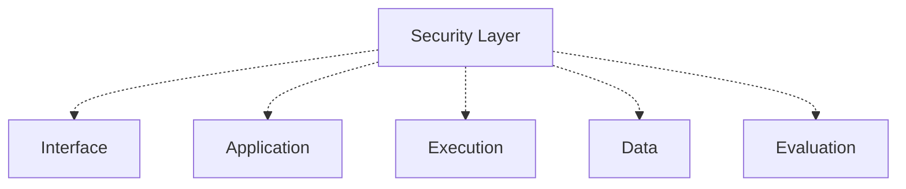

# Security Architecture

## Security Is Cross-Cutting

Security in AEGIS is not a feature added at the end of the project. It is a cross-cutting layer that applies to every component at every layer. There is no part of the system that is exempt from security controls, and there is no point in the lifecycle where security is "finished."



The security layer is woven through the interface, application logic, execution engine, data layer, and evaluation fabric. It is not a standalone component sitting beside them; it constrains every interaction.

---

## Authentication

AEGIS supports two identity classes:

- **Users**: Human identities authenticated through the identity provider (OAuth2 / OpenID Connect). Users access the dashboard and the REST API.
- **Service accounts**: Non-human identities for CI/CD and automated evaluation. Service accounts authenticate with API keys.

### API Keys

API keys are issued per service account and are:

- **Scoped**: An API key is scoped to organization, project, environment, and target where appropriate (grilling.md, question 92). A key cannot access resources outside its scope.
- **Never global**: No global API key exists.
- **Revocable**: API keys can be revoked without affecting other keys.
- **Rotatable**: Keys support rotation with a documented replacement process.

Authentication failures are logged. Repeated failures trigger rate limiting and abuse controls.

---

## Authorization

Authorization is enforced at every layer:

- **API**: Every REST endpoint enforces organization and project scoping and permission checks.
- **Jobs / execution**: Queue consumers verify that the worker has authorization to execute the job. Workers cannot access resources outside their authorized scope.
- **Storage**: Object storage and trace store access is gated by authorization checks. Raw trace data is not accessible by default.
- **Telemetry**: Trace and telemetry access is authorization-gated. Users see only what their permissions allow.
- **External integrations**: External service calls (targets, CI/CD, notification systems) are authorized and governed by policy.

### Permissions Are First-Class

AEGIS models permissions explicitly rather than treating role names as the source of truth. Permissions are first-class; roles bundle permissions (grilling.md, question 88).

The initial roles bundle permissions as follows:

- **Owner**: Full control of an organization, including billing, tenancy, and membership management.
- **Admin**: Administrative control of projects within the organization, including project configuration and member management.
- **Engineer**: Create and run experiments, datasets, targets, and evaluations within assigned projects. Can access execution traces.
- **Analyst**: View results, run analyses, and generate reports, but cannot modify target configurations or datasets.
- **Viewer**: Read-only access to dashboards and reports. Does not access raw traces.

### Identity and Privilege Abuse

Identity and privilege abuse is a first-class agentic risk, not an afterthought (grilling.md, question 335). The evaluation fabric includes tests for excessive agency, privilege escalation, and unauthorized tool use. The security layer treats the agent's claimed authority as unverified until it is validated against policy.

---

## Tenant Isolation

AEGIS is multi-tenant. Every record carries explicit organization and project ownership fields (grilling.md, question 81).

Isolation is enforced at multiple layers, not by application code alone (grilling.md, question 83):

- **Application code**: Every query and write is scoped by organization and project.
- **Database controls**: PostgreSQL Row-Level Security (RLS) is a strong candidate for SaaS isolation, applied as a defense-in-depth layer beneath application checks.
- **Storage**: Object storage paths are organization-scoped, and access is gated by authorization.
- **Network**: Service accounts and workers are network-isolated per organization where required.

RLS alone is not sufficient (grilling.md, question 85). Authorization exists across API, jobs, storage, telemetry, and external integrations. Isolation is enforced at every one of those layers.

---

## Secrets Management

Secrets never enter evaluation records or traces (grilling.md, question 60, question 461).

- Provider configuration secrets are stored in a dedicated secret manager, never in target metadata or experiment records.
- Target metadata records the provider configuration reference, not the secret value.
- If a model accidentally outputs an API key or secret, AEGIS detects it, redacts it, raises an alert, and treats the event as a potential security incident according to policy.

### Secret Detection and Redaction

The evaluation fabric and trace ingestion pipeline include secret detection (FR-TRC-05):

1. **Detect**: Scan model outputs and trace content for known secret patterns (API keys, tokens, connection strings).
2. **Redact**: Replace detected secrets with redaction markers before storage.
3. **Alert**: Notify the security channel and record the event for incident response.

Detection and redaction occur before storage, matching the preference stated in grilling.md (question 458-459).

---

## Data Classification

AEGIS supports data classification categories (grilling.md, question 97):

```text
Public
Internal
Confidential
Restricted
Regulated
```

Classification determines:

- Who can access the data.
- What redaction is applied.
- How long the data is retained.
- What auditing is required.

### PII Redaction at Ingestion

PII redaction is applied at ingestion time, before storage (FR-TRC-04). Trace and telemetry pipelines redact personally identifiable information from prompts, outputs, tool calls, and retrieval content. Redaction is configurable per organization and per project.

Users do not access raw traces by default (grilling.md, question 93). Traces can contain prompts, documents, PII, and secrets. Raw trace access requires explicit authorization and is audit-logged.

---

## Prompt Injection and Red-Team Evaluation

Prompt injection and adversarial evaluation are security test concerns in AEGIS. See docs/testing/security-testing.md.

- Prompt injection is a mandatory red-team test category.
- Red-team evaluation is driven by threat models and known attack classes, not random payloads.
- Simulation mode executes attacks with side effects blocked or sandboxed, so red-team tests never harm production systems.
- Red-team data is restricted: only authorized personnel can access attack payloads and adversarial datasets.
- Security evaluation covers the OWASP agentic threat categories: tool misuse, identity/privilege abuse, memory poisoning, inter-agent communication, cascading failures, and human-agent trust exploitation.

---

## Giving Agents Authority Safely

AEGIS tests the failure path before granting an agent real authority:

```text
"Test the failure path before giving the agent real authority."
```

An agent's capability to act is validated in a simulated, sandboxed environment before it is trusted with real-world side effects. Capability is demonstrated, not assumed.

### No Destructive Tools by Default

Destructive or high-impact tools are disabled by default:

```text
"Guardrails constrain actions, not merely criticize outputs afterward."
```

Delete, payment, send-email, and deploy operations require explicit, configurable authorization and usually human approval. Guardrails are enforced at the action boundary, not retroactively blamed when an action completes.

The default principle is that evaluation is non-destructive (grilling.md, question 75). Tool side effects are disabled or sandboxed unless explicitly authorized.

---

## The Security Boundary

A critical design principle:

```text
"Do not treat the LLM as a trusted security boundary."
```

An AI model's output is not a security control. It can be bypassed, injected, or manipulated. AEGIS does not rely on the model to enforce authorization, isolation, or safety. Those guarantees come from the surrounding deterministic security layer: authorization checks, sandboxing, secret handling, and guardrail enforcement that operate independently of model compliance (grilling.md, question 305-306).

---

## Reference

- Layer 11: Security Layer (docs/development/layers/11-security-layer.md)
- OWASP Top 10 for Agentic Applications
- grilling.md security-related interrogations (XIV. Security / Red Team)
