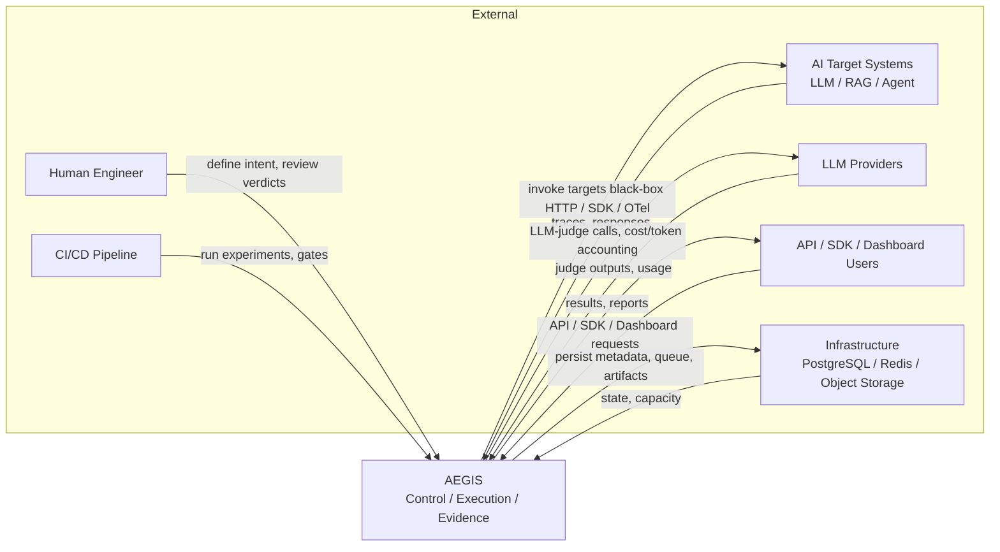

# System Context

This document defines the boundary of AEGIS in the C4 style: the system itself as a single box, the external actors and systems that surround it, the data that flows in and out, and the trust relationship with each. It answers *what belongs inside AEGIS*, *what is an external dependency*, and *what can never be directly accessed*.

## The System Boundary

AEGIS is the AI Evaluation, Reliability & Observability control plane. Externally, it presents one surface. Everything within the three planes — Control, Execution, and Evidence — is inside the boundary. Anything AEGIS does not own is outside the boundary.

## External Actors and Systems

### Human Engineer
- **Data flows in**: definitions of Projects, Targets, Target Versions, Datasets, Experiments, Evaluators, and Policies; manual review of verdicts and human overrides.
- **Data flows out**: scores, evidence, traces, reports, gate outcomes, and recommendations.
- **Trust relationship**: A trusted operator. The Engineer is authenticated and authorized per project. The Engineer can define intent and approve overrides, but cannot falsify evidence.

### CI/CD Pipeline
- **Data flows in**: requests to run experiments, evaluate changes, and evaluate deployment gates.
- **Data flows out**: pass/warn/block verdicts, evidence, and regression signals used to authorize releases.
- **Trust relationship**: A semi-trusted automated operator using scoped service accounts and API keys. It can trigger evaluation but cannot change evidence or override gates beyond its permission.

### AI Target Systems (LLM apps, RAG, agents)
- **Data flows in**: to the target — prompts, test cases, and invocation parameters sent through target adapters.
- **Data flows out**: from the target — responses, execution traces, and observability signals, ingested black-box over HTTP, via SDK, or through OpenTelemetry ingestion.
- **Trust relationship**: **Untrusted.** Targets can crash, time out, loop, or consume resources, so they are reached only through isolated execution workers and sandboxed adapters. Target behavior is never trusted as ground truth; it is measured.

### LLM Providers
- **Data flows in**: to the provider — judge calls made by LLM-judge evaluators and any cost/token accounting queries.
- **Data flows out**: judge outputs and usage/accounting data.
- **Trust relationship**: **Semi-trusted.** A judge is itself a versioned AI dependency, not ground truth. Provider pricing and accounting can change, so cost estimates carry uncertainty and provider configuration is versioned. Provider keys are secrets and never enter the evaluation record.

### Users of the API / SDK / Dashboard
- **Data flows in**: queries for projects, targets, datasets, experiments, results, traces, and reports.
- **Data flows out**: authorized views of results, evidence, traces, and reports.
- **Trust relationship**: Authenticated, authorized, and data-classification-aware. They may view evidence only within their permission; users are not trusted with raw traces by default.

### Infrastructure Services (PostgreSQL, Redis, Object Storage)
- **Data flows in**: metadata, results, configuration, jobs, and artifacts that AEGIS persists.
- **Data flows out**: stored state and capacity that AEGIS reads back.
- **Trust relationship**: **Owned infrastructure.** These are inside AEGIS's controlled deployment, not externally trusted actors. They are the storage substrate of the planes and are not reachable by external actors.

## What Belongs Inside AEGIS

Inside AEGIS are the three planes and everything they embody: the Control Plane (Projects, Targets, Target Versions, Policies, Datasets, Experiments, Evaluators), the Execution Plane (queue, workers, target adapters, evaluation fabric), and the Evidence Plane (trace store, results, artifacts, evidence graph). Also inside are the storage infrastructure AEGIS owns and the analysis, observability, and authorization capabilities that tie the planes together.

## What Belongs Outside AEGIS

Outside AEGIS are the actors and external systems it interacts with: human engineers, CI/CD pipelines, AI target systems, LLM providers, and the users of the API/SDK/Dashboard. None of these become part of AEGIS's internal state or authority.

## What Is an External Dependency

An external dependency is anything AEGIS uses but does not own: the AI target systems it evaluates, the LLM providers used by LLM-judge evaluators, and (from the perspective of its own code) the infrastructure services it integrates with semantically. These are versioned, monitored, and treated as imperfect — never as a trusted security boundary or as ground truth.

## What Can Never Be Directly Accessed

Crossing boundaries is forbidden where it would break authority, isolation, or evidence integrity:

- **The Dashboard cannot directly access the Database.** All reads and writes flow through the API and its authorization layer. Direct database access would bypass authentication, tenancy, and data-classification controls.
- **The Evaluator cannot directly access the Control Plane.** Evaluators consume executions and traces from the Evidence Plane; they cannot reach into the Control Plane to read or alter definitions.
- **The Worker cannot modify policy definitions.** Workers execute; authority over policy lives exclusively in the Control Plane. A worker's failures or behavior must never alter the rules that gate releases.
- **The Target Adapter cannot decide gate outcomes.** Adapters integrate with untrusted targets; verdicts are computed from evidence and applied by the Policy Service, never by the component that touched the target.
