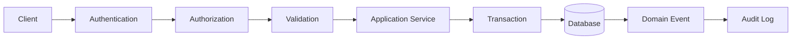

# Write Architecture

## The Most Dangerous Part of the System

Every mutating operation in AEGIS is a potential source of data corruption, inconsistent state, or security violation. The write path is designed with the assumption that it will be attacked by misconfiguration, concurrency, partial failures, and adversarial input. Every write must pass through a controlled pipeline.

---

## Write Pipeline



### Stage Responsibilities

- **Authentication**: Verify caller identity. Supports user sessions, service account tokens, and scoped API keys. Unauthenticated requests are rejected before any domain logic executes.
- **Authorization**: Verify caller permissions against the target resource and action. Authorization checks are organization-scoped and project-scoped. Permissions are first-class; roles bundle permissions.
- **Validation**: Validate request payload against schema and business rules. Reject malformed, incomplete, or semantically invalid requests before they reach the application service.
- **Application Service**: Execute domain logic. The application service orchestrates the transaction, enforces invariants, and coordinates side effects. It does not bypass validation or authorization.
- **Transaction**: Wrap all database writes in a single atomic transaction. Either all writes commit or none commit. No partial state is persisted.
- **Database**: Persist the transactional result to PostgreSQL. All persistent records include organization and project ownership fields.
- **Domain Event**: Emit domain events for downstream consumers. Events are produced only after the transaction commits successfully. Events are idempotent.
- **Audit Log**: Record the mutation in an append-only audit log. Every audit entry captures identity, action, object, before/after state, timestamp, and approval status where required.

---

## Write Invariants

The following invariants are enforced by the application service within the transaction boundary. No write path may violate these constraints.

### Result Invariants

```text
A Result cannot exist without:

Experiment
Target Version
Dataset Version
Evaluator Version
Execution
Evidence
```

A Result is the terminal output of an evaluation. It links to every upstream entity that produced it. If any of these references are missing, the Result must not be created. This ensures the evidence graph is always complete.

### Execution Invariants

An Execution cannot exist without a valid Experiment, Target Version, and Dataset Version. The Execution records the actual invocation of a target against a specific test case within the context of an experiment. If the experiment does not reference the target version or dataset version, the execution must not be created.

### Target Version Immutability

A Target Version is immutable once referenced by an experiment. The version snapshot captures the complete configuration of the AI system: model, provider, prompt, tools, retrieval configuration, memory policy, guardrails, and runtime settings. If any of these changed after version creation, historical experiments would lose their meaning.

### Dataset Version Immutability

A Dataset Version is immutable once locked. Locking is a one-way operation. The locked version can be referenced by experiments and produces reproducible results. An unlocked dataset version can be modified freely.

### Experiment Immutability

Running and historical experiments are immutable. An experiment can be cloned to create a new variant, but the original must not be modified. This preserves the reproducibility guarantee.

### Evaluator Version Immutability

An Evaluator Version captures the evaluator code, configuration, judge model, and judge prompt at a point in time. Once versioned, these values are immutable. Changes produce a new version.

---

## Immutable Resources

The following resources are immutable after creation or lock:

```text
Target Versions
Dataset Versions after lock
Experiment snapshots
Evaluator Versions
Historical Results
```

Immutability is enforced at the application service level within the transaction boundary. Update and delete operations on these resources are rejected with an error. The database schema does not include soft-delete or update paths for these records.

---

## Transaction Rules

### The Anti-Pattern

Agents must not execute the following sequence:

```text
Create Experiment
Commit

Create Execution
Commit

Create Evidence
Commit
```

This pattern produces inconsistent intermediate states. If the second commit fails, the system contains an Experiment with no Execution. If the third commit fails, the system contains an Execution with no Evidence. These partial states violate invariants and corrupt the evidence graph.

### The Correct Pattern

If an operation requires atomic creation of multiple related records, the application service must execute them within a single transaction:

```text
Application Service
    ↓
Validate
    ↓
Start Transaction
    ↓
Create Required State
    ↓
Commit
```

All records are created within the transaction. The commit either succeeds (all records persist) or fails (no records persist). There is no intermediate state exposed to reads.

### Transaction Scope

Transactions in AEGIS are short-lived. A single transaction covers:

- Creation of an experiment and its configuration snapshot.
- Creation of an execution record and its initial state.
- Creation of evidence records linked to an execution.
- Update of aggregate summaries after evaluation completion.

Transactions do not span network calls, external service invocations, or worker processing. Long-running operations are modeled as asynchronous jobs that persist results through their own transactional writes.

---

## Concurrency Control

### Unique Execution IDs

Every execution receives a globally unique ID at creation time. This ID is generated before the transaction begins and is used as the primary key for the execution record. Duplicate execution IDs are rejected at the database level (unique constraint). This prevents duplicate executions from retries or concurrent submissions.

### Optimistic Locking on Immutable Resources

When an immutable resource is read for inclusion in a write operation (for example, attaching a target version to an experiment), the application service reads the resource's version number or check constraint. The write transaction includes a conditional clause that verifies the resource has not changed since it was read. If the resource was modified between read and write, the transaction fails and the operation is retried or rejected.

### Idempotency Keys for External Effects

Operations that produce external side effects (for example, sending notifications, triggering CI/CD pipelines, or writing to external storage) include an idempotency key. The key is derived from the operation's logical identity (execution ID, experiment ID, or result ID). If the operation is retried, the idempotency key prevents duplicate external effects.

Idempotency keys are persisted alongside the external effect record. Before executing an external effect, the system checks whether the idempotency key already exists. If it does, the effect is skipped.

---

## Audit Trail

Every mutating write records an audit entry. The audit entry captures:

- **Identity**: The authenticated user or service account that initiated the write.
- **Action**: The operation performed (create, update, delete, lock, approve).
- **Object**: The resource type and ID affected by the write.
- **Before**: The previous state of the resource (for updates and deletes). Null for creates.
- **After**: The new state of the resource (for creates and updates). Null for deletes.
- **Timestamp**: The time the mutation committed.
- **Approval**: If the operation required approval (for example, promoting a production failure to a regression test, or deploying with a safety gate override), the approval identity and timestamp are recorded.

Audit entries are append-only. They are never updated or deleted. Audit data is retained according to the organization's data retention policy and classification requirements.
