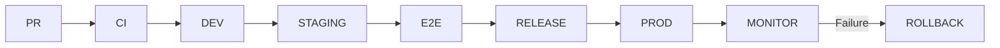

# Deployment Strategy

## Purpose

The deployment strategy defines how a verified release candidate is promoted to production and how failures are detected and answered. Its core advice is that deployment is a deliberate, gated, staged act — never an unexamined mechanical consequence of merging.

## Advised Against

Do **not** deploy like this:

```text
Merge → Production
```

"Merge to production" collapses integration, delivery, and deployment into a single irreversible act. It bypasses evaluation, removes the rollback window, and turns every merged change into a production event without evidence. AEGIS deploys from a release candidate that has already passed CI and staging, through the release gate, with verification and a rollback path.

## Preferred



- **PR → CI** — the pull request passes the CI gates (`docs/ci-cd/pull-request-gates.md`).
- **CI → DEV → STAGING** — the merged change builds an immutable artifact delivered automatically to staging (`docs/ci-cd/continuous-delivery.md`).
- **STAGING → E2E → RELEASE** — E2E and migration rehearsal in staging establish a release candidate.
- **RELEASE → PROD** — the release gate runs on the candidate's evidence; on pass, the candidate is deployed under a controlled trigger.
- **PROD → MONITOR → ROLLBACK** — post-deploy monitoring verifies the deployment; a failure triggers rollback per `docs/ci-cd/rollback-strategy.md`.

## Deployment Types: Staged Rollout

Production deployment uses a **staged rollout** — canary and percentage rollout — as the environment permits:

- **Canary**: deploy the release candidate to a small, representative slice of production first and observe its behavior against monitoring and smoke suites before widening.
- **Percentage rollout**: progressively shift the share of traffic to the new candidate across stages, pausing and reversing at any stage if monitoring signals a problem.
- **Full rollout**: only after the widened stages hold, commit the candidate to full production traffic.

Staged rollout keeps the blast radius small and gives monitoring a defined window to catch a regression while the majority of traffic is still on the known-good version. The rollout plan is recorded per release so the width and pace of each stage is auditable.

## The Release Gate

The release gate is the policy decision that permits the candidate to move to production. It is **composite** and **configurable**, supporting multiple conditions combined with AND logic. The default gate is:

```text
quality >= 0.90
AND
critical_safety_failures == 0
AND
p95_latency < 3s
```

The gate is configurable per project and environment, because different applications have different risk tolerances (`grilling.md` Q234). It is evaluated by the policy and gates layer (`docs/development/layers/08-policy-and-gates-layer.md`), which produces PASS, WARN, BLOCK, or REQUIRE_OVERRIDE.

### Non-Compensatory Safety

The gate enforces **non-compensatory safety**: a quality improvement may **not** compensate for a safety regression (`grilling.md` Q497-498). Concretely:

- `critical_safety_failures == 0` is an independent, blocking dimension.
- High quality, low latency, and low cost do not dilute or excuse a critical safety failure.
- A critical safety failure blocks the candidate regardless of how good every other score is.

The non-compensatory rule applies to the gate exactly as it applies to regression verdicts and PR gates.

### Gate Outcomes

- **PASS** — the candidate may be promoted.
- **WARN** — the candidate is advisory-flagged; promotion is permitted only under the configured warning policy.
- **BLOCK** — the candidate may not be promoted until the blocking condition is resolved.
- **REQUIRE_OVERRIDE** — a deliberate, recorded human override is required, with an audit trail and a named approver, per the override policy. Overriding a safety BLOCK is subject to the most restrictive approval.

## Deployment Verification

Every deploy is verified after it lands:

- **Smoke suites** run against the deployed candidate to confirm it is healthy in production (never destructive — `docs/testing/test-environments.md`).
- **Monitoring** observes latency, error rate, availability, and reliability against the NFRs, and canary evaluation samples the deployed behavior.
- **Verification is time-boxed**: the candidate is treated as unconfirmed until the monitoring window closes without a triggering alert.

## Automatic Rollback Triggers

Rollback is triggered automatically when the deployment fails verification:

- **Release gate failure** after deploy — the candidate's live behavior violates a blocking gate condition.
- **Critical alert** — an observability alert on availability, error rate, p95 latency, or a critical safety signal exceeds the configured threshold.

On trigger, the pipeline rolls back via `docs/ci-cd/rollback-strategy.md` and the rollback protocol in `docs/implementation/rollback-protocol.md`: return to the previous immutable image, restore configuration, and follow the migration and evidence rules. A monitoring failure in production therefore has a defined, exercised answer rather than an improvised one.

## Related Documentation

- `docs/ci-cd/continuous-delivery.md` — how a release candidate is built and proven in staging before this strategy runs.
- `docs/ci-cd/rollback-strategy.md` — the rollback types, triggers, and evidence rules.
- `docs/ci-cd/release-policy.md` — candidate sign-off and the audit trail that pairs the gate verdict with its evidence.
- `docs/implementation/rollback-protocol.md` — the operational rollback runbook.
- `docs/development/layers/08-policy-and-gates-layer.md` — how the gate is evaluated.
