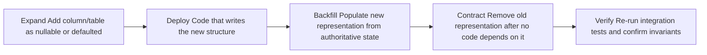

# Migration Strategy

## Purpose

The migration strategy governs how schema changes flow through CI to staging to production. Every schema change is a controlled, reviewed, tested migration; there is no ad-hoc DDL (`docs/data/schema-evolution.md`). Migrations are additive-first and expand/contract by default, they are bundled with the artifact they ship with, and they are coordinated with the code deploy and the rollback plan.

## Migrations Flow Through CI → Staging → Prod

### CI

- **Migration tests** run whenever the database changed: each migration is run against a clean database and against a snapshot of the previous schema, verifying it applies forward, backfills correctly, and leaves no drift (`docs/data/schema-evolution.md`).
- A **fresh migrate on the preview database** proves the full migration sequence applies cleanly from an empty schema to the current state.
- CI rejects out-of-order, unreviewed, or immutable-table-touching migrations. An **unsafe migration** fails the PR gate (`docs/ci-cd/pull-request-gates.md`).
- Integration tests after migration verify that tenant isolation, evidence linkage, and immutability invariants still hold.

### Staging

- Staging **rehearses the full migration** against production-shaped data before it touches production (`docs/testing/test-environments.md`).
- Rehearsal runs the **expand first, contract later** pattern end-to-end and proves the migration behaves under realistic volume and topology.
- E2E tests run against the migrated staging schema.

### Production

- The production migration is **ordered relative to the code deploy** and shipped with the artifact's bundle (`docs/ci-cd/continuous-delivery.md`): the schema leg precedes or accompanies the code that depends on it, per the expand/contract order, so the two never drift apart.
- The migration is **coordinated with the rollback plan** (`docs/ci-cd/rollback-strategy.md`): because it is additive, the code can roll back to the previous image while the expanded schema remains valid.
- **Backfills are idempotent and verified**: deterministic, re-runnable, and verified after application so a failed or retried run does not double-apply or corrupt data.
- **Destructive migrations require an explicit human gate** (`docs/implementation/database-change-protocol.md`): an Owner/Admin/data steward reviews and approves before it runs, and destructive steps are written so old data can be reconstructed (archival export) first.
- **Migrations never touch immutable data**: historical results, locked dataset versions, published target/evaluator versions, and executed experiment snapshots are never rewritten (`docs/data/immutability-rules.md`). If a column must change meaning, the answer is a new version entity, not an in-place mutation.

## The Expand → Deploy → Backfill → Contract → Verify Flow

Schema changes follow a five-step, zero-downtime pattern. This flow is what makes migration and rollback safe and additive:

1. **Expand.** Add the new column or table as nullable or defaulted so existing rows remain valid and reads are not broken.
2. **Deploy code.** Deploy code that writes, and optionally reads, the new structure.
3. **Backfill.** Populate the new representation from authoritative state, deterministically and idempotently, never from an immutable-interpretation change.
4. **Contract.** Remove the old representation only after no code depends on it, and only when doing so touches no immutable rows.
5. **Verify.** Re-run integration tests to confirm tenant isolation, evidence linkage, and immutability still hold.

Dual-write is an exception used only for renames or semantic moves and requires explicit approval, because it temporarily doubles write load (`docs/data/schema-evolution.md`).

## Sequencing Relative to Pipeline Stages

The migration strategy attaches to each pipeline stage:

- The **CI migration gate** (`pull-request-gates.md`) validates every schema change before merge.
- The **staging rehearsal** validates the full sequence against production-shaped data.
- The **release gate and controlled deploy** apply the production migration in its ordered position relative to the code, with the rollback plan pre-agreed.

A migration is not "done" at any single stage; it is done when it has passed CI, been rehearsed in staging, applied safely in production, and verified against the invariants — exactly as `docs/implementation/definition-of-done.md` requires proof for every item.

## Related Documentation

- `docs/data/schema-evolution.md` — the rules every migration must obey.
- `docs/data/immutability-rules.md` — the immutability boundary that constrains all migrations.
- `docs/implementation/database-change-protocol.md` — the mandatory migration process.
- `docs/implementation/migration-protocol.md` — the operational runbook for applying migrations during a release.
- `docs/ci-cd/pull-request-gates.md` — the "migration unsafe" gate.
- `docs/ci-cd/rollback-strategy.md` — how migrations and rollback are coordinated.
