# Pipeline Architecture

## The Pipeline

AEGIS moves a change through a single, ordered pipeline. Each stage receives the output of the previous stage, and each stage must pass before the change proceeds. The pipeline is deterministic: the same inputs produce the same sequence of checks, and every stage records evidence the release can be audited against.

```mermaid
flowchart LR

    DEV[Developer or Agent]
    PR[Pull Request]

    STATIC[Lint + Type Check]
    UNIT[Unit Tests]
    CONTRACT[Contract Tests]
    SECURITY[Security Scan]
    INTEGRATION[Integration Tests]
    BUILD[Build Artifact]
    STAGING[Deploy Staging]
    E2E[E2E Tests]
    GATE[Release Gate]
    PROD[Production]

    DEV --> PR
    PR --> STATIC
    STATIC --> UNIT
    UNIT --> CONTRACT
    CONTRACT --> SECURITY
    SECURITY --> INTEGRATION
    INTEGRATION --> BUILD
    BUILD --> STAGING
    STAGING --> E2E
    E2E --> GATE
    GATE --> PROD
```



- **DEV to PR** — a developer or an AI agent opens a pull request. Everything before this point (`docs/implementation/definition-of-done.md`) is the developer's own verification; the pipeline begins at the PR.
- **STATIC, UNIT, CONTRACT, SECURITY** — the fast, mandatory gates that run on every pull request. They are cheap, catch deterministic problems, and fail quickly.
- **INTEGRATION** — the selective integration set that runs with real contained infrastructure, chosen by what changed.
- **BUILD** — an immutable, versioned artifact is produced: the image digest, the bundled configuration, and the schema migrations.
- **STAGING, E2E** — the artifact is deployed to staging and validated with end-to-end tests plus migration rehearsal.
- **GATE to PROD** — the release gate evaluates evidence against the composite, non-compensatory policy and, on pass, promotes the artifact to production.

## The Key Rule: Not Every Commit Runs Everything

AEGIS does not run the full evaluation catalog on every commit. Cost and latency make that impractical, and most of a full run is irrelevant to the change at hand. Instead, CI selects the suites that are actually affected by the change. This is **dependency-aware testing**.

Test selection by changed component:

```text
Changed API
→ API tests + contract tests

Changed Evaluator
→ evaluator tests + calibration tests

Changed Database
→ migration tests + integration tests

Changed Security Policy
→ security regression suite

Changed Documentation
→ docs validation only
```

This mapping extends to the AI-testing dimensions from `grilling.md`:

- A **prompt** change runs the language and quality suites.
- A **model** change runs the regression suite.
- A **retriever** change runs the RAG suite.
- A **tool schema** change runs the agent and tool suites.
- A **guardrail** change runs the safety suite.
- A **memory policy** change runs the memory suite.

## How Change Detection Works

Change detection combines **affected-paths** with the **dependency graph**:

1. **Affected paths.** CI computes the set of files changed by the pull request. Files map to components: API routes map to the interface layer, evaluator plugins map to the evaluation layer, migration files map to the schema, documentation maps to docs-only validation.
2. **Dependency graph.** The component mapping is resolved against the dependency graph defined in `docs/development/dependency-rules.md` and the layer boundaries in `docs/development/layers/`. When a change touches a component, it also triggers the tests of every component that depends on it — a change to a domain rule that many services use pulls in the contract and integration tests of those services, even if the files for those services did not change.

The result is the minimal, complete set of suites that must run to prove the change does not regress anything it can affect. Selection is deterministic: the same diff yields the same suite set, so the run is reproducible and auditable.

## Mandatory vs Conditional Stages

The pipeline distinguishes what must run on **every** pull request from what runs **conditionally** based on the change.

### Mandatory on Every PR

- **Static** — lint and type check. Formatting and type errors are never acceptable.
- **Unit** — the fast unit suite. Cheap, and a regression in pure domain or policy logic blocks a merge.
- **Docs validation** — documentation lint and link validation (a docs-only change still validates the docs).

### Conditional (run only when affected)

- **Contract** — runs on every code PR by default; a docs-only change may skip it. Runs in full whenever an interface may have changed.
- **Integration** — the selective integration set, run only against components touched (directly or by dependency). The full integration catalog is reserved for staging.
- **Migration tests** — run only when the database changed.
- **Evaluator calibration** — runs only when an evaluator, judge model, or judge prompt changed.
- **Security scan** — runs on every PR by default; a docs-only change may defer it to a scheduled scan, though the default is to run it.
- **Expensive suites** (`expensive` tag: stress, load, soak, chaos, heavy evaluation) — never run per commit. They are scheduled and budgeted per `docs/testing/test-environments.md` and verified by the pipeline rather than gated on every merge.

The mandatory/conditional boundary keeps every PR fast and cheap while guaranteeing that nothing merges without the checks that prove its own change is safe. The precise list of merge-blocking conditions is in `docs/ci-cd/pull-request-gates.md`.

## Related Documentation

- `docs/ci-cd/pull-request-gates.md` — which checks are merge-blocking and how each runs in the pipeline.
- `docs/ci-cd/continuous-integration.md` — how CI executes static, unit, contract, security, and selective integration, including sharding, caching, and artifact collection.
- `docs/ci-cd/continuous-delivery.md` — how the artifact is built immutably and promoted to staging.
- `docs/ci-cd/deployment-strategy.md` — how a release candidate moves to production.
- `docs/testing/README.md` — the test pyramid, tags, and dependency-aware selection policy that the pipeline enforces.
