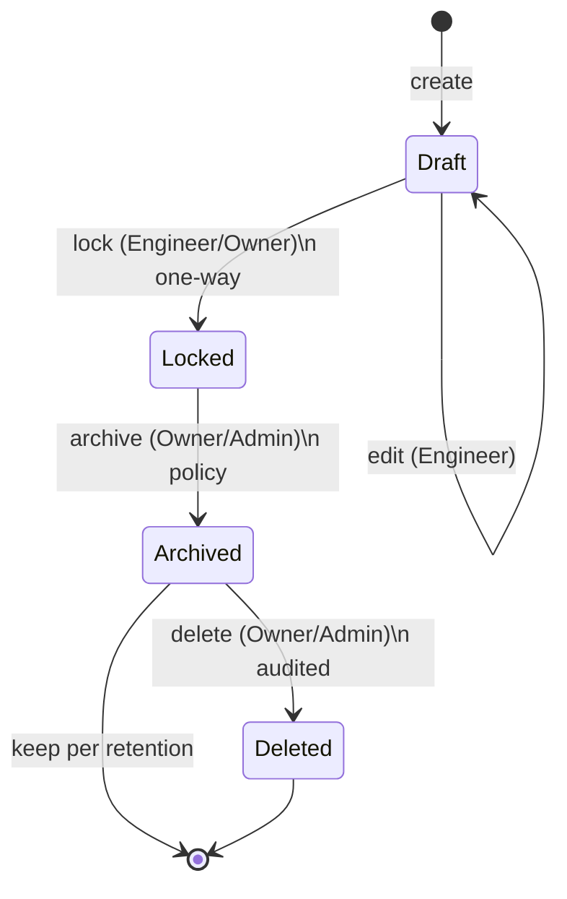
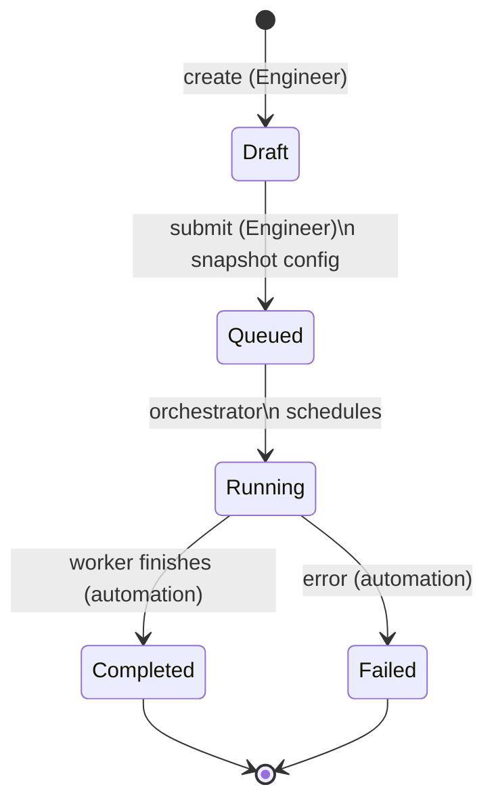
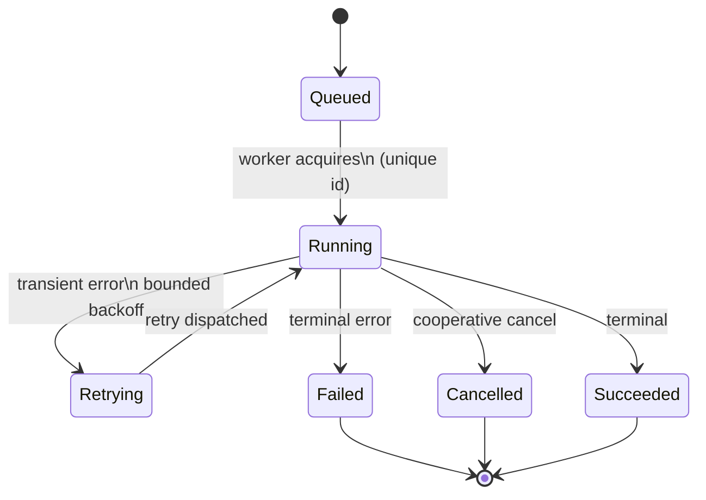

# Data Lifecycle

This document describes the end-to-end lifecycle of AEGIS's main data classes: what states they pass through, what is permitted and forbidden at each stage, and which actor may perform each transition. It is the temporal counterpart to `immutability-rules.md`: that document says *what cannot change*; this one says *how data moves* and *who may move it*.

Actors referenced throughout:

- **Project roles** — Owner, Admin, Engineer, Analyst, Viewer. Permissions are first-class; these roles bundle them (`data-ownership.md`).
- **Automation** — the orchestrator and execution workers; service accounts acting on behalf of CI/CD or automated evaluation.
- **System** — the application service itself enforcing invariants within the write transaction.
- **Auditor/Owner/Admin** — roles authorized for retention, deletion, and audit-related transitions.

The general rule: **configurable retention, auditable deletion** (grilling.md Q98-Q99). Every transition that mutates or removes data is written to the append-only audit log.

## Dataset / Test Case

Lifecycle: **draft → locked → immutable/archived → deleted-per-policy**.

| State | Allowed | Forbidden | Transition actor |
|---|---|---|---|
| **Draft** | Add, edit, remove test cases; reorder; relabel; change slices. An unlocked draft may be modified freely (`write-architecture.md`). | Reference by an experiment as an authoritative evaluation dataset. | Engineer (control plane). |
| **Locked** | Reference by experiments; read; reproduce. The version snapshot is frozen. | Modify or delete any test case; re-open. Locking is one-way. | Engineer/Owner perform the lock; automation executes experiments against it. |
| **Immutable / Archived** | Retain for reproducibility and regression; move to archive by retention policy. | Modify the locked content. | Owner/Admin initiate archiving; retention automation executes. |
| **Deleted-per-policy** | Delete when retention expires and no active references remain. | Delete while an active experiment/report references it; hard-delete immutably required data without archival (see `retention-and-deletion.md`). | Owner/Admin, role-gated and audited. |

## Experiment

Lifecycle: **draft → queued → running → completed → immutable after execution begins**.

| State | Allowed | Forbidden | Transition actor |
|---|---|---|---|
| **Draft** | Compose and edit the experiment configuration, variants, dataset links, evaluators, parameters, seed. | Run. | Engineer (control plane). |
| **Queued** | Wait in the Redis queue for a worker; cancel while queued (if not yet dispatched). | Modify the snapshot after submit. | Engineer submits; orchestrator schedules. |
| **Running** | Execute test cases; emit execution events; produce partial metric results; retry within bounded policy; cancel cooperatively. | Change the configuration; exceed retry/timeout bounds. | Orchestrator and workers (execution plane). |
| **Completed** | Aggregate results; generate reports; compare against baseline. | Modify the completed run or its configuration. The snapshot is immutable once execution begins. | Automation completes; Evidence Plane aggregates. |
| **Failed / Cancelled** | Preserve partial evidence; record failure. | Pretend success; silently drop produced evidence. | Workers/orchestrator; cancellation via Owner/Engineer. |

The experiment snapshot becomes immutable once execution begins (grilling.md Q153). To change it, clone the experiment and create a new variant.

## Execution

Lifecycle: **queued → running → retrying → failed/cancelled/succeeded → partial-evidence preserved**.

| State | Allowed | Forbidden | Transition actor |
|---|---|---|---|
| **Queued** | Wait for a worker; be pre-empted by timeout policy. | Start more than once (unique execution ID guards this). | Orchestrator. |
| **Running** | Invoke the target; collect trace; persist execution events. | Duplicate side effects; retry without idempotency. | Workers. |
| **Retrying** | Retry within a bounded policy with exponential backoff and error classification. **Deterministic failures do not retry.** | Infinite retries (cost explosion); silently duplicate side effects. | Workers/orchestrator. |
| **Succeeded** | Produce and persist metric results; link trace and evidence. | Update the terminal record to rewrite history. | Automation/Evidence Plane. |
| **Failed** | Preserve whatever evidence was produced; record failure class (timeout, retrieval miss, tool error, validation, agent loop). | Discard evidence. | Workers/orchestrator. |
| **Cancelled** | Preserve partial evidence; stop cooperative work and enforce hard timeout. | Continue side-effecting after cancellation. | Owner/Engineer/orchestrator. |

Terminal executions are write-once (`immutability-rules.md`), but failed and cancelled executions retain their partial evidence so debugging is still possible.

## Metric Result

Lifecycle: **computed → written once → immutable**.

| Stage | Allowed | Forbidden | Transition actor |
|---|---|---|---|
| **Computed** | An evaluator computes a score with confidence, reason, judge model, and judge prompt version. | A score exists without evidence (violates "No score without evidence"). | Evaluator workers (Evidence Plane). |
| **Written once** | Persist the result with full provenance (evaluator identity/version, judge, prompt version, evidence references). | Retry that overwrites or duplicates the result (idempotency). | Application service within the write transaction. |
| **Immutable** | Read, aggregate, compare, report, gate. | Ever update or delete the result row. | Read services. |

Result Invariants in `docs/architecture/write-architecture.md` require every result to reference experiment, target version, dataset version, evaluator version, execution, and evidence.

## Evidence / Artifacts

Lifecycle: **ingested → stored → redacted/verified → retained**.

| Stage | Allowed | Forbidden | Transition actor |
|---|---|---|---|
| **Ingested** | Accept trace spans, retrieved documents, tool results, and payloads into the trace/object pipeline. | Store PII or secrets unredacted. | Trace collector / ingestion. |
| **Stored** | Persist artifacts by stable key in object storage or the trace store; record artifact references. | Embed full payloads in the relational evidence graph. | Evidence Plane. |
| **Redacted / Verified** | Apply PII redaction and secret detection before persistence; verify artifact integrity (hashes) where applicable. | Store raw sensitive content by default; treat detected secret leakage as routine. | Ingestion/security pipeline. |
| **Retained** | Keep evidence until classification/policy expiry or until the referencing gate/policy is retired. | Sample away evaluation evidence; silently remove referenced evidence. | Evidence Plane and retention automation. |

Evidence is immutable after publication. Removal for privacy/regulatory reasons goes through controlled, audited deletion (`evidence-architecture.md`, `retention-and-deletion.md`).

## Audit Log

Lifecycle: **append-only, no terminal state by design**.

Audit entries are created for every mutating write and are **never updated or deleted** (`write-architecture.md`). There is no transition back out of the log except through the retention/legal-hold process described in `retention-and-deletion.md`.

| Allowed | Forbidden | Transition actor (writer) |
|---|---|---|
| Append an entry after a successful write, capturing identity, action, object, before/after, timestamp, and approval. Read by Owner/Admin/auditors. | Update or delete an existing entry. | Application service / audit writer; all transitions are writes to the log. |

## Principles Across All Lifecycles

- **Retention is configurable; deletion is auditable** (grilling.md Q98-Q99). Nothing is hard-deleted without an audit trail and role gating.
- **Failed and partial data is preserved.** Cancellation or failure never destroys evidence already collected.
- **Immutability begins where meaning could drift.** The moment a version can be referenced (target version), locked (dataset version), or executed (experiment, evaluator version), it becomes immutable rather than mutable.
- **Every mutation is attributable.** Each transition is tied to the actor (human or service account) that performed it.

## Related Documentation

- `docs/data/immutability-rules.md` — the underlying immutability guarantees for these lifecycles.
- `docs/data/retention-and-deletion.md` — the retention and deletion policy that ends these lifecycles.
- `docs/architecture/write-architecture.md` — the write pipeline and invariants that constrain transitions.
- `docs/architecture/execution-architecture.md` — how execution states and retries are scheduled and contained.
