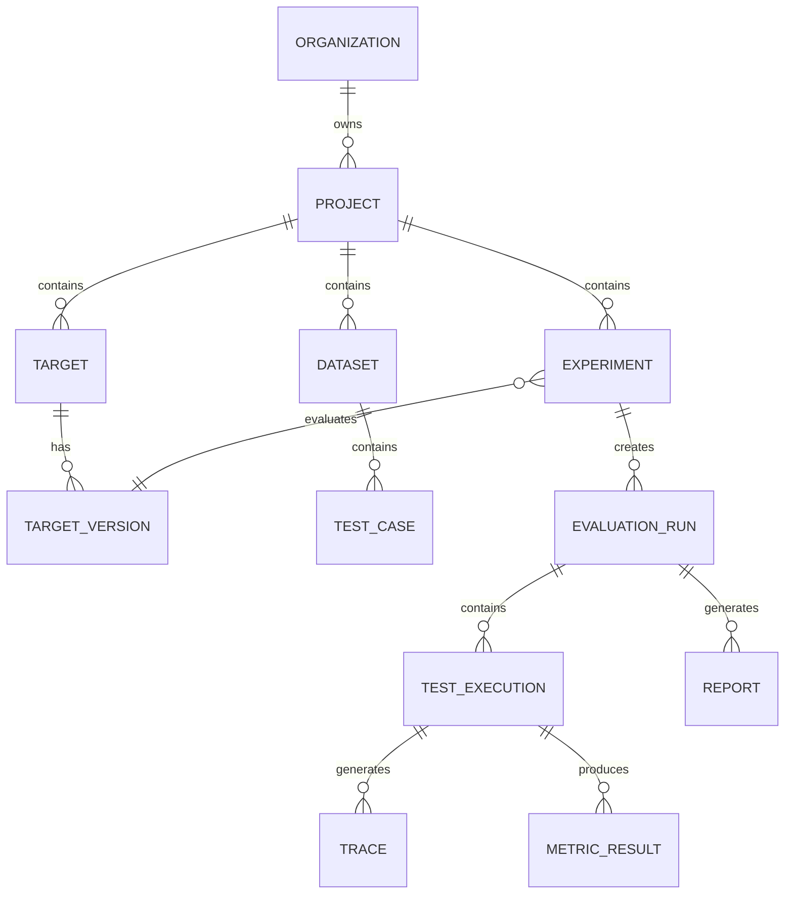

# Entity-Relationship Diagram

The following diagram captures the core domain of AEGIS: how projects, targets, datasets, and experiments relate to the executions, traces, metric results, and reports that make evaluation verifiable.

In this notation, `||` is "exactly one" and `o{` is "zero or more". A crow's-foot on the child side means the parent may have many children; a double bar on the parent side means the child must belong to exactly one parent.

## Narrative of the Relationships

### Organization owns Projects

An **Organization** is the top-level tenant. A **Project** is the unit of tenancy beneath it: a team's AI application. Every tenant-owned record further down this diagram carries both `organization_id` and `project_id` so that ownership can be enforced at every boundary (`data-ownership.md`). An organization can contain many projects, and a project always belongs to exactly one organization.

### Project contains Targets, Datasets, and Experiments

A **Project** is the container for the three things an evaluation combines:

- **Targets** — the AI systems registered for evaluation (LLM apps, RAG pipelines, agents). One project may register many targets.
- **Datasets** — the versioned collections of evaluation scenarios a project uses or reuses.
- **Experiments** — the reproducible evaluation configurations a project runs.

These containment relationships mean that a target, dataset, or experiment is never shared across projects implicitly; cross-project use of a dataset is an explicit, authorized link that preserves tenant isolation.

### Target has Target Versions

A **Target** is an identity; a **Target Version** is a reproducible snapshot of that target's configuration (model, provider, prompt, tools, retrieval config, memory policy, guardrails, build identity). A target has many versions, and each version is immutable once referenced by an experiment. Versioning is what lets AEGIS compare `v0.3` against `v0.4` and detect regressions.

### Dataset contains Test Cases

A **Dataset** is a versioned collection of **Test Cases** — individual executable/evaluable scenarios with their expected outputs, expected tool calls, labels, and slices. Once a dataset version is locked, its test cases are immutable.

### Experiment evaluates Target Version

An **Experiment** evaluates *exactly one Target Version* (the `}o--||` relationship: many experiments can evaluate the same target version, but an experiment pins exactly one). Within an experiment, variants (not shown here) allow multiple parameterizations against that pinned target version for A/B comparison. Because the experiment pins a specific, immutable target version, the experiment's meaning cannot drift as the target changes.

### Experiment creates Evaluation Runs

An **Experiment** is a configuration; an **Evaluation Run** is a concrete execution of that configuration. An experiment can be run many times (re-ran, replayed), and each run is an isolated instance of the experiment.

### Evaluation Run contains Test Executions

An **Evaluation Run** breaks down into many **Test Executions** — one per test case exercised against the target. The run is the aggregate; the test execution is the atomic unit of evaluation.

### Test Execution generates Trace and produces Metric Results

The heart of the model: each **Test Execution** generates a **Trace** (the span tree of model calls, retrieval, tools, memory, guardrails, and errors) and produces many **Metric Results** (scores with provenance). The trace is generated by the execution; the metric results are produced from the execution and its trace.

### Evaluation Run generates Report

Finally, an **Evaluation Run** generates a **Report** — the rendered aggregate of the evaluation, keyed by experiment and report version.

## Why Test Execution Is the Center of the Debugging Model

The **Test Execution** is the pivot on which every other entity hangs, and it is why debugging is tractable. A single test execution carries the complete context needed to investigate a result:

- **Test Case** — *what* was asked, including expected behavior.
- **Target Version** — *what system and configuration* answered.
- **Input** — the exact scenario submitted.
- **Output** — the exact response the target produced.
- **Trace** — *how* the target reached that output (model calls, retrieval, tool calls, memory events, guardrails, errors).
- **Metrics** — the scores derived from this execution.
- **Cost** — the spend for this execution.
- **Latency** — timing, including time-to-first-token where relevant.
- **Status** — succeeded, failed, cancelled, retrying, and so on.

Because an execution carries all of this together, a failing score can be traced straight back to the test case, the target version, the input, and the trace that produced it. This is the difference between "the model scored 71%" and "test #184 failed because the retrieval returned the wrong document before generation." The execution ties the aggregate to the concrete evidence, which is what makes AEGIS a debugging system rather than a dashboard.

## Connecting to the Evidence Graph

The ER diagram above is the relational skeleton of the **Evidence Graph** (`docs/architecture/evidence-architecture.md`). The graph traverses this structure in one direction:

**execution → trace → evidence → score**

A **Test Execution** produces a **Trace**, which captures the evidence of what actually happened (retrieval hits, tool results, guardrail decisions, errors). The **Metric Result** (the score) links to that execution, its trace artifact, the dataset test case, and the evaluator version. The law of the Evidence Plane is **"No score without evidence":** a metric result cannot exist unless it reaches back through the execution to the trace and evidence that produced it. This is enforced at the write boundary by the Result Invariants in `docs/architecture/write-architecture.md`.

In practice the graph adds nodes that the simplified ER diagram omits for clarity — dataset versions, evaluator versions, judge model/prompt versions, gates, and verdicts — but the backbone is this chain. Every score in the UI can be walked backward to concrete, immutable evidence; every verdict is explainable by the executions, traces, and results beneath it.

## Related Documentation

- `docs/data/database-design.md` — the table groups and columns that realize these relationships in PostgreSQL.
- `docs/data/data-lifecycle.md` — the states each of these entities passes through.
- `docs/architecture/evidence-architecture.md` — the Evidence Graph and "No score without evidence."
- `docs/architecture/read-architecture.md` — how these entities are read and joined for the UI and API.
