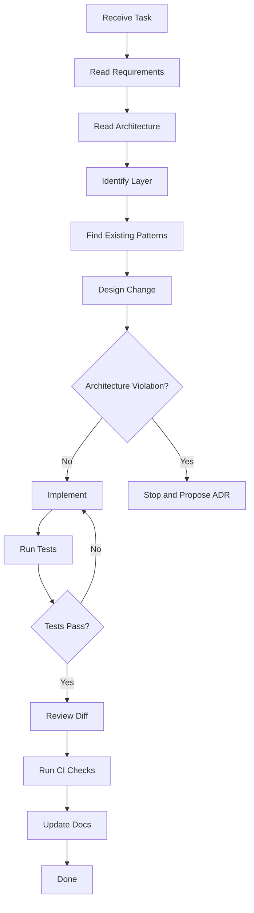

# Agent Development Protocol

This is the contract for any coding agent -- human or AI -- working in the AEGIS repository. Follow this workflow for every change.

## Workflow



## Step-by-Step

1. **Receive Task**: Understand what is being asked. Do not start coding until the task is clear.
2. **Read Requirements**: Identify acceptance criteria, constraints, and edge cases.
3. **Read Architecture**: Read `docs/architecture/development-architecture.md` and the relevant layer file.
4. **Identify Layer**: Determine which layer (00-11) the change belongs to. If the change spans multiple layers, determine the primary layer and the interaction points.
5. **Find Existing Patterns**: Search the codebase for similar implementations. Do not reinvent patterns that already exist.
6. **Design Change**: Plan the change before implementing. Identify files to modify, files to create, and tests to write.
7. **Architecture Violation Check**: If the design requires crossing non-neighboring layers or violates any rule in these docs, stop and propose an ADR. Do not proceed with an implementation that violates architecture.
8. **Implement**: Write the code following the coding standards, error handling rules, and layer-specific rules.
9. **Run Tests**: Execute the full test suite for the affected modules. Tests must pass before proceeding.
10. **Review Diff**: Review your own changes for correctness, style, and compliance.
11. **Run CI Checks**: Run lint, typecheck, and any other CI checks configured in the project.
12. **Update Docs**: Update relevant documentation if the change introduces new patterns, APIs, or dependencies.
13. **Done**: Do not mark complete until acceptance criteria pass per `implementation/definition-of-done.md`.

## Forbidden Actions

```
Invent new architecture without checking ADRs.

Access infrastructure directly from domain code.

Change database schema without migration.

Change API response without contract review.

Modify immutable historical data.

Add dependency without documenting why.

Retry unknown failures indefinitely.

Hide errors.

Swallow exceptions.

Use an LLM judge as a replacement for deterministic validation.

Treat average score as proof that all slices passed.
```

## Pre-Implementation Checklist

Before writing any code:

- [ ] Read the layer file for the layer you are modifying.
- [ ] Read the dependency rules for the layers involved.
- [ ] Check if the change crosses layer boundaries.
- [ ] Identify existing patterns to follow.
- [ ] Confirm you understand the error handling requirements.
- [ ] Confirm you know what tests are needed.

## Post-Implementation Checklist

Before marking work complete:

- [ ] All tests pass.
- [ ] Lint and typecheck pass with no errors.
- [ ] No forbidden imports in domain code.
- [ ] Error handling follows the typed exception hierarchy.
- [ ] No secrets or PII in logs.
- [ ] Documentation updated if applicable.
- [ ] Acceptance criteria met per `implementation/definition-of-done.md`.

## When in Doubt

Read the relevant docs file. Do not invent rules, patterns, or conventions. The docs are authoritative. If the docs do not cover a case, stop and ask rather than guessing.
