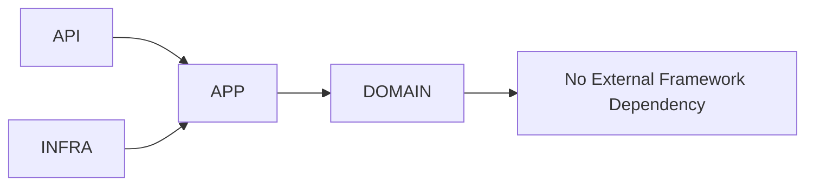

# Layer 01: Domain

## 1. Purpose

The domain layer contains the pure domain model and core entities of AEGIS. It defines what the system can and cannot do, the invariants that must hold, and the business rules that govern AI evaluation. It has zero external framework dependencies.

## 2. Responsibilities

- Defining core entities: Experiment, Execution, Result, Evidence, Gate, Policy, Dataset Version, Target Version.
- Encoding invariants: a Result cannot exist without an Experiment, Target Version, Dataset Version, Evaluator Version, Execution, and Evidence.
- Defining domain events and state transitions.
- Encapsulating business rules that do not depend on any technology.

## 3. Non-Responsibilities

- Persisting data (infrastructure layer).
- Handling HTTP requests (interface layer).
- Scheduling or running jobs (execution layer).
- Computing metrics (evaluation layer).
- Making pass/warn/block decisions (policy and gates layer).
- Communicating with external systems (infrastructure layer).

## 4. Public Interfaces

Domain entities, value objects, domain events, and domain services. These are imported by the application layer and by specialized layers (evaluation, analysis, policy, evidence).

## 5. Inputs

Business rules, invariants, and domain knowledge from the grilling.md interrogation and product design.

## 6. Outputs

A pure domain model that other layers consume without technology coupling.

## 7. Internal Components

- Entity definitions (Experiment, Execution, Result, Evidence, Gate, Policy, Dataset Version, Target Version, Metric Result, Evaluator, Organization, Project, Target).
- Value objects (Score, Severity, Confidence, Version, Metric, Timestamp).
- Domain events (ExperimentStarted, ExecutionCompleted, GateDecided).
- Domain exceptions (NotFound, Conflict, InvalidState, ValidationFailed, etc.).

## 8. Allowed Dependencies

Python standard library only. No external packages.

## 9. Forbidden Dependencies

Verbatim:

```
HTTP
SQL
Redis
FastAPI
Django
Celery
Provider SDK
```

## 10. Why This Design

A pure domain layer can be tested without infrastructure, reasoned about without technology context, and preserved across technology changes. If the database, API framework, or queue system changes, the domain remains intact.

## 11. Alternatives Considered

- **Domain with ORM annotations**: Rejected because it couples domain to SQLAlchemy.
- **Domain with Pydantic models**: Rejected for entities; Pydantic is permitted for DTOs in the application layer but not for core domain entities that need immutability semantics beyond what Pydantic provides.
- **Anemic domain model with services in application layer**: Partially adopted -- business logic lives in domain services, but state transitions are on entities.

## 12. Why Alternatives Were Rejected

ORM annotations in domain code break purity. Pydantic for entities introduces framework coupling. Anemic models scatter business rules across layers.

## 13. Technology Choice

Plain Python dataclasses, frozen dataclasses, enums, and standard library types.

## 14. Technology Limits

No ORM, no HTTP, no async I/O frameworks. Domain code is synchronous by nature.

## 15. When To Use This Technology

Always. Every piece of business logic and every entity definition belongs here if it has no technology dependency.

## 16. When NOT To Use This Technology

When the code requires a database, HTTP call, queue operation, or any external system interaction. Those belong in infrastructure or execution layers.

## 17. Failure Modes

- Domain logic leaks into infrastructure or application layers, making it untestable in isolation.
- Domain entities carry ORM annotations, creating technology coupling.
- Invariants are enforced inconsistently across layers.

## 18. Security Risks

- Domain entities that carry PII without classification annotations.
- Business rules that bypass authorization (domain does not handle auth; that is layers 02 and 11).

## 19. Performance Risks

None at the domain layer itself. Performance concerns are addressed in infrastructure and execution.

## 20. Testing Strategy

Unit tests with no external dependencies. Every domain invariant has a test. Domain services are tested with mock repositories. Test execution is fast because there is no I/O.

## 21. Scaling Strategy

Not applicable. The domain layer has no runtime footprint to scale.

## 22. Agent Rules

Before writing domain code: verify there are zero framework imports. After writing domain code: run import analysis to confirm purity. Never place infrastructure concerns in domain modules.

## 23. Code Examples

The dependency direction for this layer:



The domain knows nothing about infrastructure. It defines invariants and business rules: a Result cannot exist without Experiment, Target Version, Dataset Version, Evaluator Version, Execution, and Evidence.

## 24. Common Implementation Mistakes

- Importing `sqlalchemy` or `pydantic` in domain entity files.
- Placing repository implementations in the domain package.
- Adding HTTP client calls in domain services.
- Using `datetime.utcnow()` instead of injecting time (testability issue).
- Defining validation logic in the application layer instead of on the entity.
- Creating mutable domain entities that should be immutable historical records.
