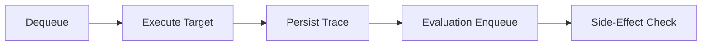

# Layer 05: Execution

## 1. Purpose

The execution layer manages job scheduling, worker lifecycle, and the runtime concerns of running evaluations against target AI systems. It is a runtime concern, not a business logic concern, which is why it is separated from the application layer. It is not a standalone microservice from the start because it needs no independent deployment boundary yet (per ADR-001).

## 2. Responsibilities

- Job scheduling and queue management.
- Worker lifecycle (startup, heartbeat, shutdown).
- Retry management with exponential backoff and bounded attempts.
- Timeout enforcement (per-test, per-target, per-experiment).
- Cancellation support (cooperative plus hard timeout).
- Sandboxing target execution (isolating untrusted or potentially hazardous code).
- Side effect protection (blocking or sandboxing destructive tool calls during evaluation).

## 3. Non-Responsibilities

- Business logic and domain rules (domain layer).
- Use case orchestration (application layer).
- Metric computation (evaluation layer).
- Gate decisions (policy and gates layer).
- Data persistence (infrastructure layer).

## 4. Public Interfaces

Job submission API, worker registration, execution status reporting, and cancellation signals. These are consumed by the application layer and exposed through the interface layer.

## 5. Inputs

Evaluation commands from the application layer, experiment configurations, and dataset references.

## 6. Outputs

Execution results (traces, tool call records, target responses), execution status updates, and cost/latency metrics.

## 7. Internal Components

- Queue producer and consumer (Celery, Dramatiq, or ARQ).
- Worker process management.
- Retry policy engine (classification-based, bounded).
- Timeout enforcement (per-test, per-target, per-experiment).
- Cancellation token propagation.
- Sandbox runtime (containerized or process-isolated).
- Side effect interceptor (blocks or records destructive operations).

## 8. Allowed Dependencies

- Queue client (Celery, Dramatiq, or ARQ).
- Sandboxing libraries (container runtimes, process isolation).
- Application layer (02).
- Infrastructure layer (04) for queue and storage access.

## 9. Forbidden Dependencies

- Domain exceptions for business rule enforcement (domain layer).
- Policy decisions (policy and gates layer) -- execution executes; policy decides.
- Evaluation computation (evaluation layer).
- Interface layer (FastAPI) -- execution runs independently of HTTP.

## 10. Why This Design

Execution is a runtime concern, not a business logic concern. It manages how work is scheduled, run, and monitored, not what the work means. Separating it from the application layer prevents runtime concerns (timeouts, retries, sandboxing) from contaminating business workflows.

It is not a standalone microservice because ADR-001 establishes that AEGIS starts as a modular monolith. The execution layer runs as worker processes within the same deployment boundary. It can be extracted to a separate service later if scaling demands require it.

## 11. Alternatives Considered

- **Execution as application-layer services**: Rejected because runtime concerns (timeouts, retries, sandboxing) do not belong in business orchestration.
- **Execution as a separate microservice from day one**: Rejected per ADR-001. No independent deployment boundary needed yet.
- **Using Kubernetes CronJobs for scheduling**: Rejected for MVP; adds infrastructure complexity before the execution model is validated.

## 12. Why Alternatives Were Rejected

Application-layer execution mixes business and runtime concerns. Premature microservices add operational overhead. Kubernetes scheduling is overkill for initial scale.

## 13. Technology Choice

Redis-backed queue with Celery, Dramatiq, or ARQ. Container-based sandboxing for target isolation. Process-based isolation as a lightweight alternative.

## 14. Technology Limits

Queue technology is bounded by Redis throughput. Sandboxing overhead adds latency to each execution. Worker horizontal scaling is bounded by queue partitioning strategy.

## 15. When To Use This Technology

Every evaluation run, background job, and asynchronous operation that calls external AI systems or performs long-running computation.

## 16. When NOT To Use This Technology

Synchronous request-response operations that complete within the HTTP timeout. Simple CRUD operations that go through the application layer directly.

## 17. Failure Modes

- Worker crashes lose in-progress executions without proper checkpointing.
- Retry storms from misconfigured backoff policies.
- Timeout misconfiguration causing premature or delayed cancellation.
- Sandbox escapes allowing target code to affect the host system.
- Side effects executed during evaluation causing data corruption.
- Queue exhaustion from unbounded job submission.

## 18. Security Risks

- Target execution accessing internal networks without authorization.
- Sandbox escapes allowing arbitrary code execution.
- Credentials for target AI systems exposed in worker memory.
- Side effects (API calls, database writes) executed during evaluation.
- Queue messages containing secrets in plaintext.

## 19. Performance Risks

- Worker starvation from long-running evaluations blocking the queue.
- Memory exhaustion from large trace payloads in queue messages.
- Latency from sandbox startup overhead on cold workers.
- Cost explosion from infinite or excessive retries against AI providers.

## 20. Testing Strategy

Unit tests for retry policies, timeout logic, and cancellation handling. Integration tests with mock queues. End-to-end tests with sandboxed execution against mock targets. Chaos testing for worker failure scenarios.

## 21. Scaling Strategy

Horizontal worker scaling via queue partitioning. Worker auto-scaling based on queue depth. Resource limits per worker to prevent runaway execution.

## 22. Agent Rules

Before writing execution code: confirm the logic is about scheduling, running, or monitoring work, not business rules. After writing: verify retries are bounded, timeouts are enforced, and side effects are protected.

## 23. Code Examples

Worker pipeline:

## 24. Common Implementation Mistakes

- Implementing business logic in workers instead of delegating to application services.
- Using infinite retries without classification.
- Missing timeout enforcement on target calls.
- Not implementing cooperative cancellation.
- Allowing side effects during evaluation without sandboxing.
- Logging queue messages that contain sensitive target data.
- Not checkpointing execution progress, causing full restarts on worker failure.
