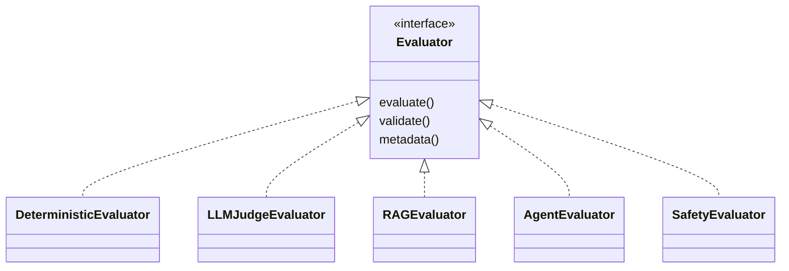

# Layer 06: Evaluation

## 1. Purpose

The evaluation layer computes metric results from executions and traces. Every evaluator is a plugin. It covers deterministic evaluation, LLM judge-based evaluation, and domain-specific metrics for RAG, agents, safety, tools, memory, and reliability.

## 2. Responsibilities

- Deterministic evaluation (schema validity, exact match, tool call accuracy, latency, token counts, cost).
- LLM judge-based evaluation (instruction following, answer quality, reasoning quality).
- Semantic metrics (relevance, similarity, coherence).
- RAG metrics (faithfulness, retrieval recall, retrieval precision, citation correctness).
- Agent metrics (task success, tool selection, loop detection, recovery rate, step efficiency).
- Tool metrics (tool call accuracy, argument validation, tool authorization).
- Memory metrics (memory recall accuracy, poisoning detection, cross-tenant leakage).
- Safety metrics (toxicity, prompt injection resistance, sensitive data leakage).

## 3. Non-Responsibilities

- Job scheduling and worker lifecycle (execution layer).
- Gate decisions based on evaluation results (policy and gates layer).
- Regression analysis and comparison (analysis layer).
- Evidence persistence (evidence layer).

## 4. Public Interfaces

The `Evaluator` interface and the evaluator plugin registry. Each evaluator exposes `evaluate()`, `validate()`, and `metadata()`.

## 5. Inputs

Execution results (traces, tool calls, responses), dataset references (golden answers, expected tool calls), and evaluator configuration (model, prompt version, thresholds).

## 6. Outputs

MetricResult objects containing: metric name, score, evidence, evaluator identity, evaluator version, judge model (if applicable), prompt version (if applicable), confidence, and severity.

## 7. Internal Components

- Evaluator interface definition.
- Plugin registry and discovery mechanism.
- Deterministic evaluator implementations.
- LLM judge evaluator implementations (with prompt versioning).
- Domain-specific evaluator categories (RAG, agent, safety, tool, memory).
- Calibration helpers for judge quality.

## 8. Allowed Dependencies

- Evaluator plugin SDK (AEGIS internal).
- LLM provider SDKs (for judge-based evaluation, within evaluator plugins only).
- Embedding model clients (for semantic metrics).
- Application layer (02) for configuration access.

## 9. Forbidden Dependencies

- Execution layer (05) -- evaluation does not schedule or run jobs.
- Policy and gates layer (08) -- evaluation produces results; policy interprets them.
- Interface layer (03) -- evaluation has no HTTP awareness.
- Direct database access -- evaluation reads data through repository interfaces.

## 10. Why This Design

A plugin architecture allows evaluators to be added, versioned, and replaced independently. Deterministic and LLM-based evaluators have fundamentally different characteristics (cost, latency, reproducibility) and must be clearly separated.

## 11. Alternatives Considered

- **Hardcoded metrics**: Rejected because it prevents extension and independent versioning.
- **Evaluator as infrastructure adapter**: Rejected because evaluation is domain-specific computation, not technology adaptation.
- **Single evaluator class with mode parameter**: Rejected because it creates a god class with divergent behavior.

## 12. Why Alternatives Were Rejected

Hardcoded metrics cannot be extended. Infrastructure placement is wrong for domain computation. Single-class evaluators violate single responsibility.

## 13. Technology Choice

Python plugin architecture (entry points or registry pattern). Provider SDKs for LLM judges. Embedding models via provider APIs.

## 14. Technology Limits

LLM judge evaluation is bounded by provider rate limits, cost, and latency. Deterministic evaluation is bounded by the completeness of deterministic rules. Plugin quality varies and must be validated.

## 15. When To Use This Technology

Every metric computation, whether deterministic or probabilistic. No metric is computed outside the evaluation layer.

## 16. When NOT To Use This Technology

Gate decisions (use policy and gates layer). Regression analysis (use analysis layer). Evidence persistence (use evidence layer).

## 17. Failure Modes

- LLM judge produces inconsistent results across runs (expected for probabilistic evaluation, must be tracked with confidence).
- Evaluator plugin failures crash the entire evaluation run.
- Judge prompt version drift causes incomparable historical results.
- Deterministic evaluator misses edge cases, producing false passes.
- Evaluator cost exceeds target cost without detection.

## 18. Security Risks

- Judge prompts contain sensitive data from target executions.
- LLM provider receives confidential evaluation data.
- Evaluator plugins execute arbitrary code without sandboxing.
- Judge model changes introduce silent bias.

## 19. Performance Risks

- LLM judge evaluation is slow and expensive at scale.
- Embedding model calls add latency to semantic metrics.
- Plugin discovery overhead on cold start.
- Concurrent evaluator execution competing for provider rate limits.

## 20. Testing Strategy

Each evaluator plugin has calibration tests with known-good and known-bad examples. Deterministic evaluators are tested exhaustively. LLM judge evaluators are tested with fixed-seed runs where possible and variance analysis where not. Evaluator identity and version are verified in result metadata.

## 21. Scaling Strategy

Evaluator plugins are independently scalable. LLM judge evaluation can be parallelized with rate limiting. Deterministic evaluation is CPU-bound and scales with worker count.

## 22. Agent Rules

Before writing evaluator code: confirm it implements the Evaluator interface. After writing: verify that evaluator identity, version, confidence, and evidence are present in all results. Never use an LLM judge as a replacement for deterministic validation.

## 23. Code Examples

Evaluator plugin architecture:

Every result carries evaluator identity, version, judge model, prompt version, and confidence.

## 24. Common Implementation Mistakes

- Using LLM judges for metrics that can be computed deterministically.
- Not versioning judge prompts, making historical results incomparable.
- Treating LLM judge scores as ground truth instead of probabilistic estimates.
- Not tracking evaluator cost separately from target cost.
- Missing confidence scores on probabilistic metrics.
- Using average scores to claim all slices passed.
- Not calibrating evaluators against known-good and known-bad examples.
- Evaluator plugins that silently fail instead of reporting partial results.
