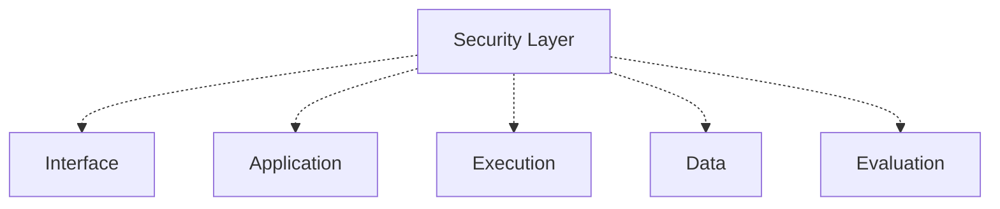

# Layer 11: Security

## 1. Purpose

Security is not a feature at the end of the project. It is a cross-cutting layer that applies at every layer of AEGIS. This layer defines authentication, authorization, tenant isolation, secrets management, PII redaction, and AI-specific security concerns including prompt injection and red-team evaluation.

## 2. Responsibilities

- Authentication (user identity, service accounts, API keys).
- Authorization (RBAC, permission checks, resource-level access control).
- Tenant isolation (organization and project scoping, PostgreSQL RLS).
- Secrets management (rotation, access control, audit).
- PII detection and redaction (in traces, logs, and evaluation data).
- Prompt injection defense (evaluation of injection resistance).
- Red-team evaluation (adversarial testing, attack simulation).
- Data classification (public, internal, confidential, restricted, regulated).
- Audit logging (who accessed what, when, and why).

## 3. Non-Responsibilities

- Business logic and domain rules (domain layer).
- Metric computation (evaluation layer).
- Gate decisions (policy and gates layer, though security rules can be part of policy).

## 4. Public Interfaces

Auth middleware, permission checkers, tenant context providers, secrets clients, PII redactors, and classification annotators. These are consumed by all other layers.

## 5. Inputs

User credentials, API keys, service account tokens, resource access requests, and data classification labels.

## 6. Outputs

Authentication results, authorization decisions, redacted data, classified records, and audit log entries.

## 7. Internal Components

- Authentication providers (OAuth2, API keys, service accounts).
- Permission checker (RBAC with permission-first design).
- Tenant context manager (organization and project scoping).
- Secrets provider (Vault, cloud KMS, with caching and rotation).
- PII detector and redactor.
- Classification engine.
- Audit logger.
- Prompt injection test generator (for evaluation, not runtime defense).
- Red-team attack generator (for evaluation, not runtime defense).

## 8. Allowed Dependencies

- Domain layer (01) for entity types.
- Application layer (02) for configuration.
- Infrastructure layer (04) for secrets provider and audit log storage.

## 9. Forbidden Dependencies

- Interface layer (03) -- security defines rules, it does not handle HTTP directly.
- Execution layer (05) -- security does not schedule work.
- Evaluation layer (06) -- security evaluates target systems, it does not compute metrics.

## 10. Why This Design

Security is cross-cutting by nature. Every layer must consider auth, authz, tenancy, and classification. Making security a dedicated layer ensures these concerns are consistently implemented rather than ad hoc. The layer provides shared services that other layers consume.

## 11. Alternatives Considered

- **Security as middleware only**: Rejected because it misses background job authorization, data classification, and audit logging.
- **Security baked into each layer**: Rejected because it produces inconsistent implementations and duplicated logic.
- **Separate security service**: Deferred; for the modular monolith, security is an internal cross-cutting layer.

## 12. Why Alternatives Were Rejected

Middleware-only misses non-HTTP security concerns. Baked-in produces inconsistency. Separate service adds deployment complexity before the monolith is validated.

## 13. Technology Choice

OAuth2 for authentication. RBAC with permission-first design. PostgreSQL RLS for tenant isolation. Vault or cloud KMS for secrets. PII detection via regex and NER models.

## 14. Technology Limits

RLS adds query overhead. PII detection is imperfect and requires human review for edge cases. Prompt injection defense is an evolving field with no guaranteed solution.

## 15. When To Use This Technology

Every request, every background job, every data access, and every evaluation that involves sensitive data or external systems.

## 16. When NOT To Use This Technology

Domain logic (domain defines entities, security defines access rules). Metric computation (evaluation layer). Gate decisions (policy layer, though security findings feed into policy).

## 17. Failure Modes

- Authentication bypass allowing unauthorized access.
- Tenant data leakage across organization boundaries.
- Secrets exposed in logs, traces, or evidence records.
- PII appearing in evaluation results or dashboards.
- Audit log gaps preventing incident investigation.
- Prompt injection succeeding against target systems.

## 18. Security Risks

This layer directly manages security risks:

- Unauthorized access to AEGIS functionality.
- Cross-tenant data leakage.
- Secret compromise.
- PII exposure.
- Prompt injection attacks on target systems.
- Red-team attack payloads being misused.
- Overly permissive RBAC rules.
- Missing audit trails.

## 19. Performance Risks

- Authentication checks adding latency to every request.
- RLS policies slowing database queries.
- PII detection adding overhead to trace processing.
- Audit logging blocking critical paths.

## 20. Testing Strategy

Unit tests for permission check logic. Integration tests for tenant isolation (verifying cross-tenant access is blocked). PII redaction tests with synthetic data. Authentication flow tests. Audit log completeness tests.

## 21. Scaling Strategy

Auth checks are lightweight and cacheable. RLS scales with PostgreSQL. Audit logs use append-only storage with partitioning. PII detection can be parallelized.

## 22. Agent Rules

Before writing security-related code: confirm it aligns with the security layer's responsibilities. After writing: verify no secrets appear in code, logs, or test fixtures. Verify tenant isolation is enforced. Do not treat the LLM as a trusted security boundary.

## 23. Code Examples

Cross-cutting security application:

The principle: Do not treat the LLM as a trusted security boundary.

## 24. Common Implementation Mistakes

- Hardcoding credentials in code or configuration files.
- Skipping tenant isolation checks in background jobs.
- Logging PII or secrets in structured logs.
- Not rotating secrets on a schedule.
- Treating prompt injection defense as a runtime-only concern (it must be tested via evaluation).
- Missing audit logging for sensitive operations.
- Overly permissive RBAC rules (default deny, not default allow).
- Storing red-team attack payloads without access control.
- Assuming LLM output is safe because it was generated by a trusted model.
