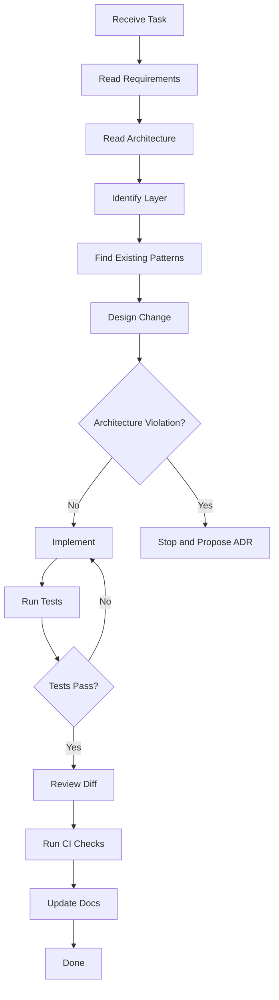

# Agent Implementation Guide

## Purpose and Authority

This document is the **contract for any coding agent doing implementation work in AEGIS** — AI or human, interactive session or batch process. It extends the workflow in `docs/development/agent-development-protocol.md` with the concrete detail of how to read a task, choose a layer, decide when to propose an ADR, verify work locally, and close out the Definition of Done.

The workflow below is not a recommendation. It is the ordered sequence of state transitions every change must traverse. Skipping a step, or passing a decision point without resolving it, means the change is not complete regardless of whether the code runs.

## The Workflow



## Step Detail

### 1. Receive Task

Do not start coding until the task is clear. If the task arrives as a sentence ("add regression detection") or as a bug report, you must turn it into requirements before touching the code.

### 2. Read Requirements

Turn the task into functional and acceptance terms:

- What requirement in `docs/requirements/functional-requirements.md` and `non-functional-requirements.md` does this serve?
- What does the feature need to do, and what must be objectively true when it is done?
- What are the constraints and edge cases? Use the acceptance-criteria template in `docs/requirements/acceptance-criteria.md`; every acceptance criterion must be verifiable as true or false.
- Cross-check the product facts in `grilling.md`. If a requirement contradicts an accepted fact (immutability, evidence, bounded retries, "No score without evidence", regression is blockable, overrides need authorization), stop and escalate. The facts win.

### 3. Read Architecture

Read the architecture files that govern the change before designing anything:

- `docs/architecture/development-architecture.md` for the layer model and dependency rules.
- `docs/architecture/write-architecture.md` for the Write Invariants that constrain every write path.
- The ADRs (`docs/architecture/architecture-decision-records/`). A change that conflicts with an accepted ADR is an architecture violation, not a new idea.
- Any requirements, data, API, and testing READMEs relevant to the affected surface.

### 4. Identify Layer

Determine which of the 11 layers (`docs/development/layers/00` through `11`) owns the change, using the layer table in `docs/development/README.md` and the rules in the individual layer files:

| Layer | Owns |
|---|---|
| 00 | System boundaries |
| 01 | Domain model and invariants (zero framework imports) |
| 02 | Application use cases, transactions, orchestration, authorization decisions |
| 03 | REST API, CLI, webhook surface (no business logic) |
| 04 | Adapters to PostgreSQL, Redis, object storage, OTel, secrets, HTTP |
| 05 | Job scheduling, worker lifecycle, retries, timeouts, sandboxing |
| 06 | Evaluator plugins: deterministic, LLM judge, RAG, agent, safety |
| 07 | Regression, failure clustering, comparison, slicing, statistics |
| 08 | Policy and gate decisions |
| 09 | Provenance, evidence linking, reproducibility |
| 10 | Telemetry for AEGIS and AI traces |
| 11 | Auth, authz, tenancy, secrets, PII, security |

If the change spans multiple layers, identify the **primary layer** and the interaction points. Cross the boundary only through the documented interface of the neighboring layer. Never reach through non-neighboring layers.

### 5. Find Existing Patterns

Search the codebase before writing anything. AEGIS deliberately has stable patterns: the evaluator plugin interface (ADR-004), the migration scaffolding, the error taxonomy, the tenant-scoping conventions. If a pattern already exists, extend it. If you are about to invent a pattern, verify it does not already exist with a different name (`docs/development/development-rules.md`).

### 6. Design Change

Plan before implementing: files to modify, files to create, the migration if any, the API change if any, and the tests to write. The design must satisfy the smallest correct change rule below.

### 7. Architecture Violation Decision

Evaluate the design against layer rules, dependency rules, ADRs, and the Write Invariants:

- The design requires crossing non-neighboring layers: **propose an ADR.**
- The design changes the evidence model, immutability semantics, or requires touching immutable historical rows: **propose an ADR**, because it violates a hard invariant.
- The design contradicts an accepted ADR: **propose a new ADR** superseding it, reviewed before implementation.
- The design adds a dependency not in the authorized set: **follow `docs/development/dependency-rules.md`** before writing code.

Otherwise **implement**. Do not use the ADR path to bypass the layer system because it is faster; an ADR proposal is a deliberate, documented architecture decision reviewed by the appropriate owners, and implementing a violation and "fixing it later" is forbidden.

### 8. Implement

Write the smallest correct change that satisfies the design. Follow `docs/development/coding-standards.md` and `docs/development/error-handling.md`. No mechanical code comments, no emojis. Do not implement anything the task and its acceptance criteria do not require; scope that is not required is added risk.

### 9. Run Tests

Run the full test suite for the affected modules. Cover the failure-facing tests too: timeouts, retry exhaustion, cancellations, malformed input, and immutability violations — AEGIS behavior is only trustworthy if it fails predictably (`docs/development/error-handling.md`).

### 10. Tests Pass Decision

If tests do not pass, return to implementation with the specific failure in hand. Do not weaken a test to make it pass. A test that no longer reflects the requirement is a requirement problem to surface, not a test to delete silently.

### 11. Review Diff

Review your own change as if you were a reviewer who does not know your intent: correctness, style, layer placement, forbidden imports, no secrets or PII in logs, no raw schema edits, no silent response-shape changes. Check the diff does not include unrelated changes.

### 12. Run CI Checks

Run the validation commands defined for this repository and the PR gates in `docs/ci-cd/pull-request-gates.md`: lint, typecheck, unit tests, contract tests, contract/schema drift checks, security scans, and the migration gates relevant to the change. The CI gate set is the minimum; local results must match what CI would produce.

### 13. Update Docs

Update every affected document: API specs and `docs/api` READMEs for interface changes, schema-evolution and data docs for schema changes, layer files for new patterns, requirements if acceptance criteria changed. Documentation that contradicts the delivered code is a defect. If you created a new pattern, reflect it; do not create new documentation files for existing patterns.

### 14. Done

Mark the work complete **only** after the Definition of Done checklist in `docs/implementation/definition-of-done.md` is satisfied with proof, and the acceptance criteria in `docs/requirements/acceptance-criteria.md` all pass. "Done" without the checklist is not done.

## Reading a Task into Requirements

A good task decomposes into a requirements paragraph, acceptance criteria, and a scope. A vague task does not get implemented; it gets interrogated:

1. **What is the user-visible behavior?** Write it as a sentence. If you cannot, ask for the requirement reference.
2. **What is objectively verifiable?** Turn behavior into true/false acceptance criteria using the template in `docs/requirements/acceptance-criteria.md`.
3. **What are the failure cases?** List what can go wrong before you implement, not after: no evidence, timeout, retry exhaustion, locked version edit attempt, cross-tenant access. These become failure-mode tests.
4. **What is out of scope?** State it. Unbounded scope is the most common cause of an untested change.

## Picking the Layer File

- Read the layer file for the primary layer you identified in step 4 of the workflow.
- Read the dependency rules for the layers involved (`docs/development/dependency-rules.md`) to confirm the boundary crossings are legal.
- If the change touches the interface, also read `docs/api/api-conventions.md` and `docs/api/error-contract.md`.
- If the change touches storage, also read the layer 04 file and `docs/data/`.

The layer file is authoritative for where code may live. If a behavior does not obviously belong to a layer, the answer is to escalate, not to guess.

## The Smallest Correct Change Rule

```text
A change is the smallest change that satisfies the acceptance criteria
without violating architecture, and no smaller.
```

Concretely:

- Add only the fields, endpoints, tables, and code paths the acceptance criteria require.
- Do not "also fix" unrelated issues in the same change; split them so each change is reviewable and rollbackable.
- Do not collapse multiple independent changes into one "big change"; each migration, each contract change, and each feature change is separately reviewable.
- If the smallest correct change still feels large, split it and update the task, do not widen the single change.

## When to Propose an ADR vs When to Just Implement

Propose an ADR when the change **violates the current architecture**, as defined by the layer rules, the dependency rules, or an accepted ADR, or when it touches a hard invariant (immutability, evidence, "no score without evidence", the result write-once rule). Put the ADR in `docs/architecture/architecture-decision-records/` following the existing format, and do not implement the change until the ADR is accepted.

Just implement — do not propose an ADR — when the change fits inside the existing layer model, uses an existing pattern, and extends the system the way it was designed to be extended. Adding a new deterministic evaluator, a new endpoint, a new migration, or a new policy rule is normal implementation work. Proposing an ADR for every change is process overhead; implementing a violation without an ADR is dishonesty about the architecture.

## How to Verify Work Locally

Before you mark anything complete, demonstrate the change works in the local tier per `docs/testing/test-environments.md`:

- **Unit tests** for the affected modules — `npm test` / `pytest` equivalents as defined in `docs/development/coding-standards.md`.
- **Fast integration tests** with the local harness: contained PostgreSQL and Redis, recorded fixtures and fake providers only. Local work never points at shared, staging, or production infrastructure.
- **Contract tests** for any boundary the change crosses (`docs/testing/contract-testing.md`).
- **Migration tests** for any schema change: apply forward against a clean database and a previous-schema snapshot, confirm no drift.
- **Lint and typecheck** exactly as CI would run them.

Then, on a pull request, rely on the per-PR gate set in `docs/ci-cd/pull-request-gates.md`. The PR gates run the fast set per change; expensive suites are tagged and scheduled, not run locally on every change. If a change is expensive-tagged, running it locally is a deliberate action with a cost cap, never an implicit default.

A change is locally verified when the local commands produce the same pass/fail signal as the CI gate set, and no test was skipped to make it pass.

## Filling the Definition of Done

Before marking a change complete:

1. Open `docs/implementation/definition-of-done.md` and work through the checklist item by item.
2. For each item, record **which file or tool test proves it**. An item without proof is not done.
3. Confirm acceptance criteria from `docs/requirements/acceptance-criteria.md` all pass — these are the objective completion conditions this checklist operationalizes.
4. Only after every item has proof, mark complete.

## Working Under the Forbidden List

`docs/development/agent-development-protocol.md` defines the forbidden actions. They are repeated here with their implementation reading:

| Forbidden | Means in implementation |
|---|---|
| Invent new architecture without checking ADRs | Any new pattern that contradicts an ADR starts as an ADR proposal, not as code |
| Access infrastructure directly from domain code | Layer 01 never imports infrastructure; adapters live in layer 04 and are injected |
| Change database schema without migration | Every DDL is a numbered migration through the protocol; no ad-hoc DDL, no raw schema edits in any environment |
| Change API response without contract review | Any response-shape change follows `docs/implementation/api-change-protocol.md`; breaking changes need a new major version |
| Modify immutable historical data | Never; write-once results, locked datasets, executed experiment snapshots, published versions are immutable; create a new version instead |
| Retry unknown failures indefinitely | Bounded retries only, with error classification and backoff; no infinite retry path |
| Hide errors | Errors surface through the typed exception hierarchy and the uniform error contract; no swallowed exceptions |
| Use an LLM judge as a replacement for deterministic validation | Deterministic contracts (schema, tool names, argument schemas, latency, cost) are never replaced by a judge; judges are an additional evaluator with confidence and provenance |
| Treat average score as proof that all slices passed | Analysis reports slice-level results and significance; an aggregate never substitutes for per-slice evidence |

## When in Doubt

The documents are authoritative. If the task, the requirement, the architecture, and the implementation order disagree, stop and ask rather than guessing. Guessing produces a change that passes tests but violates a fact — the worst outcome, because it looks complete while endangering the evidence chain.