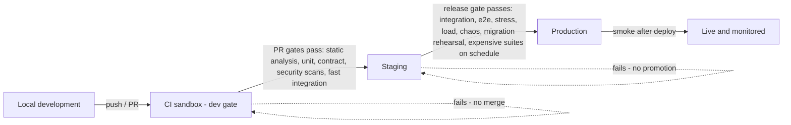

# Environments

AEGIS runs in four environment tiers. Each tier exists to answer a specific question, and each has different fidelity, safety, and cost properties. Running a workload in the wrong tier is either useless (a container that does not resemble production), dangerous (chaos against real data), or wasteful (expensive suites on every commit). The tier model is defined in `docs/testing/test-environments.md`; this document is its operational counterpart: how each tier is configured, who can access it, what may run there, what data it holds, and how changes move through it.

## Environment Tiers

### Local Development

- **Purpose**: rapid feedback for a developer. The fast unit and integration suites must run before pushing.
- **Configuration**: local containers managed by the local harness (`local-development.md`). Runs against a local PostgreSQL, Redis, and object storage instance; never against shared, staging, or production infrastructure, and never against a real tenant's data.
- **Access control**: the developer's own machine. No shared credentials and no real provider keys.
- **What may run**: unit tests and fast integration tests with containers. No real providers — targets and models are recorded fixtures or fake providers.
- **Data fixtures**: synthetic, seeded demo data scoped to a local tenant (`local-development.md`).

### CI Sandbox (Dev Tier)

- **Purpose**: gate every change quickly and at low cost before merge.
- **Configuration**: ephemeral per-run PostgreSQL and Redis containers provisioned by the pipeline. Static analysis, unit, contract, and security scans run per PR; the fast integration set runs against real contained stores. Expensive suites (tagged `expensive`) never run per PR.
- **Access control**: pipeline identities (service accounts with scoped API keys). Results and artifacts are visible to the engineering team; no human access to the ephemeral stores.
- **What may run**: the per-PR gate set defined in `docs/ci-cd/pull-request-gates.md` plus the fast integration catalog. No chaos, no stress, no red-team payloads.
- **Data fixtures**: recorded provider fixtures and synthetic data only.
- **Promotion gate**: the CI sandbox is the "dev" gate. A change that fails the PR gates does not merge and cannot reach staging.

### Staging

- **Purpose**: prove behavior at production fidelity before production sees it.
- **Configuration**: models production topology, runtime configuration, and data volume within documented tolerances — same component processes, same queue, same storage layout (`test-environments.md` parity rules). Runs integration, end-to-end, stress, load, soak, chaos, and migration-rehearsal suites.
- **Access control**: restricted. Chaos, stress, and red-team execution is limited to authorized operators and runs against synthetic scoped tenants. Red-team data and adversarial payloads are accessible only to authorized personnel. The same permission model and RLS as production are enforced so isolation bugs cannot hide behind "it is only a test environment."
- **What may run**: the full test catalog, including destructive suites — chaos, stress, load, red-team — against synthetic tenants. Chaos/stress/red-team workloads run **in staging, never in production** (grilling.md Q347).
- **Data fixtures**: representative, production-shaped synthetic datasets sized to match production volumes so load and chaos results transfer. Chaos and stress datasets are cleaned up after verification; scheduled suites are quarantined per run where needed.
- **Promotion gate**: staging is the release gate. Nothing reaches production without passing staging, and every production release is promoted from a staging-verified artifact.

### Production

- **Purpose**: serve real tenants and verify deployed behavior without risk.
- **Configuration**: the hardened topology with real stores, replicated object storage, the production queue, and the production observability pipeline. Configuration changes that alter behavior pass review/PR gates before they are eligible to run here (`configuration.md`).
- **Access control**: production is restricted to deployment identities and the on-call/security responders defined in `incident-response.md`. Production test actions (smoke, canary) are limited to deployment identities with explicit authorization.
- **What may run**: smoke suites after deployment, monitoring and alerting (synthetic transactions, health checks, availability and reliability monitoring per the NFRs), and canary evaluation — a small, explicitly authorized evaluation slice against a deployed target version. Production runs **no destructive tests**: no chaos, no stress, no red-team payloads, no test that mutates production state or triggers real side effects.
- **Production evaluation of targets requires explicit authorization** (grilling.md Q72-Q75). Evaluation against production is never the default: tests can mutate data, trigger actions, incur costs, or expose sensitive information. Evaluation is **non-destructive by default** — tool side effects are disabled or sandboxed unless explicitly authorized.

## What May Run, by Tier

| Workload class | Local | CI sandbox | Staging | Production |
|---|---|---|---|---|
| Unit tests | Yes | Yes | Yes | No |
| Fast integration (containers, fixtures) | Yes | Yes | Part of catalog | No |
| Contract / security scans | Optional | Yes | Yes | No |
| Full integration / end-to-end | No | No | Yes | Smoke only |
| Stress / load / soak | No | No | Yes | No |
| Chaos | No | No | Yes | No |
| Red-team / adversarial payloads | No | No | Yes (synthetic tenants) | No |
| Migration rehearsal | Optional | Optional | Yes | Applied via CI |
| Canary evaluation (authorized slice) | No | No | No | Yes |
| Synthetic monitoring / health probes | No | No | Yes | Yes |

## Promotion Flow

Every promotion runs through CI; there is no path that bypasses the gates. Staging to production specifically must always go through CI.

Gates in the diagram:

- **PR gate (enter CI sandbox)**: static analysis, unit tests, contract tests, security scans, and the fast integration set. Expensive suites do not run here.
- **Release gate (enter staging)**: merge of the PR-approved artifact into the staging-verified release candidate.
- **Staging gate (enter production)**: the full staging verification — integration, end-to-end, stress, load, soak, chaos, and migration rehearsal — passes, and any applicable evaluation gates (deployment gates from the policy/gates layer) are green or explicitly overridden per policy.
- **Deploy gate (production)**: CI provisions the artifact, runs smoke suites after deployment, and enables monitoring and canary evaluation.
- **Canary gate**: a small authorized canary evaluation against a deployed target version must pass before broader rollout; production evaluation requires explicit authorization and remains non-destructive by default.

Staging always matches production in topology, runtime configuration, and data volume within documented tolerances so that a result measured in staging transfers. The same migration set and schema are exercised in local, CI, and staging before they touch production.

## Data Fixtures and Isolation Per Tier

- Local and CI use fixtures and synthetic data; staging uses representative production-shaped synthetic datasets; production holds real tenant data under the retention and classification policies in `docs/data/retention-and-deletion.md`.
- Every test tier enforces per-tenant isolation: tests create their own organizations and projects, and a cross-tenant assertion must fail at every layer (`test-environments.md`). Isolation is tested between tenants, not only between test classes.
- Chaos and stress datasets are removed from staging after verification; shared staging is quarantined per run so scheduled suites cannot corrupt each other.

## Governance and Cost

- Expensive suites are tagged `expensive` and run on schedules, never implicitly on every change. Per-environment budgets cap load, chaos, and AI spend; exceeding a budget aborts the run and reports it (FR-EXE-06 rate limits and cost governance in `test-environments.md`).
- Cost per run is measured, with target cost separated from evaluator cost, so suite cost is a reported number, not a surprise.

## Related Documentation

- `docs/testing/test-environments.md` — the test-side contract each tier implements
- `configuration.md` — per-environment configuration and the fail-fast rule
- `local-development.md` — local tier setup
- `docs/requirements/non-functional-requirements.md` — the targets measured in staging and production
- `docs/architecture/failure-architecture.md` — recovery semantics that staging chaos verifies