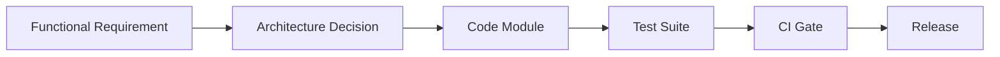

# Traceability Matrix

> Back to [Requirements README](./README.md)

This is one of the most important files in the documentation architecture. It proves that nothing is floating: every requirement is anchored to a decision, a component, a module, a test, and a gate.

```text
Requirement
        ↓
Architecture Component
        ↓
Code Module
        ↓
Test
        ↓
CI Gate
```

A requirement without a test is not done. A test without a CI gate is not enforced. A new module or layer must update the matrix.

---

## Example Traceability Chain

```text
FR-EXE-03
   ↓
Execution Engine
   ↓
execution/retry/
   ↓
test_retry_policy.py
   ↓
integration-test-job-retry
```

---

## Traceability Graph



---

## Rules for Maintaining the Matrix

1. Every functional requirement maps to at least one ADR, one architecture component, one code module, one test suite, and one CI gate.
2. Every new module or layer updates the matrix.
3. A requirement without a test is not done.
4. A test without a CI gate is not enforced.
5. The matrix is reviewed whenever an ADR is created or modified.
6. A requirement that cannot be traced end-to-end is either not implemented or not verified.
7. When a component changes ownership (layer move), the matrix row is updated in the same change.

---

## Traceability Matrix Table

Placeholder entries. Expand as functional requirements are authored in [functional-requirements.md](./functional-requirements.md).

| Requirement ID | ADR | Architecture Component | Code Module | Test | CI Gate |
|---|---|---|---|---|---|
| FR-EXE-01 | ADR-Execution | Execution Engine | `execution/engine/` | `test_experiment_execution.py` | `integration-test-experiment-execution` |
| FR-EXE-02 | ADR-Execution | Execution Engine | `execution/retry/` | `test_retry_policy.py` | `integration-test-job-retry` |
| FR-EXE-03 | ADR-Execution | Execution Engine | `execution/timeout/` | `test_timeout_policy.py` | `integration-test-job-timeout` |
| FR-EXE-04 | ADR-Execution | Execution Engine | `execution/cancellation/` | `test_cancellation.py` | `integration-test-cancellation` |
| FR-EVL-01 | ADR-Evaluation | Evaluation Engine | `evaluation/engine/` | `test_evaluator_execution.py` | `integration-test-evaluation` |
| FR-TRC-01 | ADR-Tracing | Trace Collector | `tracing/collector/` | `test_trace_collection.py` | `integration-test-tracing` |
| FR-POL-01 | ADR-Policy | Policy Engine | `policy/engine/` | `test_policy_enforcement.py` | `integration-test-policy` |
| FR-SEC-01 | ADR-Security | Security Evaluation | `security/redteam/` | `test_redteam_execution.py` | `integration-test-security` |
| FR-PRJ-01 | ADR-Tenancy | Project Service | `projects/service/` | `test_project_creation.py` | `integration-test-projects` |
| FR-TGT-01 | ADR-Targets | Target Registry | `targets/registry/` | `test_target_registration.py` | `integration-test-targets` |
| FR-DAT-01 | ADR-Datasets | Dataset Service | `datasets/service/` | `test_dataset_management.py` | `integration-test-datasets` |
| FR-EXP-01 | ADR-Experiments | Experiment Service | `experiments/service/` | `test_experiment_creation.py` | `integration-test-experiments` |
| FR-EVD-01 | ADR-Evidence | Evidence Graph | `evidence/graph/` | `test_evidence_graph.py` | `integration-test-evidence` |
| FR-OBS-01 | ADR-Observability | Observability Ingestion | `observability/ingestion/` | `test_observability_ingestion.py` | `integration-test-observability` |
| FR-ANA-01 | ADR-Analysis | Analysis Engine | `analysis/engine/` | `test_analysis.py` | `integration-test-analysis` |

---

## Maintenance Checklist

- [ ] New functional requirement → add a row.
- [ ] New ADR → update affected rows.
- [ ] New code module → update module column.
- [ ] New test suite → update test column.
- [ ] New CI gate → update CI gate column.