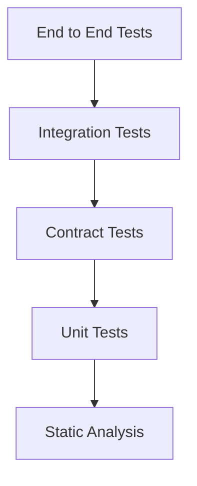

# Testing

## The Testing Layer

AEGIS is a control plane that evaluates, tests, observes, secures, and verifies AI systems. The testing layer is the discipline that keeps AEGIS itself trustworthy. AEGIS provides software-engineering-grade testing and reliability rules to the teams that build LLM applications, RAG pipelines, and agents; the same standard applies to the control plane that delivers those guarantees. Every component of AEGIS — domain rules, queue workers, target adapter, evaluator plugins, gates, and storage — is itself tested, because a broken control plane produces scores that cannot be trusted.

The governing philosophy comes from `grilling.md`:

```text
Test the AI, and test the system that tests the AI.
No score without evidence.
Fail contained, retry deliberately, never silently duplicate side effects.
```

AEGIS does not determine absolute truth. It produces evidence and confidence. Testing is how AEGIS proves that its own evidence is credible.

## Test Pyramid



The pyramid orders tests by cost and isolation. Lower layers are fast, numerous, and run on every change. Upper layers are slower, more expensive, and increasingly represent the full system.

- **Static analysis** sits below unit tests: linting, type checking, formatting, and deterministic code-level checks that run first and fastest.
- **Unit tests** cover domain rules, policies, gate logic, retry classification, validation, evaluator logic, and statistics in complete isolation from infrastructure and models.
- **Contract tests** pin the interfaces between components: API to client, worker to queue, worker to target adapter, and adapter to evaluator plugin. A contract change must be discovered before production.
- **Integration tests** exercise real contained infrastructure: the application with PostgreSQL, the worker with the real queue, and plugin-to-evaluator RPC — without real LLM or provider calls.
- **End-to-end tests** run full scenarios through every plane of the system against recorded or fake external responses.

The pyramid's volume mirrors the relative number of tests at each level; most of AEGIS testing budget sits at the lower levels where failures are cheap to find.

## AEGIS-Specific Testing

AEGIS cannot copy a conventional test strategy, because it tests probabilistic AI rather than only deterministic software. Generic platforms test functions; AEGIS must additionally verify behavior, safety, and reliability of systems that can be nondeterministic, stateful, and adversarial. That requires a specialty testing layer that covers:

- **LLM testing**: contract-style deterministic tests around the model — JSON schema, tool invocation schema, authorization policy, required fields, maximum output length — plus behavioral tests for prompts rather than exact-snapshot overfitting. LLM testing is not equivalent to normal unit testing.
- **Agent testing**: trajectory-level evaluation of goal completion, planning, tool use, recovery, and efficiency, not only final-answer scoring. Evaluate the trajectory and consequences, not only the final sentence.
- **RAG testing**: retrieval, evidence, generation, and end-to-end behavior measured separately, because a wrong answer can originate from bad retrieval rather than bad generation.
- **Safety testing**: prompt injection, tool misuse, identity and privilege abuse, memory poisoning, cascading failures, and human-agent trust exploitation, mapped to recognized threat taxonomies.
- **Reliability testing**: chaos, stress, load, and soak verification that execution survives killed workers, failed infrastructure, and provider outages without duplication or evidence loss.

Two principles distinguish AI testing from conventional testing:

1. **Contract around the model is deterministic.** Schema validity, tool names, argument schemas, policy violations where mechanically detectable, latency, token counts, and cost are testable exactly. Where the answer is stochastic, AEGIS tests behavior and evidence, never exact wording.
2. **LLM judges are themselves versioned AI dependencies** that must be calibrated with known-good and known-bad examples and judged on their own accuracy. An evaluator is not objective truth; a high score is defensible only with evaluator identity, version, judge model, and judge prompt version attached.

## Test Tagging

Tests are tagged so that suites can be selected by change impact and cost. AEGIS uses the following standard tags:

```text
smoke
regression
safety
rag
agent
memory
expensive
```

- `smoke` — fast, broadly covering sanity checks run on every commit and before deployment.
- `regression` — suites that compare target versions for regressions.
- `safety` — adversarial, injection, abuse, and guardrail tests.
- `rag` — retrieval, evidence, and generation evaluation suites.
- `agent` — trajectory, tool, planning, and agent-loop suites.
- `memory` — memory poisoning, leakage, and persistence suites.
- `expensive` — load, stress, chaos, and run-heavy suites that consume significant cost or time.

`expensive` is orthogonal to the other tags: a chaos run may be tagged `safety` and `expensive`, a load suite `regression` and `expensive`. The tag determines scheduling and gating, never meaning.

## Dependency-Aware Test Selection

Not every change runs everything. Running the full suite on every commit is wasteful and slow, and the cost is real: LLM calls, provider invocations, compute, and time. AEGIS selects tests by the dependency graph and the affected components.

- A prompt-only change runs language and quality suites, not infrastructure load tests.
- A model change runs the regression suite.
- A retriever change runs the RAG suite.
- A tool schema change runs the agent and tool suites.
- A guardrail change runs the safety suite.
- A memory policy change runs the memory suite.

Test selection, the PR gate definitions, and the merge rules are specified in the CI/CD documentation: `docs/ci-cd/pull-request-gates.md`. The gates decide what must pass before a change merges, which tags are mandatory on every pull request, and which suites are scheduled separately because they are too expensive to run per commit.

## Test Environments

Different test classes belong in different environments. Local development runs unit and fast integration tests with containers and no real provider. The CI sandbox runs per-PR gates: static, unit, contract, and security scans with selective integration. Staging runs integration, end-to-end, stress, load, and chaos testing plus migration rehearsal. Production runs smoke suites, monitoring and alerts, and canary evaluation — never destructive tests. See `docs/testing/test-environments.md`.

## Document Index

| Document | Description |
|---|---|
| [testing-strategy.md](testing-strategy.md) | The overall testing strategy: what is tested at each level, how AI systems are tested, and how evaluation self-testing works. |
| [unit-testing.md](unit-testing.md) | Unit test scope and principles: domain rules, policies, gate logic, and evaluator logic, with no real database, Redis, LLM, or provider. |
| [integration-testing.md](integration-testing.md) | Integration tests against real contained infrastructure: PostgreSQL, Redis-backed queue, API, and evaluator RPC, without real models or providers. |
| [contract-testing.md](contract-testing.md) | Contract tests pinning every cross-boundary interface: API to client, worker to queue, worker to target adapter, adapter to evaluator, and webhooks. |
| [end-to-end-testing.md](end-to-end-testing.md) | Full scenario tests across all planes, from creating a project through to a gated, overridden run. |
| [stress-testing.md](stress-testing.md) | Verify system behavior under extreme load: 500 concurrent executions, queue backlog, evaluator bottleneck, and infrastructure saturation. |
| [load-testing.md](load-testing.md) | Normal and anticipated-peak load behavior, latency percentiles, soak stability, ramp-up patterns, and capacity planning data. |
| [chaos-testing.md](chaos-testing.md) | Deliberately kill workers, Redis, database connections, evaluators, providers, network, and object storage, and prove invariants hold. |
| [security-testing.md](security-testing.md) | Authentication and authorization abuse, tenant isolation, secrets, PII redaction, prompt injection and red-team evaluation, and supply-chain scans. |
| [manual-user-testing.md](manual-user-testing.md) | The human test script for the full scenario: 14 steps from project creation to authorized override, with recorded evidence. |
| [regression-testing.md](regression-testing.md) | Per-test-case comparison across target versions, statistical significance, non-compensatory safety rules, and regression suite promotion. |
| [test-data-strategy.md](test-data-strategy.md) | Realistic, adversarial, and edge-case test data, golden datasets, dataset quality checks, public and private datasets, and fixture use. |
| [test-environments.md](test-environments.md) | Environment tiers (local, CI sandbox, staging, production), parity rules, access control, cleanup, and cost governance. |