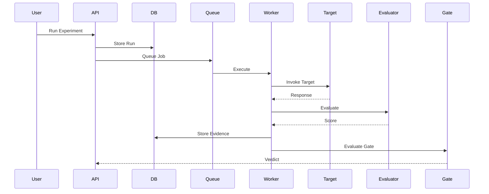

# End-to-End Testing

## Purpose

End-to-end tests prove the full AEGIS scenario works through every plane — control plane, execution plane, and evidence plane — the way a user actually uses it. A unit or integration test proves a piece; an end-to-end test proves the orchestration, from the moment a user creates a resource to the moment a gate produces a verdict and a user inspects the evidence.

## Scenario

The canonical end-to-end scenario is the full lifecycle:

```text
1. Create Project
2. Create Target
3. Create Target Version
4. Create Dataset
5. Add Test Cases
6. Lock Dataset
7. Create Evaluator
8. Create Experiment
9. Run Experiment
10. Wait for completion
11. Inspect failure
12. Compare baseline
13. Trigger gate
14. Override if authorized
```

Each step must be exercised in order, with realistic payloads, and each terminal artifact must be verified: the run reaches a terminal state, evidence is stored for every execution, the verdict is computed from real results, and the gate honors the policy.

## Sequence



The sequence is the contract of the happy path. End-to-end tests also cover the branches: a failed test case inside a run, partial completion, a gate that blocks, and a gate that is overridden by an authorized identity.

## Scenario Coverage

Every object type and relationship must be covered by at least one end-to-end scenario:

- Resource lifecycle: creating, reading, locking, and immutably versioning projects, targets, target versions, datasets, test cases, evaluators, and experiments.
- Execution: queueing a run, worker claim, target invocation, evaluator scoring, evidence persistence, and terminal-state reporting.
- Evaluation: evaluator execution through the ADR-004 plugin boundary, including evidence and provenance on every `MetricResult`.
- Gates: verdict computation from results and policy, blocking behavior on critical safety failures, and authorized human override.
- Multi-tenant behavior: every scenario executes under a tenant identity, and a cross-tenant assertion must fail.

## Where E2E Runs

End-to-end tests run in staging, not in the CI sandbox and never in production. Staging provides production-shaped topology and data volume with safe boundaries. The details of which suites run in which environment and how they are scheduled are in `docs/ci-cd/pull-request-gates.md` and `docs/testing/test-environments.md`.

## Data and Provider Strategy

End-to-end tests run against a clean, seeded dataset prepared by the harness, with recorded responses for target providers. Recorded responses keep the scenario deterministic, cheap, and free of real model cost — the point of end-to-end testing is orchestration integrity, not model behavior. Scenario coverage must not depend on a live third-party provider.

## Scheduling

End-to-end suites run on schedules, not on every commit, unless explicitly tagged as part of a fast smoke set. The full lifecycle is expensive and staging is shared; scheduling is configured per tag in the CI/CD gates. Smoke end-to-end runs cover the happy path cheaply and frequently; comprehensive lifecycle suites run on the schedule and their results are archived as artifacts.